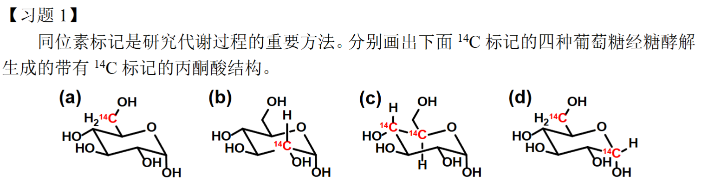
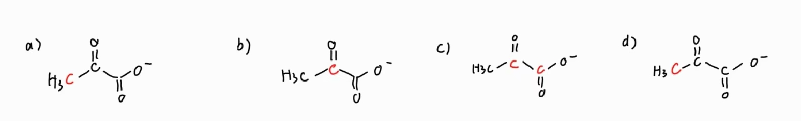
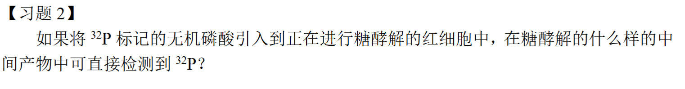
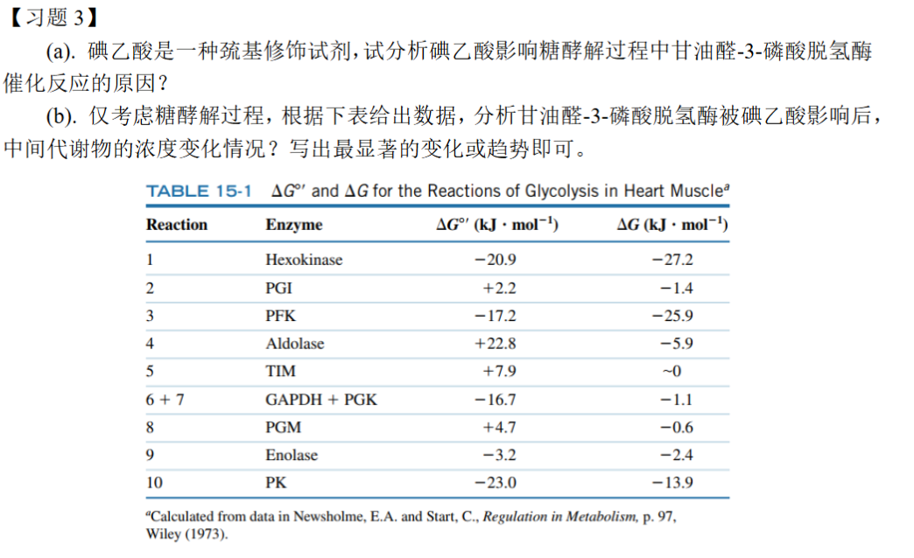
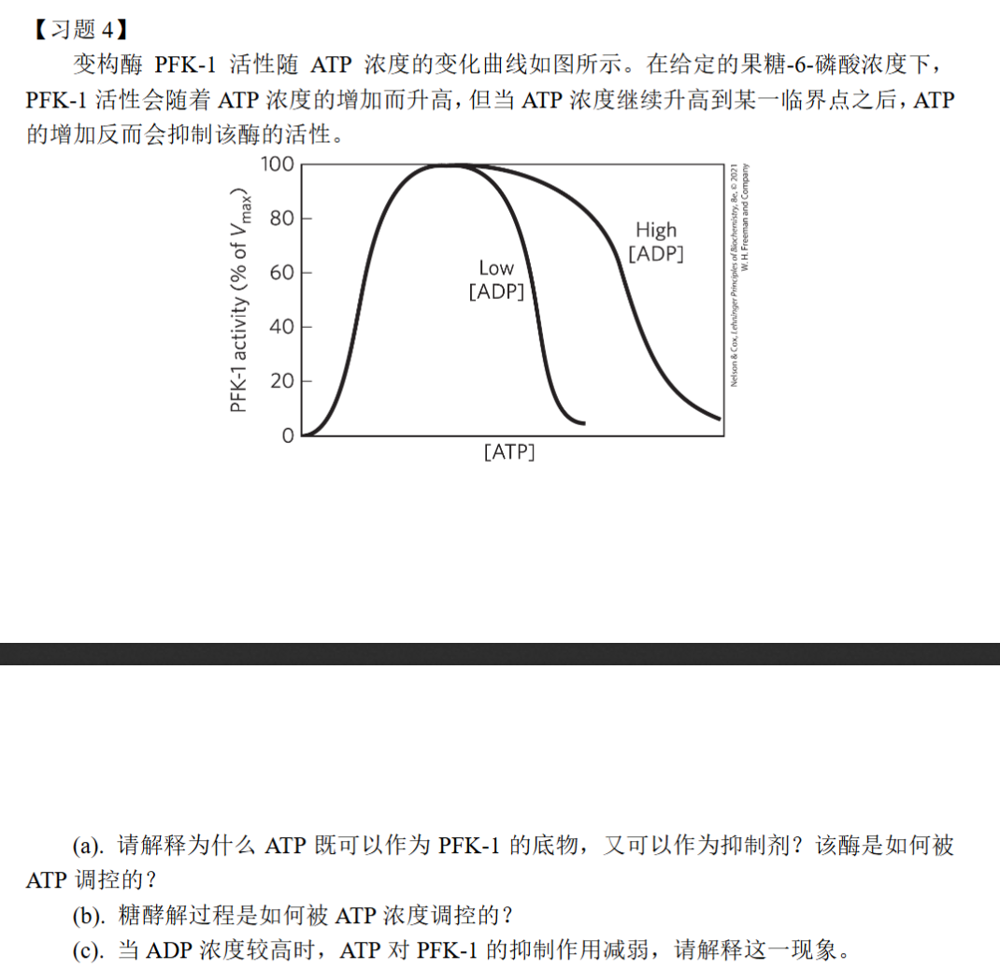
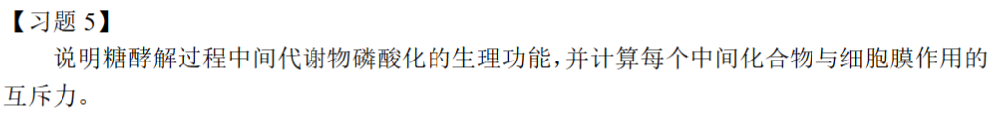

### 生物化学第二周作业

许呈睿 2023012946 探微化31

---

#### 习题一

---

#### 习题二

在 **1,3-二磷酸甘油酸 (1,3-Bisphosphoglycerate, 1,3-BPG)** 中可直接检测到 ³²P。

---

#### 习题三

a)醛氧化（放能）与酰基磷酸形成（吸能）通过**硫酯中间体耦联**，碘乙酸通过与甘油醛-3-磷酸脱氢酶 (GAPDH) **活性中心的关键半胱氨酸残基**发生不可逆反应，从而抑制该酶的活性。

b)当甘油醛-3-磷酸脱氢酶 (GAPDH) 的活性被抑制后，代谢流在该点被“截断”，会导致：

1. **上游产物显著积累** ：被抑制酶的**直接底物**以及上游的所有中间产物会因为无法被消耗而大量积累。最显著的变化是：

    **甘油醛-3-磷酸 (GAP)** 和与其处于平衡状态的 **二羟基丙酮磷酸 (DHAP)** 浓度会 **急剧上升** 。紧接着，**1,6-二磷酸果糖 (FBP)** 的浓度也会显著积累。

    2.**下游产物显著减少** ：被抑制酶的**产物**以及下游的所有中间产物会因为来源被切断而浓度下降。最显著的变化是：

    **1,3-二磷酸甘油酸 (1,3-BPG)** 的浓度会 **急剧下降** 。随后， **3-磷酸甘油酸 (3-PG)** 、**磷酸烯醇式丙酮酸 (PEP)** 直至最终产物 **丙酮酸 (Pyruvate)** 的浓度都会相继 **耗尽** 。

---

#### 习题四

a)对于这一步反应，PFK-1 是一种 **变构酶 (Allosteric Enzyme)** ，它上面有两个不同的 ATP 结合位点：活性位点 (Active Site) / 底物结合位点与别构位点 (Allosteric Site) / 调节位点，

    当 ATP 浓度较低时: ATP 会优先结合到高亲和力的活性位点上。此时，别构位点基本是空置的。随着 ATP 浓度增加，为反应提供了更多的底物，因此 PFK-1 的活性随之**升高** 。

    当 ATP 浓度高时 : 活性位点已经基本被 ATP 饱和。此时，过量的 ATP 就开始结合到**低亲和力的别构位点**上。一旦 ATP 结合到别构位点，就会抑制酶的活性，导致 PFK-1 的整体活性反而 **下降** 。

b)ATP 浓度通过**负反馈机制**来调节糖酵解
    当细胞能量充足 (ATP 浓度高) 时:高浓度的 ATP 会强烈抑制 PFK-1（以及丙酮酸激酶等其他关键酶）的活性,这导致整个糖酵解途径的速率 **减慢** 。
    当细胞能量匮乏 (ATP 浓度低) 时:低浓度的 ATP 对 PFK-1 的抑制作用很弱。同时，ATP 减少意味着 ADP 和 AMP 的浓度会升高，它们反而会**激活** PFK-1,这导致整个糖酵解途径的速率 **加快** 。

c)这种现象是由于 **ADP 与 ATP 在别构位点上的竞争**所导致的。 ADP 和 ATP 的分子结构非常相似，都可以与 PFK-1 的调节位点结合。当细胞内 ADP 浓度较高时（例如在剧烈运动时，ATP 被大量消耗为 ADP），ADP 就会与 ATP 竞争同一个 别构抑制位点 。由于 ADP 的大量存在，它会占据一部分别构位点，从而阻止了 ATP 与该位点的结合。因为结合上去的 ADP 不会引起抑制效应，所以 ATP 的整体抑制作用就被大大减弱了。

---

#### 习题五

1、磷酸基团带负电，细胞膜也带负电，相互排斥有助于代谢产物保留于胞内

    化学能可以被用来形成高能磷酸键实现能量暂存

    可以增加酶的催化效率和特异性，磷酸基团作为一个独特的结构“把手”，可以与酶活性位点中的氨基酸残基（如带正电的精氨酸、赖氨酸等）形成强大的离子键和氢键。

2、

| 步骤 | 中间化合物 (Intermediate)  | 磷酸基团数量 | 在生理pH下的大致净电荷 | 与细胞膜的相互作用      |
| ---- | -------------------------- | ------------ | ---------------------- | ----------------------- |
| 0    | 葡萄糖 (Glucose)           | 0            | 0                      | 弱 (需通过转运蛋白)     |
| 1    | 6-磷酸葡萄糖 (G6P)         | 1            | -2                     | 强互斥                  |
| 2    | 6-磷酸果糖 (F6P)           | 1            | -2                     | 强互斥                  |
| 3    | 1,6-二磷酸果糖 (FBP)       | 2            | -4                     | 极强互斥                |
| 4/5  | 甘油醛-3-磷酸 / DHAP       | 1            | -2                     | 强互斥                  |
| 6    | 1,3-二磷酸甘油酸 (1,3-BPG) | 2            | -4                     | 极强互斥                |
| 7    | 3-磷酸甘油酸 (3-PG)        | 1            | -3                     | 极强互斥 (羧基也带负电) |
| 8    | 2-磷酸甘油酸 (2-PG)        | 1            | -3                     | 极强互斥                |
| 9    | 磷酸烯醇式丙酮酸 (PEP)     | 1            | -3                     | 极强互斥                |
| 10   | 丙酮酸 (Pyruvate)          | 0            | -1                     | 中等互斥 (羧基带负电)   |
