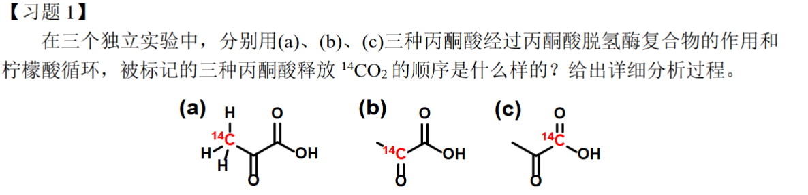
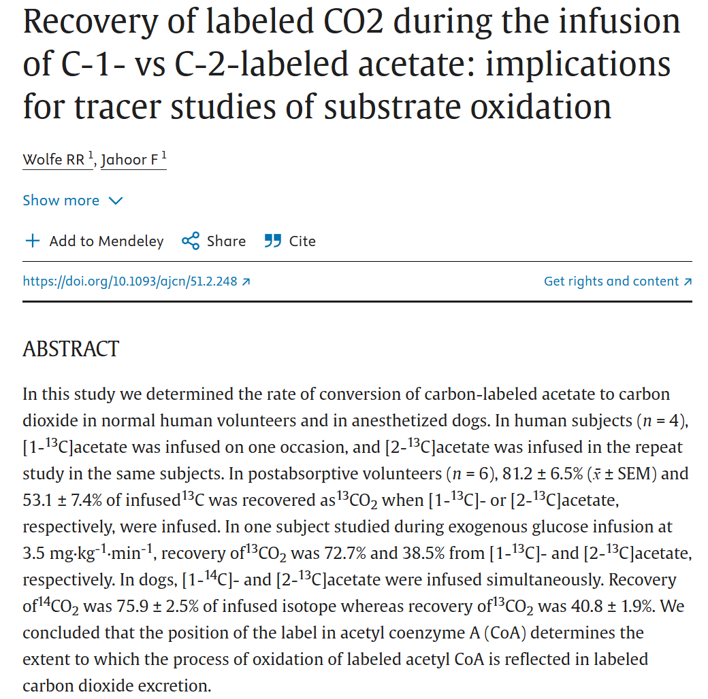
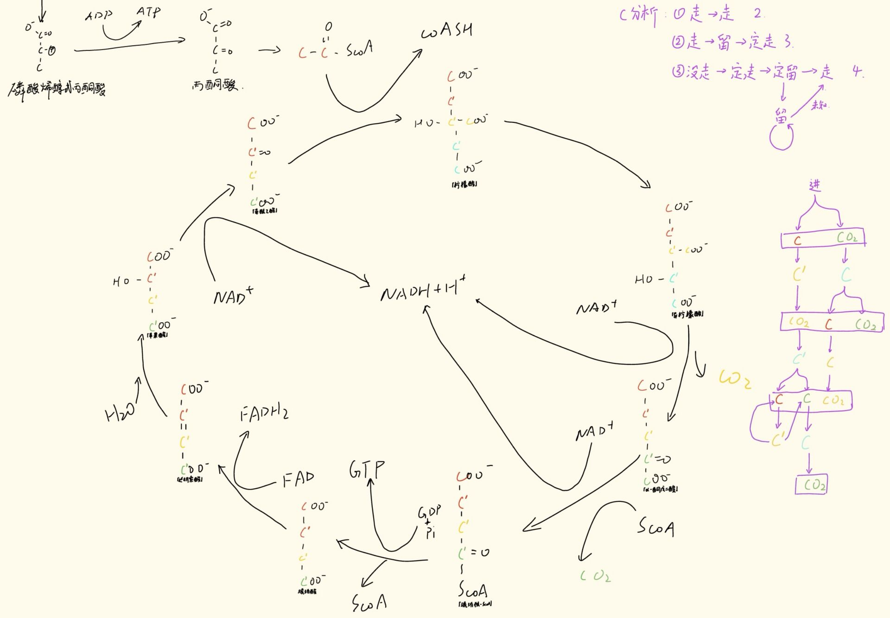
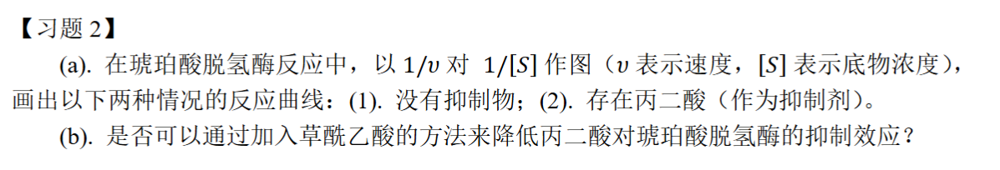
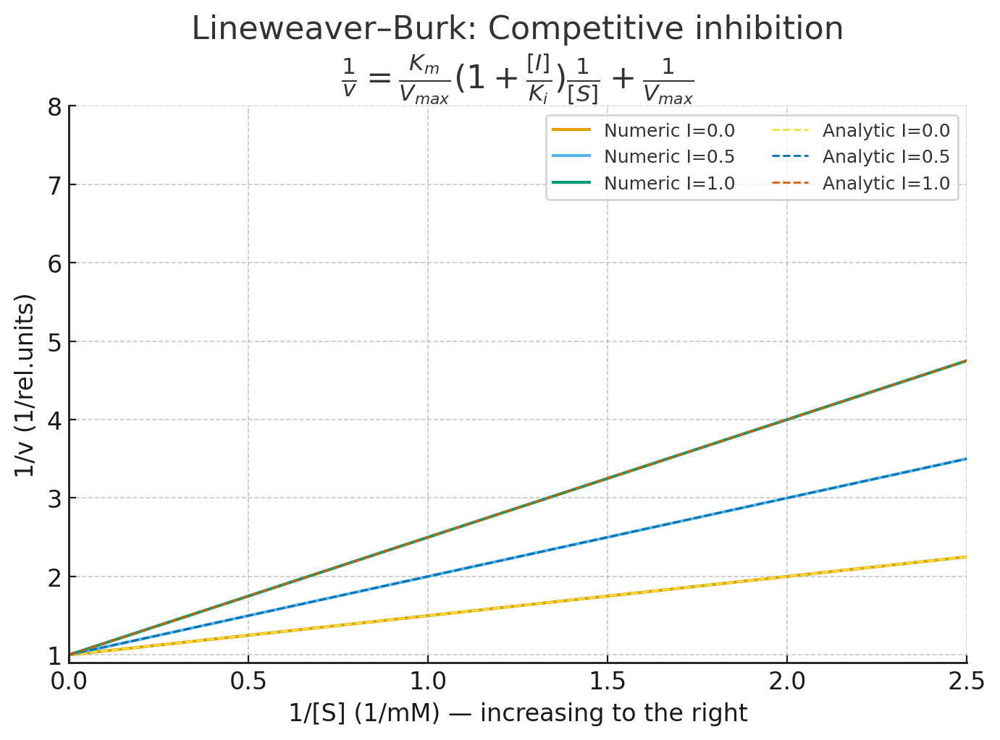
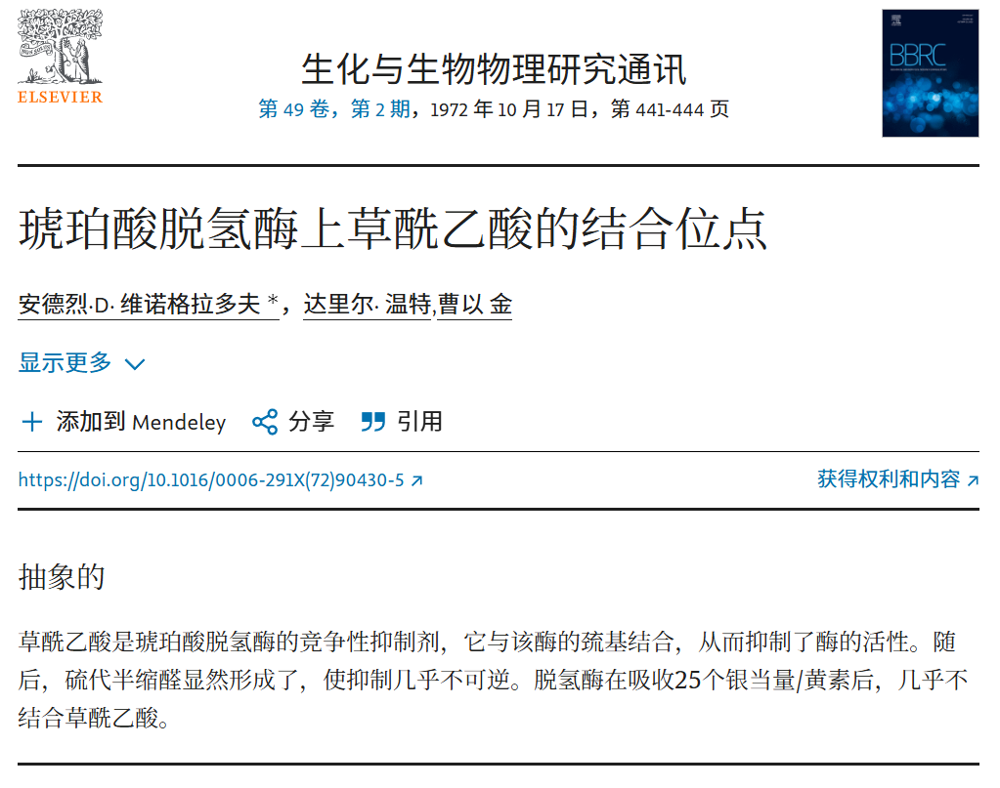
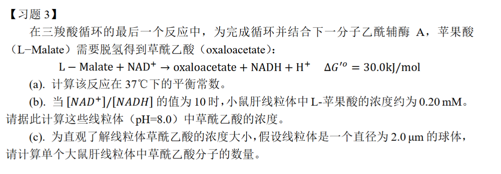

### 生物化学第四周作业

许呈睿 2023012946 探微化31

---

最先释放的是(c)，其在生成乙酰CoA的第一步脱羧反应即释放该羧基上的$CO_2$

但是（b）和（a）在第一轮循环中都是**作为乙酰辅酶A上的碳**进入反应，不会在第一轮氧化循环中被氧化为二氧化碳，个人认为的反应顺序如下，并通过查阅文献验证了我的猜测：

(b) （丙酮酸的酮碳 C-2 → **乙酰-CoA 的羰**基碳）——随后在柠檬酸循环的二周次中作为乙酰辅酶的羰基碳被氧化并以 CO₂ 回收； 比 (a) 更早 更高比例回收 （常见于第 2 周期或较早被检测到）。

(a) （丙酮酸的甲基 C-3 → **乙酰-CoA 的甲基碳**）——最慢释放为 CO₂，往往在更多次循环后才见到显著释放，且一部分标记可被转入其他代谢通路（因此在短时间内回收为 CO₂ 的比例最低）。

我的理解：

---

a)如图就是所求作的

$$
\frac{1}{v} = \frac{\alpha K_m + [S]}{V_{max}[S]}= \frac{\alpha K_m}{V_{max}}\cdot\frac{1}{[S]} + \frac{1}{V_{max}}.
$$

代回 ($\alpha = 1 + [I]/K_i$)：

$$
\boxed{\frac{1}{v} = \frac{K_m}{V_{max}}\Big(1+\frac{[I]}{K_i}\Big)\frac{1}{[S]} + \frac{1}{V_{max}}}
$$

竞争性抑制**改变斜率** ，**不改变纵截距** ($1/V_{max}$)。在 Lineweaver–Burk 图上，不同 [I] 的直线应在纵轴相交（相同 1/Vmax），而斜率随 [I] 增大而增大（直线更陡）。

b)一般不能，草酰乙酸本身也是对 SDH 的抑制因子，由动力学角度看，若两者都与底物（琥珀酸）竞争相同或重叠位点，加入另一种竞争性抑制剂不会降低已存在竞争抑制剂的效果。

---

已知反应：$\mathrm{L\text{-}Malate} + \mathrm{NAD}^+ \rightleftharpoons \mathrm{Oxaloacetate} + \mathrm{NADH} + \mathrm{H}^+$

(a) 平衡常数 (K)

$\Delta G^{\circ\prime}=-RT\ln K'$这里的 K' 为生化转化平衡常数

$$
K'=\exp\Big(-\frac{\Delta G^{\circ\prime}}{RT}\Big)=\exp\Big(-\frac{30000}{8.314\times310.15}\Big)\approx 8.86\times10^{-6}
$$

(b)

$$
K_{\text{chem}}=\frac{[\mathrm{OAA}][\mathrm{NADH}][\mathrm{H}^+]}{[\mathrm{Mal}][\mathrm{NAD}^+]}
$$

而生化转化常数 (K') 与 ($K_{\text{chem}}$) 的关系为

$$
K_{\text{chem}} = K'\times[H^+] _{\text{std}},
$$

其中按惯例生化标准 pH = 7 时把 ($[H^+]_ {\text{std}}=10^{-7}\ \mathrm{M}) $固定进去了。于是在真实 pH 条件下：

$$
[\mathrm{OAA}] = \frac{K_{\text{chem}}[\mathrm{Mal}][\mathrm{NAD}^+]}{[\mathrm{NADH}][H^+]}
$$

$$
=K'[\mathrm{Mal}]\frac{[\mathrm{NAD}^+]}{[\mathrm{NADH}]}\frac{[H^+]_{\text{std}}}{[H^+]}.
$$

]

代入数值：

$$
[\mathrm{OAA}]=8.857\times10^{-6}\times 2.0\times10^{-4}\times 10\times\frac{10^{-7}}{10^{-8}}\approx 1.77\times10^{-7}\ \mathrm{M}
$$

如果不对 pH 做修正,将得到小 10 倍的值 ≈1.77×10−8 M

(c)

球体体积：

$$
V=\tfrac{4}{3}\pi r^3,\quad r=\tfrac{2.0\ \mu\mathrm{m}}{2}=1.0\times10^{-6}\ \mathrm{m}.
$$

$$
V = \tfrac{4}{3}\pi (1.0\times10^{-6}\mathrm{m})^3
$$

$$
=4.18879\times10^{-15}\ \mathrm{L}.
$$

$$
分子数 = 浓度（mol·L⁻¹） × 体积（L） × (N_A)
$$

$$
[\mathrm{OAA}]=1.77\times10^{-7}\ \mathrm{M}：
$$

$$
N = 1.77\times10^{-7}\times 4.18879\times10^{-15}\times 6.022\times10^{23}\approx 4.47\times10^{2}.
$$

约  **447 个 OAA 分子 / 线粒体** （**若不做 pH 修正**则约为 45 个，差 10 倍）。
