## Biochemistry 2 笔记（第二讲）

课程信息

- 课程：BIOCHEMISTRY 2 / 生物化学2
- 教师：Li Chun（李春）教授，化学工程系，清华大学

目录

- 1 代谢导论回顾
- 2 热力学与氧化还原基础
- 3 电子载体与还原当量
- 4 代谢研究方法学
- 5 糖的种类、消化吸收与细胞摄取
- 6 糖酵解（Glycolysis）总览与发现史
- 7 糖酵解分步机制（10步）
- 8 糖酵解的调控（转运/酶/激素/能荷）
- 9 代谢旁路：磷酸戊糖途径（PPP）
- 10 丙酮酸的去向（有氧/无氧）
- 11 总结与要点回顾

---

### 1 代谢导论回顾

- 定义
  - Catabolism 分解代谢：营养物/细胞组分降解，回收、供能。
  - Anabolism 合成代谢：由简单组分生物合成复杂分子。
- 三阶段框架
  - 阶段1：大分子↔单体（多糖/脂质↔单糖/脂肪酸/甘油等）
  - 阶段2：单体↔更简单有机物
  - 阶段3：与无机物互转（CO2/H2O/NH3）
- 代谢途径特征
  - 连续性（产物即下一步底物）；多步离散；可调控；可进化。
- 区室化（Compartmentation）
  - 真核细胞代谢在特定细胞器中进行，需跨膜转运。
  - 意义：隔离竞争反应、优化微环境、提高局部浓度、储存产物、实现级联。
  - 应用：人工细胞器/蛋白质胶囊/液-液相分离/细菌微室等，促进合成、隔离旁路、提高产率。
- 课前小测：为什么葡萄糖完全氧化分解为ATP有32 与30分子ATP的区别（两种电子传递方式消耗的ATP不同）

---

### 2 热力学与氧化还原基础

- 吉布斯自由能
  - ΔG = ΔH − TΔS；ΔG = ΔG′° + RT ln(Q)
  - ΔG < 0 反应自发向正向；ΔG = 0 平衡；ΔG > 0 倾向逆向。
  - 标准生化条件：pH 7，25°C，1 atm，活度~1 M。
  - 关联：ΔG′° = −RT ln Keq
- “高能化合物”
  - 定义：水解ΔG′° < −25 kJ/mol（数值更负）。
  - 代表：PEP（磷酸烯醇式丙酮酸）、1,3-BPG（1,3-二磷酸甘油酸）、磷酸肌酸等。
  - 磷酸基转移电位排序驱动磷酸基自高能向低能流动（激酶催化）。
- 氧化还原与能量
  - Nernst 方程；还原电位 E′° 越正，受电子能力越强。
  - 关系式：ΔG′° = −nFΔE′°（n为转移电子数，F为法拉第常数）。

---

### 3 电子载体与还原当量

- 电子转移方式
  - 直接电子转移；氢原子转移（H·）；氢负离子（:H−）；与氧气结合。
  - **还原当量**（reducing equivalent）：常以NADH、FADH2、QH2或H−计。
- 通用载体
  - NAD+/NADH、NADP+/NADPH、FAD/FADH2。
  - NAD+ 接受氢负离子（:H−）还原为 NADH；烟酰胺环可逆还原。
- 代谢分工与池浓度
  - [NAD+]/[NADH] 高，利于氧化（分解代谢）；[NADPH]/[NADP+] 高，利于还原（合成代谢）。
  - NAD+ 多参与氧化/产能；NADPH 供还原力（脂肪酸/胆固醇合成、抗氧化等）。
- 氧化还原酶、脱氢酶

---

### 4 代谢研究方法学

- 标记追踪
  - 荧光探针、放射性同位素、稳定同位素（13C/15N）示踪代谢流。
- 扰动实验
  - 代谢抑制剂、遗传缺陷、基因编辑/过表达，观察通量与中间体变化（敲除某个基因观察过程）。
- 系统生物学
  - 转录组/DNA微阵列、代谢组/通量分析（13C MFA），整合网络建模。

---

### 5 糖的种类、消化吸收与细胞摄取

- 分类
  - 单糖：葡萄糖、果糖、半乳糖、核糖、2-脱氧核糖等；醛糖/酮糖；D-对映体为主。
  - 二糖：麦芽糖、蔗糖、乳糖；多糖：淀粉、糖原、纤维素。
- 消化与酶
  - 淀粉/糖原：α-淀粉酶切α-1,4键；麦芽糖/三糖：麦芽糖酶、α-葡萄糖苷酶；
    蔗糖：蔗糖酶（invertase）；乳糖：乳糖酶。
- 小肠吸收产物
  - 主要为葡萄糖/果糖/半乳糖，经门静脉入肝。
- 细胞摄取（GLUT家族）
  - GLUT1：广泛；GLUT2：肝/胰β细胞/肠；GLUT3：神经元；GLUT4：骨骼肌/心肌/脂肪，受胰岛素刺激转位；
    GLUT5：果糖转运。
  - 胰岛素激活受体酪氨酸激酶→GLUT4膜转位，促进摄糖。

---

### 6 糖酵解（Glycolysis）总览与发现史

- 定义与特征
- - 一分子葡萄糖转化为两分子丙酮酸，分为有氧和无氧。
  - 无需O2，胞质内进行；10步酶促，所有中间体均为磷酸化化合物。
  - 中心代谢通路，**进化上高度保守**；第一条被阐明的代谢途径之一。
- 发现史要点
  - Pasteur：发酵与酵母细胞相关；
  - Buchner：无细胞提取物可发酵（生化学诞生）；
  - Harden & Young：无细胞中的反应可以通过无机磷促进；中间体为磷酸化糖 果糖1,6-二磷酸 (Fructose 1,6-bisphosphate)；
  - Embden–Meyerhof–Parnas（EMP）途径建立。
- 葡萄糖的四大命运
  - 细胞外多糖（ECM/细胞壁）、储存（糖原/淀粉/蔗糖）、糖酵解供ATP/中间体、磷酸戊糖途径产R5P与NADPH。
- 重要生理
  - 脑（非饥饿）与红细胞主要依赖葡萄糖；RBC完全依赖糖酵解供能。
- 总览
  **十步反应 六种反应类型 所有的酶来自细胞质 所有中间产物都是磷酸化的**

---

### 7 糖酵解分步机制（10步）

总反应与产能

- 投资阶段（1–5步）：消耗2 ATP，将己糖活化并裂解为2个C3。
- 收获阶段（6–10步）：每个C3产1 NADH + 2 ATP；总体每葡萄糖净得 2 ATP + 2 NADH + 2 丙酮酸。
- 总反应（细胞质）：Glucose + 2 ADP + 2 Pi + 2 NAD+ → 2 Pyruvate + 2 ATP + 2 NADH + 2 H+ + 2 H2O

Stage 1 准备/己糖阶段

1) 己糖激酶 Hexokinase（±Mg2+）

   - 反应：Glucose → Glucose-6-P（消耗1 ATP）
   - 机制：诱导契合，排斥水（变为非极性环境）；Mg2+ 屏蔽ATP负电，利于C6-OH进攻γ-P。
   - 组织同工酶（结构不同反应功能相同）：Hexokinase I–III（低Km，受G6P抑制）；肝脏/胰岛：Glucokinase（IV，Km高，不受G6P抑制，诱导型
   - 意义：将葡萄糖“捕获”在细胞内（带负电难外流）。

   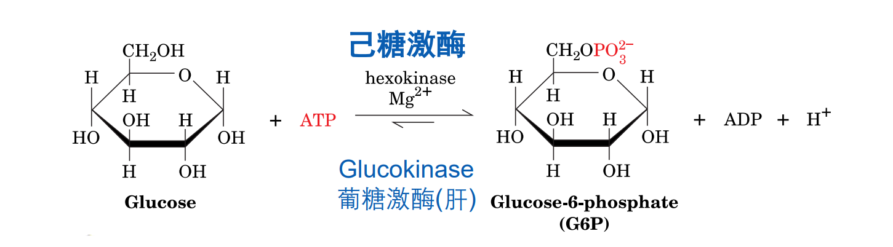
2) 磷酸己糖异构酶 Phosphoglucose isomerase

   - 反应：G6P（醛糖）↔ F6P（酮糖），经烯二醇中间体。

   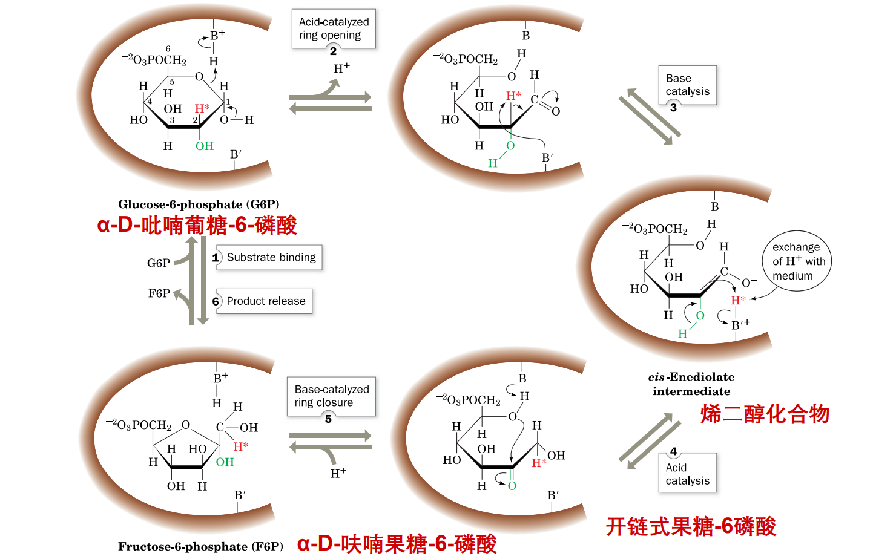
3) 磷酸果糖激酶-1 PFK-1（±Mg2+）

   - 反应：F6P → F1,6BP（消耗1 ATP），**强放能，不可逆（调节差->多途径->往往具有同工酶），限速/节律点**。
   - 调控：**ATP别构抑制**，AMP/ADP激活，柠檬酸抑制，F2,6BP强力激活（肝/心关键）。

   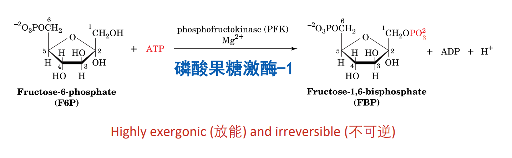
4) 醛缩酶 Aldolase

   - 反应：F1,6BP → GAP + DHAP（醇醛裂解）。

   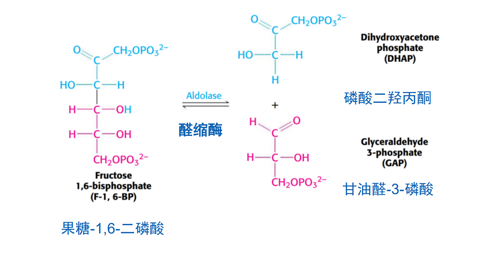
5) 丙糖磷酸异构酶 Triose phosphate isomerase（TPI）

   - 反应：DHAP ↔ GAP（经烯二醇中间体）。
   - 生化：平衡偏向DHAP（96%），但后续消耗GAP推动正向；TPI缺陷罕见且致死。
   - 酶：八个beta sheet 桶装结构

   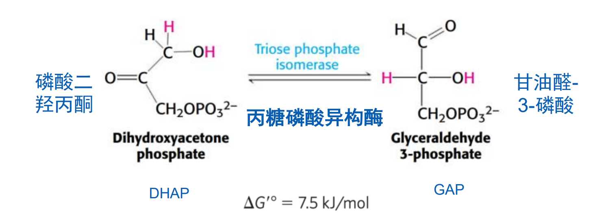

Stage 2 收获/三糖阶段
6) 甘油醛-3-P 脱氢酶 GAPDH

- 反应：GAP + Pi + NAD+ → 1,3-BPG + NADH + H+
- 耦联：**醛氧化（放能）与酰基磷酸形成（吸能）**通过硫酯中间体耦联（Cys活性位）。高磷酸转移电位

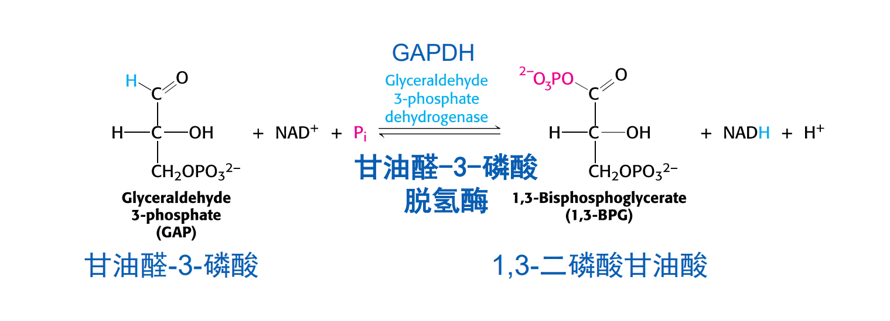

7) 磷酸甘油酸激酶 PGK（±Mg2+）

   - 反应：1,3-BPG + ADP → 3-PG + ATP（底物水平磷酸化，第一分ATP）。
   - 与第6步通量耦联，整体前向。**为什么要有第七步？**
     因为第六步只是把能量**储存**成了一种“高能化学键”的形式（在1,3-BPG中），而第七步才是真正把这种能量**转化**成细胞可以直接使用的ATP的步骤。没有第七步，第六步储存的能量就无法被利用，整个糖酵解的能量产出目标就无法实现。

   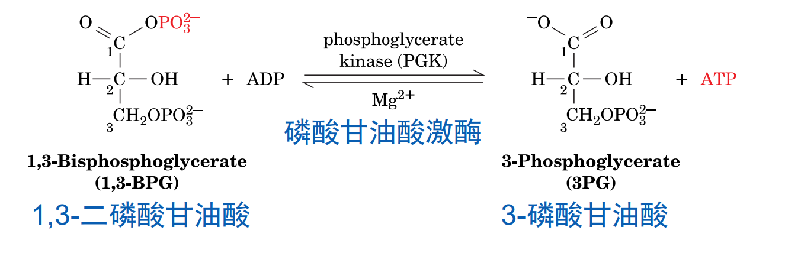
8) 磷酸甘油酸变位酶 PGM

   - 反应：3-PG ↔ 2-PG（酶His-P参与；“此磷非彼磷”）。

   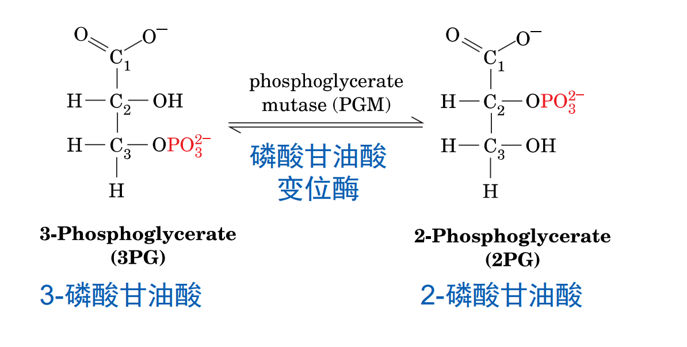
9) 烯醇化酶 Enolase

   - 反应：2-PG → PEP + H2O（脱水生成高能中间体）。

   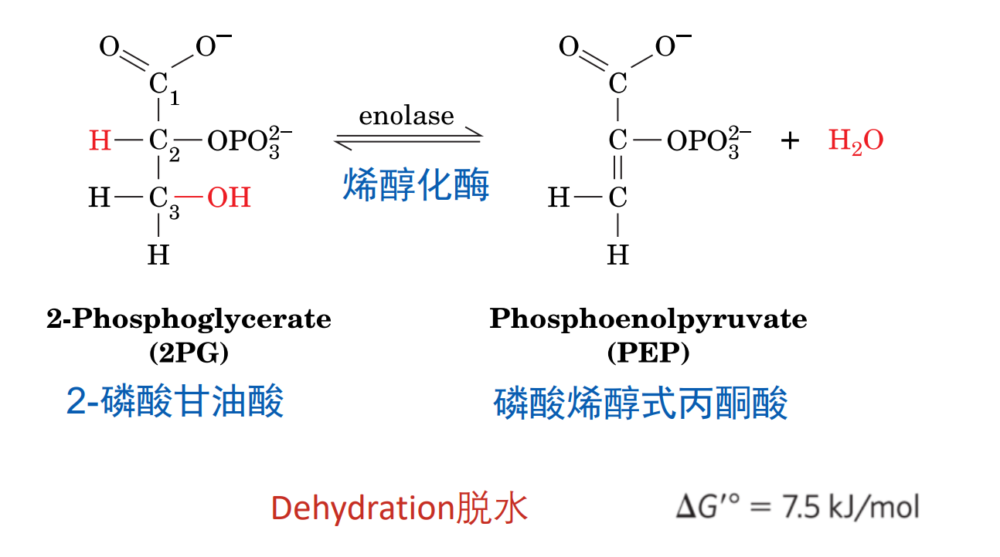
10) 丙酮酸激酶 Pyruvate kinase（±K+，±Mg2+）

- 反应：PEP + ADP → Pyruvate + ATP（**第二个底物水平磷酸化**）。
- 驱动力：PEP转移后产物烯醇式→酮式互变异构，强放能。
- 调控：F1,6BP前馈激活；ATP、丙氨酸抑制；肝脏受磷酸化/去磷酸化调控（胰高血糖素抑制）。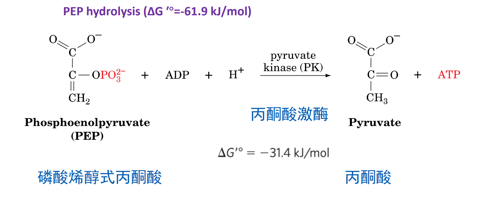

补充：癌代谢与PKM2

- 正常：PKM1高活四聚体；肿瘤：PKM2占主导，易为低活形式，利于代谢物堆积供生物合成（Warburg效应）。
- 小分子激活PKM2促成四聚体化，是潜在治疗策略。

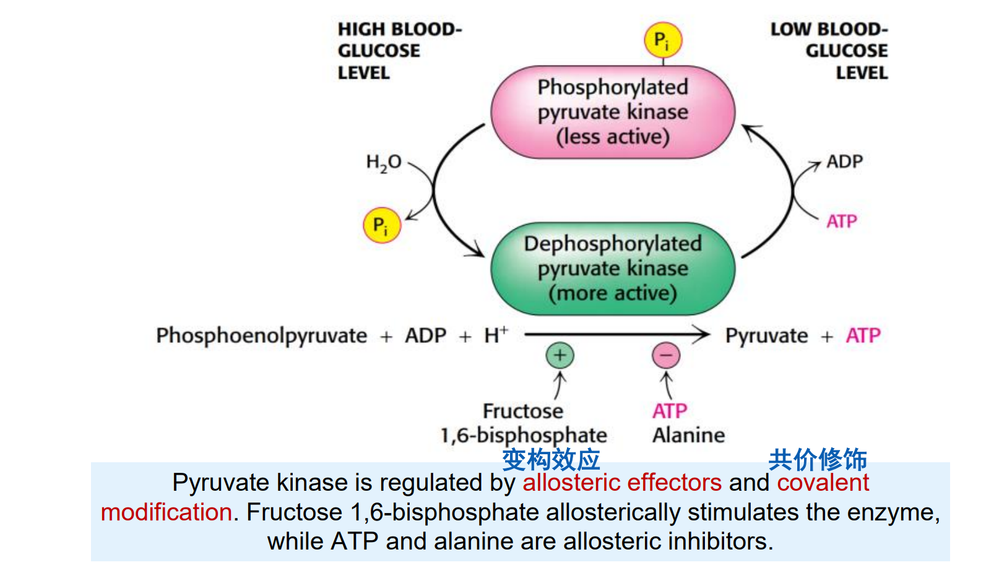

---

### 8 糖酵解的调控

层级与要点

- 膜转运：GLUT表达与转位（胰岛素↑GLUT4）；肝门静脉供糖波动由GLUT2缓冲。
- 酶学控制关键点（不可逆步）：HK/GK、PFK-1、PK。
- 细胞能荷：ATP/ADP/AMP；AMPK信号。
- 代谢物别构：柠檬酸（抑PFK-1）、F2,6BP（激PFK-1）、F1,6BP（激PK）。

  ### 核心思想

  首先，我们要明白一个核心问题：**细胞为什么需要调节糖酵解？**

  因为糖酵解是细胞获取能量的核心途径，但能量（ATP）的生产需要根据细胞的“贫富”状态来精确控制。


  * 当细胞能量**充足**时（ATP多），就应该**减慢**糖酵解，节省葡萄糖资源。
  * 当细胞能量**匮乏**时（ATP少），就应该**加速**糖酵解，快速产生ATP。

  这种调控主要发生在糖酵解途径中**三个不可逆的、释放能量较多的步骤**上。这三个步骤的催化酶就是图中标注的三个主角。

  ---

  ### 1. 己糖激酶 (Hexokinase) - 糖酵解的“入口”

  这是糖酵解的第一步，负责将进入细胞的葡萄糖“捕获”。

  * **调控方式** : **产物抑制 (Product Inhibition)**
  * **抑制物** : **6-磷酸葡萄糖 (Glucose 6-phosphate)**
  * **生物学逻辑** : 己糖激酶的产物是6-磷酸葡萄糖 (G6P)。如果G6P在细胞内开始 **积累** ，通常意味着下游的反应（比如第三步的PFK-1）变慢了，细胞暂时处理不了这么多的葡萄糖。这时，积累的G6P就会反过来抑制己糖激酶的活性，告诉它：“下游堵车了，先别放新的葡萄糖进来了！” 这是一种非常直接有效的负反馈调节。

  ### 2. 磷酸果糖激酶-1 (Phosphofructokinase-1, PFK-1) - 糖酵解的“总开关”

  这是糖酵解的第三步，也是整个途径中 **最重要、最核心的调控点** ，被称为“限速步骤”。一旦分子通过了这一步，它基本上就注定要完成整个糖酵解过程。

  * **调控方式** : **别构调节 (Allosteric Regulation)**
  * **抑制物** :
  * **ATP** : ATP是糖酵解的最终能量产物。当细胞内**ATP水平很高**时，说明能量供应充足。ATP会作为别构抑制剂结合到PFK-1上，降低其活性。逻辑是：“我们已经很有钱了，没必要再拼命赚钱了。”
  * **柠檬酸 (Citrate)** : 柠檬酸是下游**三羧酸循环 (Krebs Cycle)** 的第一个中间产物。如果柠檬酸积累，说明下游代谢途径也很饱和，有充足的能量和生物合成原料。柠檬酸会抑制PFK-1，相当于告诉糖酵解：“下游的生产线也满了，源头请减速。”
  * **激活物** :
  * **AMP** : AMP是ATP消耗后的产物，是细胞 **能量匮乏的强烈信号** 。当AMP水平升高时，它会作为别构激活剂，强力激活PFK-1的活性。逻辑是：“我们快没钱了，赶紧开足马力赚钱！”
  * **2,6-二磷酸果糖 (Fructose 2,6-bisphosphate)** : 这是 **最强的PFK-1激活剂** 。它本身不是糖酵解的中间产物，而是一个专门的 **信号分子** 。它的浓度受到胰岛素等激素的调控，可以将身体的整体血糖状况与细胞内的糖酵解速率联系起来。

  ### 3. 丙酮酸激酶 (Pyruvate Kinase) - 糖酵解的“出口”

  这是糖酵解的最后一步，负责产生丙酮酸和ATP。

  * **调控方式** : **别构调节**
  * **抑制物** :
  * **ATP** : 和PFK-1的逻辑一样，高浓度的ATP标志着能量充足，因此需要抑制这个最终产出ATP的步骤。
  * **激活物** :
  * **1,6-二磷酸果糖 (Fructose 1,6-bisphosphate, FBP)** : 这是上游PFK-1反应的 **产物** 。这种调节方式非常巧妙，叫做 **前馈激活 (Feed-forward activation)** 。当上游的总开关PFK-1被激活并大量生产FBP时，FBP会“提前通知”下游的终点站丙酮酸激酶：“注意，一大波产物正在路上，请做好准备，提高你的工作效率！” 这保证了整个代谢途径的流动顺畅，避免了中间产物的拥堵。

  ### 总结

  这张PPT告诉我们，糖酵解的调控是一个精密的网络，主要通过以下方式实现：

  1. **能量状态感知** : 细胞通过ATP和AMP的相对水平来感知自身的能量“贫富”，从而调节关键酶的活性。
  2. **上下游信息互通** : 通过产物抑制（如HK）、下游产物反馈抑制（如柠檬酸）和上游产物前馈激活（如FBP），确保整个代谢流的协调与顺畅。
  3. **与整体代谢关联** : 通过柠檬酸等分子，将糖酵解的速率与其他代谢途径（如三羧酸循环）联系起来。

  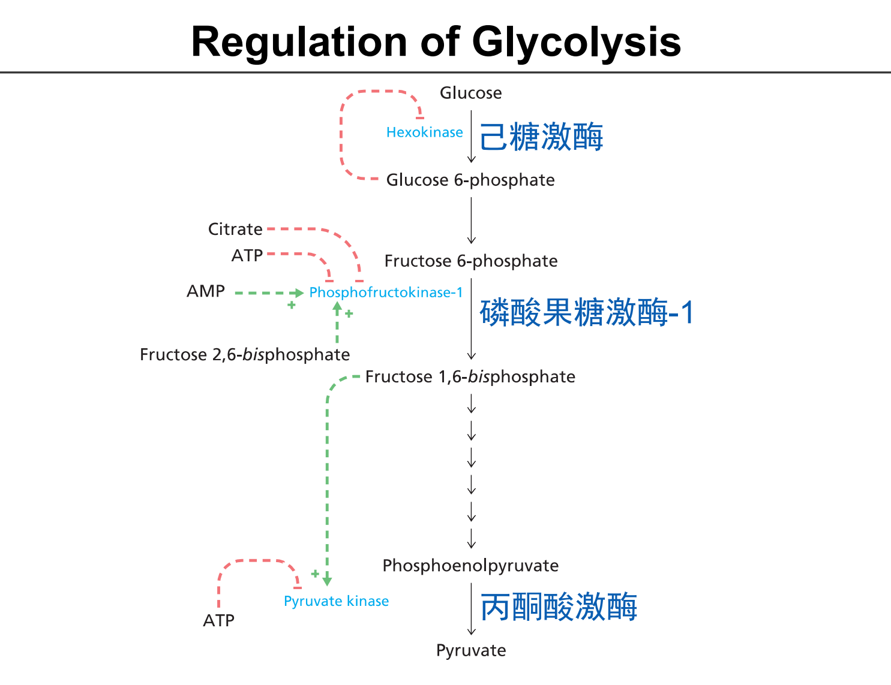
- 激素与共价修饰（肝脏）

  - 胰岛素：促糖酵解与合成代谢（↑PFK-2活性→↑F2,6BP→激活PFK-1；去磷酸化激活PK）。
  - 胰高血糖素/肾上腺素：抑糖酵解促糖异生（PK磷酸化失活；PFK-2/FBPase-2切换至FBPase-2）。
- 组织特异

  - 肌肉：满足即时能量需求（运动时AMP↑，PFK-1↑）；休息时ATP/柠檬酸抑制。
  - 肝脏：维持血糖稳态，优先调控GK、PFK-1、PK及F2,6BP水平。

总结：

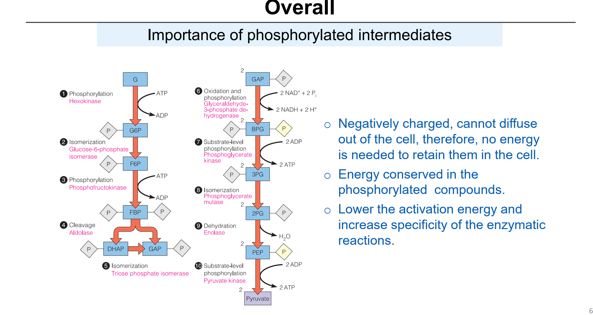

| 阶段                            | 步骤 | 反应物 → 产物                      | 酶 (缩写 / 中文名)          | 核心事件 / 记忆要点                                 |
| ------------------------------- | ---- | ----------------------------------- | --------------------------- | --------------------------------------------------- |
| 能量投资期``(消耗2 ATP)         | ①   | 葡萄糖 → 6-磷酸葡萄糖              | HK / 己糖激酶               | 第一次ATP投资；不可逆；将葡萄糖“捕获”在细胞内。   |
|                                 | ②   | 6-磷酸葡萄糖 → 6-磷酸果糖          | PGI / 磷酸葡糖异构酶        | 异构化；为了方便进行下一步的磷酸化。                |
|                                 | ③   | 6-磷酸果糖 → 1,6-二磷酸果糖        | PFK / 磷酸果糖激酶          | 第二次ATP投资；不可逆；糖酵解最关键的速率决定步骤。 |
|                                 | ④   | 1,6-二磷酸果糖 → 甘油醛-3-P + DHAP | ALD / 醛缩酶                | 裂解；一个六碳糖裂解为两个三碳糖。                  |
|                                 | ⑤   | DHAP → 甘油醛-3-磷酸 (GAP)         | TPI / 磷酸丙糖异构酶        | 异构化；确保所有产物都以GAP的形式进入下一阶段。     |
| 能量回收期``(产出4 ATP, 2 NADH) | ⑥   | GAP → 1,3-二磷酸甘油酸 (1,3-BPG)   | GAPDH / 甘油醛-3-磷酸脱氢酶 | 氧化并磷酸化；首次产生NADH；形成高能磷酸键。        |
|                                 | ⑦   | 1,3-BPG → 3-磷酸甘油酸 (3-PG)      | PGK / 磷酸甘油酸激酶        | 首次收获ATP；（底物水平磷酸化）。                   |
|                                 | ⑧   | 3-PG → 2-磷酸甘油酸 (2-PG)         | PGM / 磷酸甘油酸变位酶      | 分子内重排；为下一步形成高能键做准备。              |
|                                 | ⑨   | 2-PG → 磷酸烯醇式丙酮酸 (PEP)      | ENO / 烯醇化酶              | 脱水；形成能量极高的烯醇式磷酸键。                  |
|                                 | ⑩   | PEP → 丙酮酸 (Pyruvate)            | PK / 丙酮酸激酶             | 第二次收获ATP；不可逆；糖酵解的终点。               |

---

### 9 代谢旁路：磷酸戊糖途径（PPP）

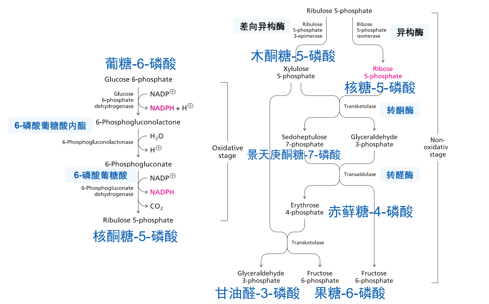

两相反应

- 氧化相（不可逆）：G6P → 6-磷酸葡糖酸内酯 → 6-磷酸葡糖酸 → Ribulose-5-P + 2 NADPH + CO2
  - 限速酶：G6PDH（葡萄糖-6-磷酸脱氢酶）；RBC中为唯一生成NADPH的反应。
- 非氧化相（可逆，碳骨架重排）：R5P、Xu5P、S7P、E4P 与 F6P、GAP 互转
  - 转酮酶（TPP依赖）、转醛酶实现C2/C3转移，连接糖酵解。

好的，这张PPT展示的是生物体内一个非常重要的代谢途径—— **磷酸戊糖途径 (Pentose Phosphate Pathway, PPP)** 。

这个途径与我们熟知的糖酵解并行存在，都发生在**细胞质**中。但它的主要目的 **不是为了产生ATP** ，而是为了实现两个核心功能。这张图清晰地将该途径分为了两个阶段，下面我将为您详细讲解。

---

#### 磷酸戊糖途径 (PPP) 的核心目的

在深入细节之前，请记住这个途径的 **两大战略目标** ：

1. **生成 NADPH (还原型烟酰胺腺嘌呤二核苷酸磷酸)** ：这是一种高能电子载体，是细胞内主要的**还原力**来源。它对于 **合成代谢** （如脂肪酸、胆固醇的合成）和 **抗氧化应激** （保护细胞免受活性氧损伤）至关重要。
2. **生成 核糖-5-磷酸 (Ribose-5-phosphate)** ：这是合成**核苷酸**的前体物质。而核苷酸是构成 **DNA、RNA、ATP、NADH** 等核心分子的基石。

---

#### 第一阶段：氧化阶段 (Oxidative stage) - 不可逆

这个阶段是**产生NADPH**的主要部分，是不可逆的。

* **起始物** :  **葡糖-6-磷酸 (Glucose-6-phosphate)** ，它也是糖酵解的中间产物。
* **第一步** : 这是整个途径的 **关键调控步骤** 。在**葡糖-6-磷酸脱氢酶 (G6PD)** 的催化下，葡糖-6-磷酸被氧化，同时将 NADP⁺ 还原为  **NADPH** 。这是本阶段产生的 **第一个NADPH** 。
* **第二步和第三步** : 经过水解和第二次氧化脱羧反应（由**6-磷酸葡萄糖酸脱氢酶**催化），再次将一个 NADP⁺ 还原为  **NADPH** ，并释放一分子  **CO₂** 。这是本阶段产生的 **第二个NADPH** 。
* **此阶段终点** :  **核酮糖-5-磷酸 (Ribulose-5-phosphate)** ，这是一个五碳糖。

**氧化阶段总结：**
每消耗一个六碳的葡糖-6-磷酸，细胞就获得了 **2个NADPH** 和一个五碳的核酮糖-5-磷酸。

---

#### 第二阶段：非氧化阶段 (Non-oxidative stage) - 可逆

这个阶段是一系列复杂的、可逆的**糖分子重组（碳骨架重排）**过程。它的主要任务是根据细胞的需求，灵活地转化五碳糖。

* **起始物** :  **核酮糖-5-磷酸 (Ribulose-5-phosphate)** 。
* **五碳糖的转化** :
* 通过 **异构酶 (Isomerase)** ，它可以转变为 **核糖-5-磷酸 (Ribose-5-phosphate)** ，直接用于合成DNA和RNA。
* 通过 **差向异构酶 (Epimerase)** ，它可以转变为 **木酮糖-5-磷酸 (Xylulose-5-phosphate)** ，用于后续的重组反应。
* **碳骨架重排** : 接下来，在**转酮酶 (Transketolase)** 和**转醛酶 (Transaldolase)** 的作用下，不同碳数的糖分子开始进行碳单元的“剪切和粘贴”，例如：
* C5 + C5 → C3 + C7
* C3 + C7 → C4 + C6
* C4 + C5 → C3 + C6
* **此阶段终点产物** : 经过一系列重排，最终可以生成多种产物，其中最重要的是**果糖-6-磷酸 (Fructose-6-phosphate)** 和  **甘油醛-3-磷酸 (Glyceraldehyde-3-phosphate)** 。

#### 总结与意义

这张图最重要的信息是展示了磷酸戊糖途径的**灵活性**和它与 **糖酵解途径的联系** 。

1. **与糖酵解的联系** ：非氧化阶段的终点产物（果糖-6-磷酸和甘油醛-3-磷酸） **本身就是糖酵解的中间产物** 。这意味着磷酸戊糖途径和糖酵解是紧密相连、可以相互转化的。
2. **途径的灵活性** ：细胞可以根据自身需求，灵活地调控这条途径的走向：

* **当细胞需要大量分裂，急需DNA/RNA时** : 细胞会优先将五碳糖转化为 **核糖-5-磷酸** 。
* **当细胞需要大量合成脂肪酸，急需NADPH时** : 细胞会完整地走完两个阶段。非氧化阶段生成的果糖-6-磷酸和甘油醛-3-磷酸可以重新变回葡糖-6-磷酸，再次进入氧化阶段，循环往复地 **最大化生产NADPH** 。
* **当细胞能量不足时** : 产生的果糖-6-磷酸和甘油醛-3-磷酸可以直接进入糖酵解途径，继续分解以 **产生ATP** 。

因此，磷酸戊糖途径是细胞代谢网络中一个至关重要的“枢纽”，它根据细胞是需要“建筑材料”（核糖）还是需要“还原电力”（NADPH），来智能地调配葡萄糖的去向。

生理与临床

- NADPH：脂肪酸/胆固醇合成、谷胱甘肽还原抗氧化、细胞色素P450。
- R5P：核苷酸/核酸合成。
- G6PDH缺乏：溶血性贫血（氧化应激触发：蚕豆、磺胺药、萘等）；全球~4亿人受影响。
- 区分NADH vs NADPH：前者偏分解代谢产能，后者偏合成代谢与抗氧化。

---

### 10 丙酮酸的去向（Fates of Pyruvate）

无氧条件（发酵）

- 乳酸发酵：Pyruvate + NADH ↔ Lactate + NAD+（乳酸脱氢酶，RBC/骨骼肌缺氧时）。
- 乙醇发酵（酵母/部分微生物）：
  - 丙酮酸脱羧酶（PDC，TPP依赖）→ 乙醛；乙醇脱氢酶（ADH）→ 乙醇（再生NAD+）。
  - 临床关联：TPP缺乏致脚气病/韦尼克-柯萨可夫综合征；ALDH缺乏（乙醛脱氢酶）致饮酒脸红；胎儿酒精综合征与乙醛毒性相关。
- 工业发酵：大规模生产酒精、有机酸、氨基酸等。

有氧条件（线粒体氧化）

- 丙酮酸脱氢酶复合体（PDH，TPP、FAD、NAD+、CoA、lipoate）：
  - Pyruvate → Acetyl-CoA + CO2 + NADH，进入柠檬酸循环与氧化磷酸化。
- 氧化产能差异（真核）：细胞质NADH入线粒体通过穿梭（苹果酸-天冬氨酸穿梭 2.5 ATP/NADH；甘油-3-磷酸穿梭 ~1.5 ATP/NADH）。

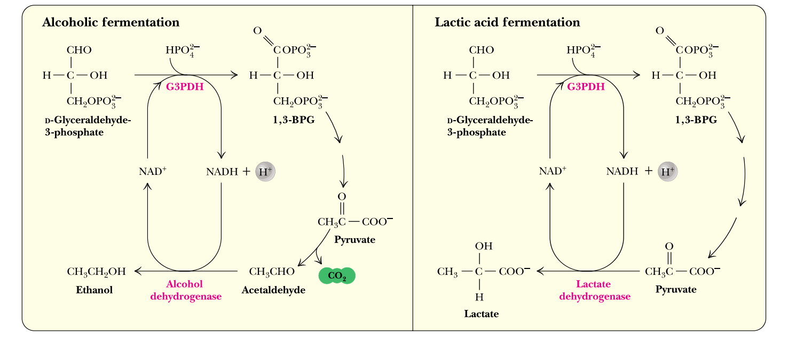

---

### 11 其他单糖进入糖酵解（Feeder pathways）

- 果糖：肝脏果糖激酶 → F1P → 醛缩酶B → DHAP/Glyceraldehyde → GAP；肌肉由HK直接→F6P。
- 半乳糖：Leloir途径（Gal → Gal-1P → UDP-Gal ↔ UDP-Glc → Glc-1P → Glc-6P）。
- 甘露糖：Man → Man-6P（HK）→ Fru-6P（磷酸甘露糖异构酶）。
- 应用：糖果工业用转化酶（invertase）水解蔗糖为葡萄糖+果糖，提升甜度与抗结晶。

---

### 12 Moonlighting（兼职）功能举例

- 糖酵解酶除催化外具调控/结构/信号功能。
- PKM2二聚体可入核调控转录因子（HIF-1α、STAT3），促进肿瘤相关基因表达；去磷酸化后四聚体化提高催化活性。

---

### 13 总结与要点回顾

- 糖酵解在胞质进行，将葡萄糖氧化为2丙酮酸，净得2 ATP与2 NADH；10个中间体均为磷酸化C3/C6化合物。
- 不可逆调控步：HK/GK、PFK-1、PK；PFK-1受F2,6BP强力激活是肝/心调控核心。
- 无氧条件下，丙酮酸在酵母→乙醇+CO2，在动物组织→乳酸；两者均再生NAD+维持糖酵解。
- PPP提供NADPH与R5P；G6PDH缺乏致溶血，临床常见。
- NADH偏产能，NADPH偏合成/抗氧化；细胞内池比例决定代谢方向。
- 代谢受多层调控：转运、别构、共价修饰、能荷、激素与组织特异性。

参考思考

- **为什么细胞把中间体全部磷酸化？（保留于胞内、能量暂存、提高酶的专一性/降低活化能）**
- 何以PEP具有极高转移电位？（烯醇→酮式互变提供额外驱动力）
- 肿瘤细胞为何偏好有氧糖酵解（Warburg效应）？（生物合成前体与NADPH需求）

下节预告

- 柠檬酸循环（TCA）与与糖酵解/脂代谢/氨基酸代谢的耦联。

---

## Biochemistry 2 笔记（第三讲）

**课程信息**

* **课程** ：BIOCHEMISTRY 2 / 生物化学2
* **教师** ：Li Chun（李春）教授，化学工程系，清华大学
* **主题** ：柠檬酸循环 (Citric Acid Cycle) / 三羧酸循环 (TCA Cycle) / Krebs Cycle

---

### **引言：从糖酵解到细胞呼吸**

糖酵解 (Glycolysis) 在细胞质中将一分子葡萄糖分解为两分子丙酮酸 (Pyruvate)，并产生少量的ATP和NADH。在有氧条件下，细胞呼吸 (Cellular Respiration) 会将丙酮酸彻底氧化为 **C**O**2** 和 **H**2O，释放大量能量。柠檬酸循环是细胞呼吸的核心，是连接三大营养物质（糖、脂肪、蛋白质）分解代谢的中心枢纽。

细胞呼吸通常分为三个主要阶段：

1. **乙酰辅酶A的生成** ：丙酮酸被氧化脱羧，生成乙酰辅酶A (Acetyl-CoA)。
2. **乙酰辅酶A的氧化** ：乙酰辅酶A进入柠檬酸循环，其乙酰基被彻底氧化为 **C**O**2**，能量以NADH和**F**A**D**H**2**的形式被捕获。
3. **电子传递与氧化磷酸化** ：NADH和**F**A**D**H**2**将高能电子传递给电子传递链，最终生成大量ATP。

---

### **1. 柠檬酸循环（TCA循环）概述**

* **定义** ：柠檬酸循环是一系列在**线粒体基质**中发生的酶促反应，它彻底氧化乙酰CoA中的乙酰基，产生 **C**O**2**、GTP/ATP以及大量的还原当量 (NADH, **F**A**D**H**2**)。
* **发生部位** ：
* **真核细胞** ：绝大多数反应发生在线粒体基质 (Mitochondrial Matrix) 中。
* **例外** ：**琥珀酸脱氢酶 (Succinate Dehydrogenase)** 是一个例外，它镶嵌在线粒体内膜上，同时也是电子传递链的复合物II。
* **核心功能** ：
* **分解代谢 (Catabolism)** ：作为所有产能营养素（糖类、脂肪酸、氨基酸）分解代谢的共同通路。
* **合成代谢 (Anabolism)** ：为生物合成（如氨基酸、血红素、葡萄糖）提供前体物质，是名副其实的“代谢十字路口”。
* **循环载体** ：草酰乙酸 (Oxaloacetate, OAA) 在循环的第一步与乙酰CoA缩合，并在最后一步被再生，理论上一分子OAA可以催化无数分子乙酰CoA的氧化。

---

### **2. 乙酰CoA的生成：连接糖酵解与TCA循环的桥梁**

#### **2.1 丙酮酸进入线粒体**

糖酵解产生的丙酮酸通过线粒体外膜的孔道，再由内膜上的**线粒体丙酮酸载体 (Mitochondrial Pyruvate Carrier, MPC)** 主动转运进入线粒体基质。

#### **2.2 丙酮酸脱氢酶复合体 (PDH Complex)**

在线粒体基质中，丙酮酸被一个巨大的多酶复合体——**丙酮酸脱氢酶复合体 (PDH)** 催化，发生 **氧化脱羧反应** ，生成乙酰CoA。 **此反应不可逆** ，是决定丙酮酸命运的关键一步。

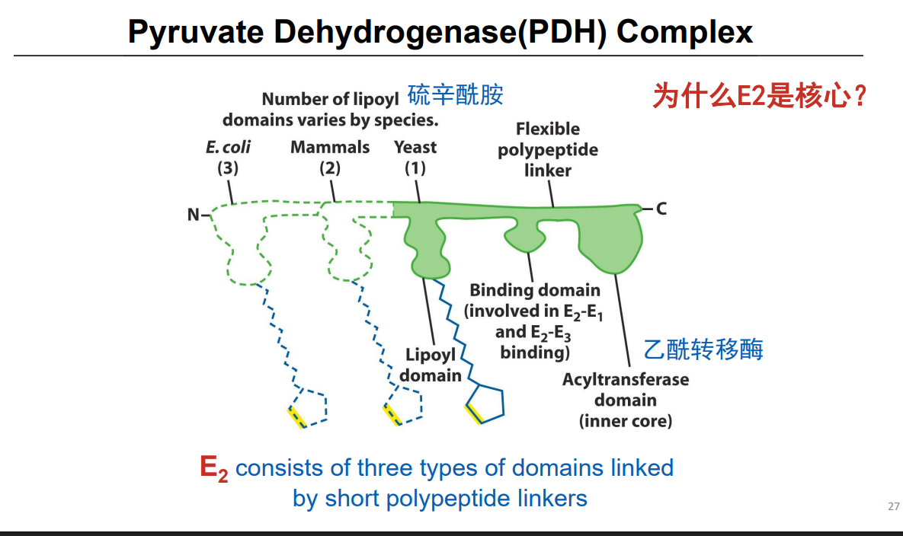

* **总反应** :
  **Pyruvate**+**CoA-SH**+**NAD**+**→**Acetyl-CoA**+**CO**2+**NADH**+**H**+**
* **复合体构成** :
* **E1 - 丙酮酸脱氢酶 (Pyruvate Dehydrogenase)** ：核心催化脱羧反应。
* **E2 - 二氢硫辛酰胺乙酰转移酶 (Dihydrolipoyl Transacetylase)** ：构成复合体的核心骨架，负责转移乙酰基。
* **E3 - 二氢硫辛酰胺脱氢酶 (Dihydrolipoyl Dehydrogenase)** ：负责再生氧化型的辅酶。
* **五种辅酶/辅基** :

1. **焦磷酸硫胺素 (TPP)** ：结合在E1上，负责脱羧。
2. **硫辛酸/硫辛酰胺 (Lipoic Acid/Lipoamide)** ：以酰胺键共价连接在E2的赖氨酸残基上，形成一个长的“摇臂”，负责传递乙酰基和电子。
3. **黄素腺嘌呤二核苷酸 (FAD)** ：紧密结合在E3上，接受电子。
4. **辅酶A (CoA)** ：作为乙酰基的载体。
5. **烟酰胺腺嘌呤二核苷酸 (**N**A**D+) ：最终的电子受体。

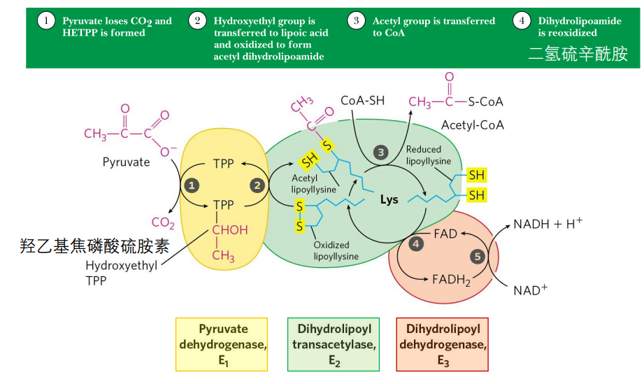

 **催化步骤** ：

1. **脱羧 (Decarboxylation)** ：丙酮酸进入E1的活性位点，在其辅酶TPP（焦磷酸硫胺素）的帮助下，脱去一个羧基，释放出一分子 **C**O**2**。剩下的两碳片段形成“羟乙基-TPP”中间体。

   
2. **氧化与转移 (Oxidation & Transfer)** ：羟乙基被从E1转移到E2的辅酶——硫辛酰胺（Lipoamide）的长臂上。在这个过程中，羟乙基被氧化成乙酰基，同时硫辛酰胺被还原成二氢硫辛酰胺。这个长臂就像一个起重机，在不同酶的活性位点间摆动。

   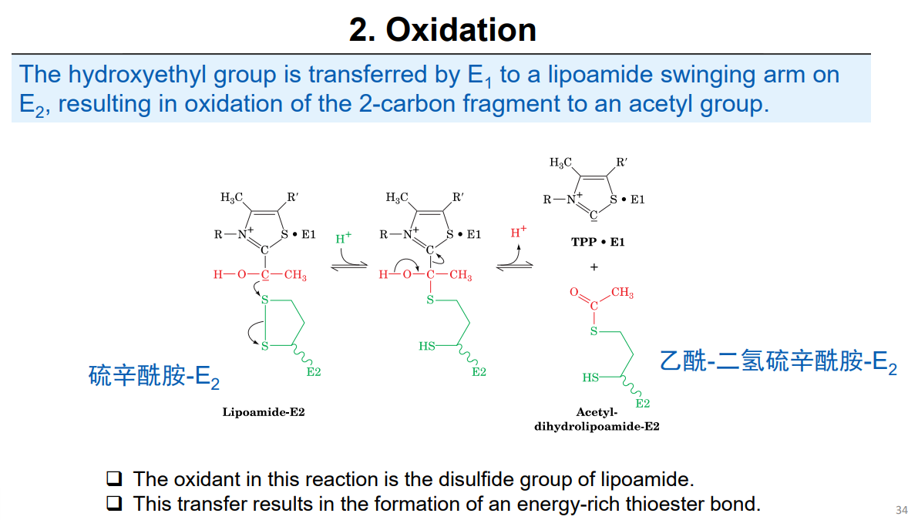
3. **乙酰辅酶A的形成 (Acetyl-CoA Formation)** ：E2催化，将乙酰基从二氢硫辛酰胺臂上转移给辅酶A (CoA-SH)，形成最终产物 **乙酰辅酶A (Acetyl-CoA)** 。乙酰辅酶A会离开复合体，进入柠檬酸循环。

   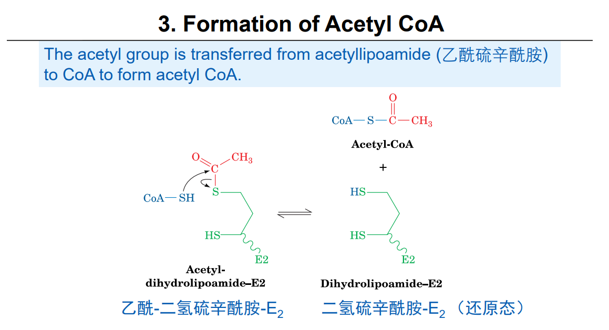
4. **E2辅酶的再生 (Reoxidation of Lipoamide)** ：携带两个氢原子的二氢硫辛酰胺臂必须被重新氧化，才能参与下一轮反应。它将氢和电子传递给E3酶上的辅基FAD，使其还原为**F**A**D**H**2**，自身则恢复为氧化态。

   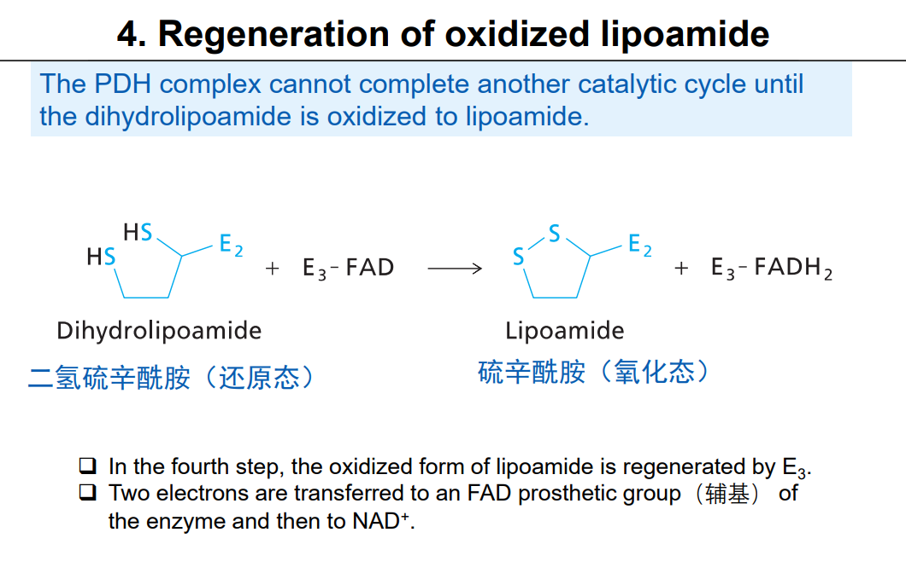
5. **E3辅酶的再生与NADH的生成 (Regeneration of FAD and Formation of NADH)** ：最后，E3上的**F**A**D**H**2**将电子传递给**N**A**D**+，生成**NADH**和**H**+，同时FAD被重新氧化，使整个复合体恢复到初始状态，准备催化下一个丙酮酸分子。

   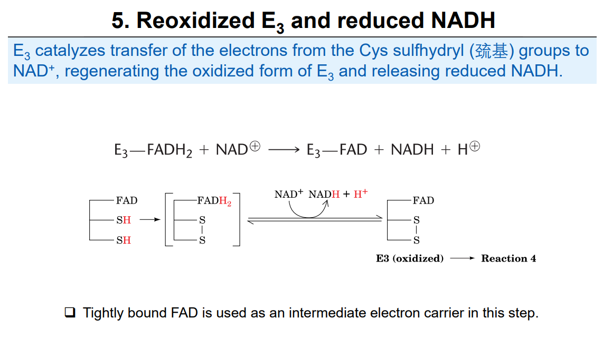

 **小结** ：PDH复合体通过这种高效的流水线作业，完成了丙酮酸的氧化脱羧，其产物——**乙酰CoA**和 **NADH** ——都是高能分子。

#### **2.3 乙酰CoA：高能硫酯化合物**

乙酰CoA的乙酰基通过一个**硫酯键 (Thioester Bond)** 与辅酶A连接。由于硫酯键缺乏共振稳定性，其水解的吉布斯自由能变 (**Δ**G′**∘**≈−**31.5** kJ/mol) 比ATP水解更为负，是一种高能化合物，为后续柠檬酸的合成提供了强大的化学驱动力。

#### **2.4 临床关联：砷中毒 (Arsenic Poisoning)**

砷化物（如亚砷酸盐）可以与含有**硫辛酰胺**的酶（如PDH复合体和α-酮戊二酸脱氢酶复合体）中的巯基发生高亲和力的结合，形成稳定的二配位加合物，从而不可逆地抑制这些酶的活性，阻断细胞呼吸和能量產生，導致嚴重中毒。

---

### **3. 柠檬酸循环八步反应机制**

关于柠檬酸循环（Citric Acid Cycle）的一些关键事实总结：

* 四碳化合物**草酰乙酸 (oxaloacetate)** 在氧化过程中充当“载体”。
* 在柠檬酸循环第一步中消耗的草酰乙酸，会在循环的最后一步被再生出来。
* 在第一轮氧化循环中，以两分子 **C**O**2** 形式释放的两个碳原子，**并非**來自剛剛進入循環的乙酰輔酶A (acetyl-CoA)。
* 循環中釋放的8個電子由3個NAD+和1個FAD分子收集。
* 每一輪循環通過**底物水平磷酸化 (substrate-level phosphorylation)** 產生一分子的ATP（或GTP）。

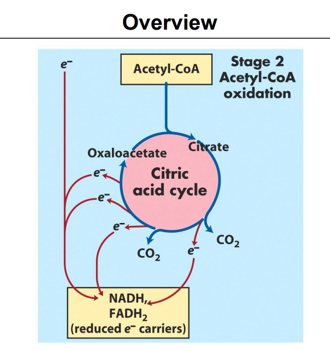

1. **缩合反应 (Condensation)**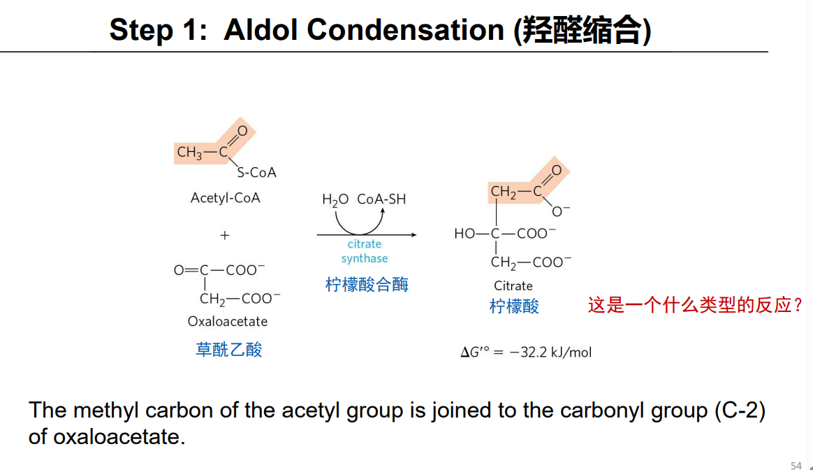

   * **反应** : 乙酰CoA + 草酰乙酸 → 柠檬酸 + CoA-SH
   * **酶** : **柠檬酸合酶 (Citrate Synthase)**
   * **要点** : 这是一个由高能硫酯键水解放能驱动的羟醛缩合反应， **高度放能加速同调召唤且不可逆** 。酶采用“诱导契合”机制，先结合草酰乙酸，开放构象改变闭合后再结合乙酰CoA，防止乙酰CoA被无效水解。
2. **异构化 (Isomerization)**

   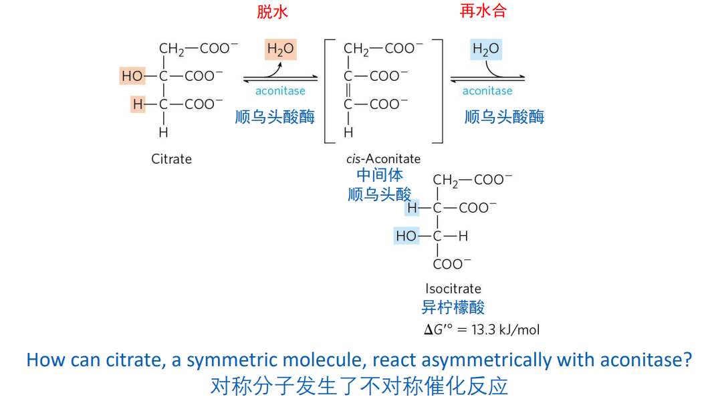

   * **反应** : 柠檬酸 ↔ 异柠檬酸
   * **酶** : **顺乌头酸酶 (Aconitase)**
   * **要点** : 通过脱水和再水合两步反应，将叔醇（柠檬酸）转化为更易于氧化的仲醇（异柠檬酸）。柠檬酸是一个对称分子，但酶通过“ **三点附着** ”的方式使其发生不对称催化。该酶含有一个铁硫簇，并被 **氟乙酸** （在体内转化为氟柠檬酸）强烈抑制。
3. **第一次氧化脱羧 (Oxidative Decarboxylation)**

   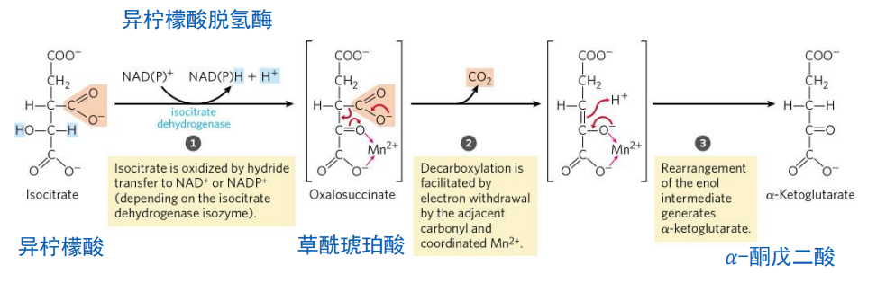

   * **反应** : 异柠檬酸 + **N**A**D**+ → α-酮戊二酸 + **C**O**2** + NADH
   * **酶** : **异柠檬酸脱氢酶 (Isocitrate Dehydrogenase)**
   * **要点** : 循环中 **第一个產生NADH和**C**O**2的步驟，是關鍵的**速率調節步驟** 。
4. **第二次氧化脱羧 (Oxidative Decarboxylation)**
   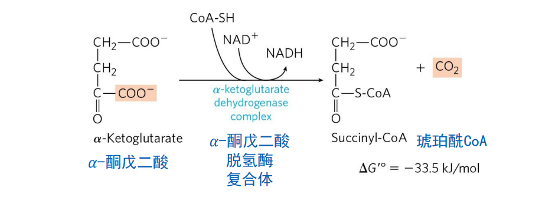

   * **反应** : α-酮戊二酸 + **N**A**D**+ + CoA-SH → 琥珀酰CoA + **C**O**2** + NADH
   * **酶** : **α-酮戊二酸脱氢酶复合体 (α-Ketoglutarate Dehydrogenase Complex)**
   * **要点** : 机制、结构和所需辅酶均与 **PDH复合体高度相似** ，也是一个关键的 **不可逆调控点** 。反应生成另一个高能硫酯化合物——琥珀酰CoA。
5. **底物水平磷酸化 (Substrate-Level Phosphorylation)**

   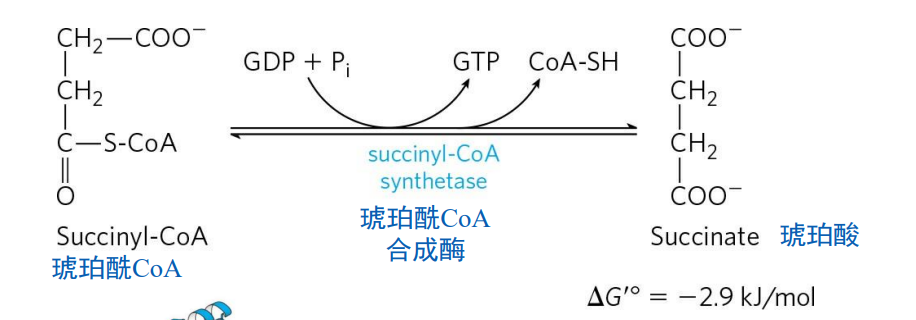

   * **反应** : 琥珀酰CoA + GDP/ADP + Pi → 琥珀酸 + GTP/ATP + CoA-SH
   * **酶** : **琥珀酰CoA合成酶 (Succinyl-CoA Synthetase)**
   * **要点** : 利用琥珀酰CoA的高能硫酯键断裂释放的能量，直接合成GTP（主要在动物）或ATP（在植物和细菌中），这是TCA循环中**唯一一次直接產生高能磷酸鍵**的反應。
6. **脱氢 (Dehydrogenation)**

   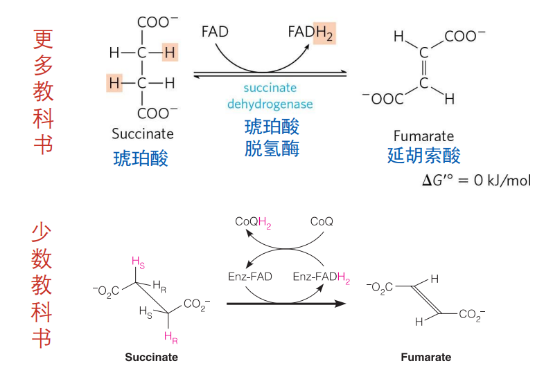

   * **反应** : 琥珀酸 + FAD → 延胡索酸 + **F**A**D**H**2**
   * **酶** : **琥珀酸脱氢酶 (Succinate Dehydrogenase)**
   * **要点** : 循环中 **唯一的膜结合酶** ，直接将电子传递给电子传递链中的辅酶Q (生成**Q**H**2**)。因此，教科书中有时也将产物写作**Q**H**2**而非**F**A**D**H**2**，后者是酶的辅基。
7. **水合 (Hydration)**

   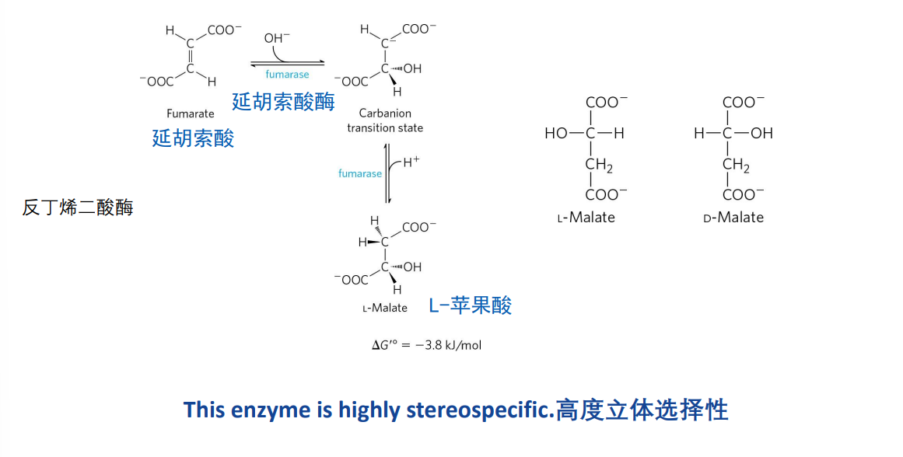

   * **反应** : 延胡索酸 + **H**2O → L-苹果酸
   * **酶** : **延胡索酸酶 (Fumarase)**
   * **要点** : 高度立体专一性，只作用于反式的延胡索酸生成L-苹果酸。
8. **脱氢 (Dehydrogenation)**

   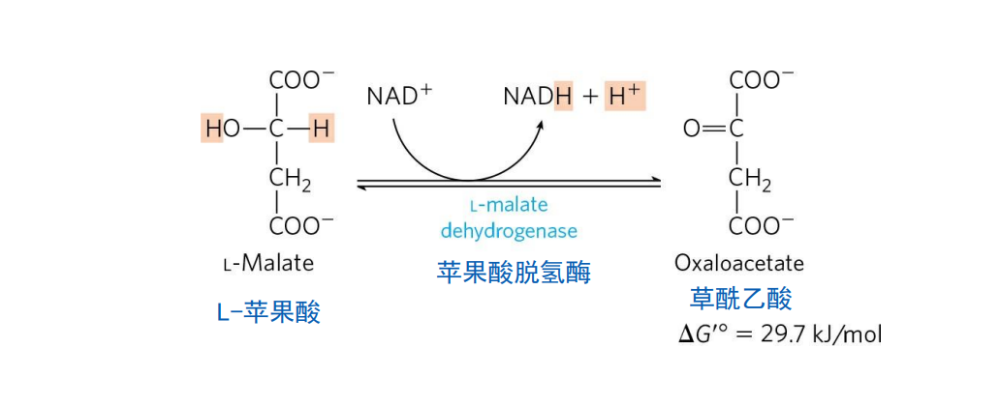

   * **反应** : L-苹果酸 + **N**A**D**+ → 草酰乙酸 + NADH
   * **酶** : **苹果酸脱氢酶 (Malate Dehydrogenase)**
   * **要点** : 此反应的标准自由能变为正，平衡偏向苹果酸。但在细胞内，由于草酰乙酸在第一步反应中被柠檬酸合酶不断消耗，其浓度极低，从而 **拉动反应持续向右进行** ，完成循环。

---

### **4. 能量收支与调控**

#### **4.1 能量收支**

每循环一轮（氧化一分子乙酰CoA）：

* **产出** :
* **2** 分子 **C**O**2**
* **3** 分子 NADH
* **1** 分子 **F**A**D**H**2**
* **1** 分子 GTP (或 ATP)
* **ATP当量** : 在氧化磷酸化中，每分子NADH约产生**2.5**个ATP，每分子**F**A**D**H**2**约产生**1.5**个ATP。因此，一轮TCA循环总共产生约 **10** 个ATP。
* **每分子葡萄糖** : 经糖酵解、PDH反应和两轮TCA循环，一分子葡萄糖完全氧化大约产生 **30-32** 个ATP。

#### **4.2 循环的调控**

TCA循环的速率主要受细胞的**能量状态**调控，调控点集中在三个**不可逆**的放能步骤：

1. **丙酮酸脱氢酶复合体 (PDH)**
2. **柠檬酸合酶 (Citrate Synthase)**
3. **异柠檬酸脱氢酶 (Isocitrate Dehydrogenase)**
4. **α-酮戊二酸脱氢酶复合体 (α-Ketoglutarate Dehydrogenase Complex)**

* **抑制信号 (能量充足)** ：
* 高水平的 **ATP**
* 高水平的 **NADH** (产物抑制)
* 下游产物反馈抑制 (如 **柠檬酸** 、 **琥珀酰CoA** )
* **激活信号 (能量需求)** ：
* 高水平的 **ADP** (能量低的信号)
* **C**a**2**+离子 (如在肌肉收缩时，是需要能量的信号)

---

### **5. 旁路与补充反应**

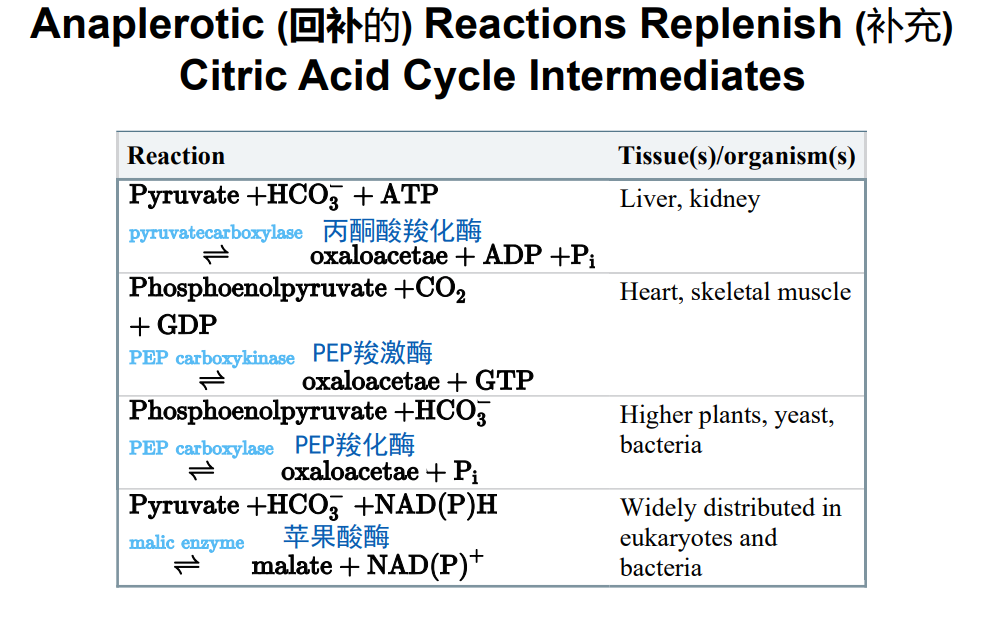

#### **5.1 回补反应 (Anaplerotic Reactions)**

由于TCA循环的中间产物会被不断抽出用于生物合成，需要有“回补”反应来补充它们，以维持循环的正常运转。最重要的回补反应是：

* **丙酮酸羧化酶 (Pyruvate Carboxylase)** ：
  **Pyruvate**+**CO**2+**ATP**→**Oxaloacetate**+**ADP**+**Pi**

  该酶在肝脏和肾脏中活性很高，由乙酰CoA别构激活。

#### **5.2 乙醛酸循环 (Glyoxylate Cycle)**

* **存在** : 植物、真菌和某些微生物特有，不存在于脊椎动物。
* **目的** : 允许生物体将**脂肪 (乙酰CoA) 净合成为碳水化合物** (如葡萄糖)。
* **关键酶** :

1. **异柠檬酸裂解酶 (Isocitrate Lyase)**
2. **苹果酸合酶 (Malate Synthase)**

* **机制** : 绕过了TCA循环中两个释放**C**O**2**的脱羧步骤，使得两分子的乙酰CoA可以净生成一分子的琥珀酸，琥珀酸进而可以转化为草酰乙酸用于糖异生。

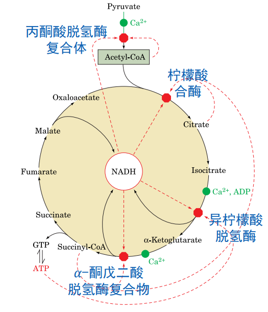

---

### **6. 总结与要点回顾**

1. TCA循环是 **有氧代谢的核心** ，在线粒体基质中将乙酰CoA彻底氧化为**C**O**2**。
2. **PDH复合体**是连接糖酵解和TCA循环的 **不可逆桥梁** ，其机制复杂，需要五种辅酶。
3. 每轮循环產生  **3 NADH、1 **F**A**D**H**2**、1 GTP 和 2 **C**O**2 ，为氧化磷酸化提供大量还原力。
4. 循环的速率受到细胞**能量状态**的严格调控，主要调控点是几个不可逆反应的酶。
5. TCA循环不仅是能量工厂，也是 **生物合成的原料库** ，需要**回补反应**来维持中间产物的稳定。
6. **乙醛酸循环**是某些生物将脂肪转化为糖的特有途径。

**1. 丙酮酸被丙酮酸脱氢酶(PDH)复合体转化为乙酰辅酶A，后者是柠檬酸循环的起始原料。**

这句话描述的是连接糖酵解和柠檬酸循环的“桥梁反应”。在糖酵解过程（细胞质中进行）结束后，产物丙酮酸会进入线粒体。在线粒体基质中，一个巨大而复杂的**丙酮酸脱氢酶（PDH）复合体**会催化丙酮酸发生氧化脱羧反应，将其从一个三碳分子转变为一个两碳的乙酰基，并与辅酶A结合，形成 **乙酰辅酶A (acetyl-CoA)** 。这个乙酰辅酶A就是进入下一阶段——柠檬酸循环——的“燃料”分子。

**2. PDH复合体由三种酶和五种不同的辅酶的多个拷贝组成。**

这一点详细说明了PDH复合体的构成。它不是一个单一的酶，而是一个由三种不同功能的酶（E1、E2和E3）组成的巨大机器。为了完成催化，这三种酶需要五种不同辅酶的协同作用，它们分别是：焦磷酸硫胺素(TPP)、硫辛酸、黄素腺嘌呤二核苷酸(FAD)、辅酶A(CoA)和烟酰胺腺嘌呤二核苷酸(**N**A**D**+)。这种多酶复合体的结构可以极大地提高反应效率并减少副反应的发生。

**3. 柠檬酸循环是一个近乎普适的中心分解代谢途径，它将来自碳水化合物、脂肪和蛋白质的化合物氧化成CO₂，并将大部分氧化能量暂时储存在电子载体NADH和FADH₂中。**

这里定义了柠檬酸循环的核心地位和功能。

* **“近乎普适”** ：意味着它存在于几乎所有的好氧生物中。
* **“中心分解代谢途径”** ：意味着它不仅处理来自葡萄糖的丙酮酸，也是脂肪（通过脂肪酸氧化）和蛋白质（通过氨基酸分解）分解代谢的共同终点通路。所有这些营养物质的碳骨架最终都可以转化为乙酰辅酶A或循环中的其他中间体进入循环。
* **“氧化成CO₂”** ：乙酰辅酶A的两碳骨架在循环中被彻底氧化，最终以二氧化碳的形式被清除。
* **“能量暂时储存在NADH和FADH₂中”** ：这是最关键的一点。柠檬酸循环本身只产生少量ATP，其主要任务是产生大量的 **高能电子载体NADH和FADH₂** 。这些载体携带着从化学键中捕获的能量，将进入后续的电子传递链，在那里才最终产生大量的ATP。

**4. 柠檬酸循环每氧化一个乙酰辅酶A，能量收益包括三个NADH分子、一个FADH₂分子和一个ATP或GTP分子。**

这明确了柠檬酸循环一轮的化学计量产出。可以看作是循环的“收支清单”：每投入一个乙酰辅酶A分子，經過八步反應後，淨產出 **3個NADH** ， **1個FADH₂** ，和 **1個GTP（或ATP）** 。這是細胞從一分子乙酰輔酶A中提取能量的核心步驟。

**5. 柠檬酸循环的总速率受丙酮酸向乙酰辅酶A的转化速率以及柠檬酸合酶、异柠檬酸脱氢酶和α-酮戊二酸脱氢酶的通量控制。**

这一点讲的是柠檬酸循环的 **调控机制** 。像所有重要的代谢途径一样，柠檬酸循环的速率必须根据细胞的能量需求进行精确调节。调控点通常是那些不可逆的、释放大量能量的步骤。这里列出了主要的控制点：

* **PDH复合体** ：控制“燃料”乙酰辅酶A的进入速率。
* **柠檬酸合酶、异柠檬酸脱氢酶、α-酮戊二酸脱氢酶** ：这三个是循环内部的关键限速酶。它们的活性受到细胞能量状态（如ATP/ADP和NADH/NAD⁺的比率）的严格调控。

**6. 乙醛酸循环仅在植物、细菌和真菌中运行，需要乙醛酸循环体中的异柠檬酸裂解酶和苹果酸合酶。这种柠檬酸循环的变体允许从脂肪转化为糖。**

这一点介绍了一个与柠檬酸循环相关但功能不同的旁路途径—— **乙醛酸循环** 。

* **“仅在植物、细菌和真菌中”** ：包括人类在内的动物没有这个途径。
* **核心功能** ：动物无法将脂肪酸氧化产生的乙酰辅酶A“净合成”为葡萄糖。但是，拥有乙醛酸循环的生物可以做到。这是因为该循环通过两个特殊的酶（**异柠檬酸裂解酶**和 **苹果酸合酶** ）绕过了柠檬酸循环中两个释放**C**O**2**的脱羧步骤，从而实现了碳的净积累，进而可以用于合成葡萄糖。一个典型的例子是，植物种子在萌发时，利用储存的脂肪通过此途径转化为糖类，为生长提供能量和物质。

---

## Biochemistry 2 笔记（第四讲）

课程信息

- 课程：BIOCHEMISTRY 2 / 生物化学2
- 教师：Li Chun（李春）教授，化学工程系，清华大学
- 主题：糖原代谢与合成 (Glycogen Metabolism and Synthesis)

目录

- 1 糖原结构与代谢概述
- 2 糖原分解过程
- 3 糖原合成过程
- 4 糖原分解与合成的调控
- 5 糖异生(Gluconeogenesis)概述
- 6 糖异生的关键反应与绕道
- 7 糖异生前体与能量消耗
- 8 糖异生的调控
- 9 总结与要点回顾

---

### 1 糖原结构与代谢概述

- **糖原的生物学重要性**

  - 脊椎动物体内葡萄糖的主要储存形式
  - 为大脑和骨骼肌提供随时可用的能量
  - 在运动爆发时可迅速（秒级）提供葡萄糖供能
- **糖原的结构特征**

  - 葡萄糖的支链均聚物（homopolymer）
  - 主链为α-1,4糖苷键，支链为α-1,6糖苷键
  - 每8-12个残基形成一个分支点（相比淀粉中的支链淀粉每24-30个残基分支）
  - 分子量可达数百万，形成β-颗粒（β-granules）
  - 中心含有二聚体糖原蛋白（glycogenin），作为合成的引物
- **组织分布与颗粒结构**

  - 肝脏（5-10%干重）和肌肉（1-2%干重）是主要储存部位
  - β-颗粒：20-30nm直径，分子量10^6-10^7
  - 肝脏中20-40个β-颗粒聚集形成α-颗粒，直径可达300nm
  - 层叠模型：中心glycogenin二聚体，向外层层延伸，每13个葡萄糖残基形成一层
  - 外层为无分支的A链，内层为含两个分支点的B链
  - 颗粒外围含有电子致密的蛋白质富集区，称为γ颗粒，含有糖原合成和分解酶

### 2 糖原分解过程

- **糖原磷酸化酶（Glycogen phosphorylase）**

  - 从糖原的非还原端磷酸解（phosphorolysis）释放葡萄糖-1-磷酸
  - 需要吡哆醛磷酸（pyridoxal phosphate）作为辅基
  - 反应：(葡萄糖)n + Pi → (葡萄糖)n-1 + 葡萄糖-1-磷酸

  
- **糖原解链酶（Glycogen debranching enzyme）**

  - 双功能酶：转移酶活性和α-1,6-葡糖苷酶活性
  - 处理分支点的α-1,6-连接：
    1. 转移3个葡萄糖残基到附近非还原端
    2. 水解剩余的单个α-1,6-连接的葡萄糖，释放游离葡萄糖
- **从葡萄糖-1-磷酸到葡萄糖-6-磷酸**

  - 磷酸葡萄糖变位酶（phosphoglucomutase）催化转化
  - 酶先在Ser残基上磷酸化，将磷酸基转移到底物C-6位，然后接受C-1位磷酸基
- **葡萄糖-6-磷酸酶系统（肝脏特有）**

  - 位于内质网膜上，由多种蛋白质组成
  - T1转运蛋白：将葡萄糖-6-磷酸从细胞质转入内质网腔
  - 葡萄糖-6-磷酸酶：水解产生葡萄糖和Pi
  - T2和T3转运蛋白：将Pi和葡萄糖运回细胞质
  - GLUT2：将葡萄糖转运入血液

### 3 糖原合成过程

- **糖核苷酸作为活化单糖的形式**

  - 糖原合成不是磷酸解的简单逆反应
  - 由Luis Federico Leloir发现（1970年诺贝尔化学奖）
  - UDP-葡萄糖是糖原合成的直接底物
- **UDP-葡萄糖的形成**

  - 葡萄糖-6-磷酸 → 葡萄糖-1-磷酸（磷酸葡萄糖变位酶）
  - 葡萄糖-1-磷酸 + UTP → UDP-葡萄糖 + PPi（UDP-葡萄糖焦磷酸化酶）
  - PPi水解提供额外能量驱动（ΔG′° = -19.2 kJ·mol⁻¹）

  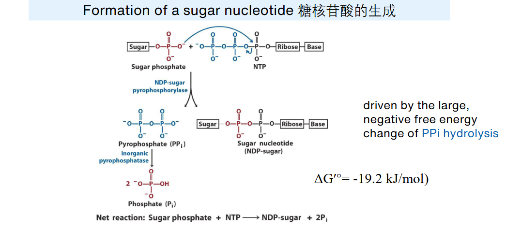
- **糖原合酶（Glycogen synthase）**

  - 催化将葡萄糖从UDP-葡萄糖转移到糖原非还原端
  - 形成α-1,4-糖苷键
  - 需要现有的引物链（不能从头开始）
- **糖原分支酶（Glycogen branching enzyme）**

  - 转移一段约7个葡萄糖残基到糖原内部
  - 形成α-1,6-糖苷键（分支点）
  - 增加溶解度和非还原端数量，提高合成和分解效率
- **糖原蛋白（Glycogenin）**

  - 双功能蛋白：引物和催化酶
  - 首先将葡萄糖从UDP-葡萄糖转移到自身Tyr194残基
  - 二聚体结构，互相交叉糖基化（transglycosylation）
  - 继续添加7个葡萄糖残基，然后糖原合酶接手延长
  - 保留在β-颗粒内部，共价连接在糖原分子还原端

### 4 糖原分解与合成的调控

- **激素调控的相反效应**

  - 肾上腺素（epinephrine，作用于肌肉和肝脏）和胰高血糖素（glucagon，作用于肝脏）
    - 激活糖原分解
    - 抑制糖原合成
  - 胰岛素（insulin）
    - 促进糖原合成
    - 抑制糖原分解
- **糖原磷酸化酶的调控**

  - 共价修饰：磷酸化激活（a型），去磷酸化失活（b型）
  - 激素信号级联放大：
    1. 激素结合表面受体
    2. 激活G蛋白（Gsα）
    3. 增加cAMP浓度
    4. 激活蛋白激酶A（PKA）
    5. PKA磷酸化并激活磷酸化酶激酶
    6. 磷酸化酶激酶磷酸化并激活糖原磷酸化酶

  
- **糖原合酶的调控**

  - 共价修饰：磷酸化失活，去磷酸化激活
  - 糖原合酶激酶3（GSK3）：主要负责磷酸化抑制
  - 胰岛素通过以下机制激活糖原合酶：
    1. 抑制GSK3活性
    2. 激活磷酸蛋白磷酸酶1（PP1）
  - 葡萄糖-6-磷酸：别构激活剂，使糖原合酶成为葡萄糖-6-磷酸的传感器
- **磷酸蛋白磷酸酶1（PP1）的靶向调控**

  - 与糖原靶向蛋白GM形成复合物
  - 胰岛素促使GM位点1磷酸化，激活PP1
  - 肾上腺素促使GM位点2磷酸化，导致PP1从糖原颗粒解离
- **肝脏与肌肉糖原代谢的差异**

  - 肝脏：维持血糖稳态，由胰高血糖素和胰岛素调控
  - 肌肉：为自身提供能量，主要受神经冲动和肾上腺素调控，能量需求变化大
  - 肌肉缺乏葡萄糖-6-磷酸酶，不能向血液释放葡萄糖

### 5 糖异生(Gluconeogenesis)概述

- **定义与生物学意义**

  - 从非碳水化合物前体合成葡萄糖的过程
  - 维持血糖稳态，确保脑、红细胞等组织持续供能
  - 不同生物中糖异生基本反应相似
- **主要前体**

  - 乳酸、丙酮酸、甘油、某些氨基酸
  - 丙酮酸到葡萄糖的转化是糖异生的核心途径
- **与糖酵解的关系**

  - 糖酵解和糖异生共享7个可逆反应
  - 糖酵解中3个不可逆反应在糖异生中被"绕过"

### 6 糖异生的关键反应与绕道

- **第一个绕道：丙酮酸到磷酸烯醇式丙酮酸（PEP）**

  - 两步反应：
    1. 丙酮酸羧化酶（pyruvate carboxylase）：丙酮酸 + CO2 + ATP → 草酰乙酸 + ADP + Pi
       - 需乙酰CoA作为正向效应物
       - 辅基为生物素（biotin）
    2. PEP羧激酶（PEP carboxykinase）：草酰乙酸 + GTP → PEP + CO2 + GDP
  - 两种途径：
    1. 线粒体内直接转化：草酰乙酸 → PEP（线粒体型PEP羧激酶）
    2. 转运途径：草酰乙酸 → 苹果酸 → 细胞质 → 草酰乙酸 → PEP（细胞质型PEP羧激酶）
  - 总反应：丙酮酸 + ATP + GTP + HCO3- → PEP + ADP + GDP + Pi + CO2
  - 注意：虽然表面上看似乎消耗一个CO2然后又释放一个CO2，但实际上是羧化-脱羧的活化过程
- **第二个绕道：果糖-1,6-二磷酸到果糖-6-磷酸**

  - 酶：果糖-1,6-二磷酸酶（FBPase-1）
  - 反应：果糖-1,6-二磷酸 + H2O → 果糖-6-磷酸 + Pi
  - ΔG = -16.3 kJ/mol
- **第三个绕道：葡萄糖-6-磷酸到葡萄糖**

  - 酶：葡萄糖-6-磷酸酶（G6Pase）
  - 位置：内质网腔侧（肝脏和肾脏细胞特有，肌肉和脑细胞不含此酶）
  - 反应：葡萄糖-6-磷酸 + H2O → 葡萄糖 + Pi
  - ΔG = -13.8 kJ/mol

### 7 糖异生前体与能量消耗

- **能量消耗**

  - 两分子丙酮酸转化为一分子葡萄糖需6个高能磷酸键
  - 糖异生过程消耗的能量远大于糖酵解产生的能量
  - 反应式：2丙酮酸 + 4ATP + 2GTP + 2NADH + 4H2O → 葡萄糖 + 4ADP + 2GDP + 6Pi + 2NAD+ + 2H+
  - ΔG = -16 kJ/mol
- **糖异生前体来源**

  - 氨基酸（生糖氨基酸）：可转化为丙酮酸或TCA循环中间体的氨基酸
  - 乳酸：肌肉无氧代谢产物（Cori循环）
  - 甘油：脂肪分解产物
  - 注意：脂肪酸在哺乳动物中不能净转化为葡萄糖（乙酰CoA不能净转化为丙酮酸或草酰乙酸）
- **特殊途径**

  - 葡萄糖-丙氨酸循环：肌肉转氨产生丙氨酸，肝脏转化为葡萄糖
  - Cori循环（乳酸循环）：肌肉产生乳酸，肝脏转化为葡萄糖
  - 乙醛酸循环（植物、真菌、细菌特有）：允许乙酰CoA净转化为琥珀酸，进而可合成葡萄糖

### 8 糖异生的调控

- **避免无效循环（futile cycling）**

  - 糖酵解和糖异生若同时进行会消耗ATP产生热量（"无效循环"）
  - 两条途径需协调互逆调控：同一调节分子对拮抗酶对有相反效应
- **主要调控因子**

  - 乙酰CoA：抑制丙酮酸脱氢酶复合体（糖酵解），激活丙酮酸羧化酶（糖异生）
  - AMP：抑制果糖-1,6-二磷酸酶（糖异生），激活磷酸果糖激酶-1（糖酵解）
  - 果糖-2,6-二磷酸（F2,6BP）：激活PFK-1（糖酵解），抑制FBPase-1（糖异生）
- **果糖-2,6-二磷酸的调控**

  - 双功能酶PFK-2/FBPase-2催化合成和降解
  - 激素调控：
    - 胰高血糖素：促进该酶磷酸化，抑制PFK-2活性，激活FBPase-2活性，降低F2,6BP水平→促进糖异生，抑制糖酵解
    - 胰岛素：促进该酶去磷酸化，激活PFK-2活性，抑制FBPase-2活性，增加F2,6BP水平→促进糖酵解，抑制糖异生
- **转录水平调控**

  - CRTC2（CREB regulated transcription coactivator 2）调控糖异生关键酶基因表达
  - 肝脏中Pck1（PEP羧激酶）和G6pc（葡萄糖-6-磷酸酶）基因受CRTC2调控

### 9 总结与要点回顾

- **糖代谢整合**

  - 糖酵解和糖异生是互逆但不同的代谢途径，共享7个可逆反应
  - 糖原合成与分解受磷酸化/去磷酸化严格调控
  - 代谢途径间的协调对于能量平衡和碳利用至关重要
- **关键调控点**

  - 糖原代谢：磷酸化酶/合酶的共价修饰；PP1定位调控
  - 糖异生：乙酰CoA、AMP、F2,6BP的对拮抗酶的相反调节
- **能量关系**

  - 糖异生消耗比糖酵解产生更多的能量
  - 糖原分解是快速供能的方式（秒级响应）
  - 能量状态（ATP/ADP/AMP比例）是代谢流向的重要调控因素
- **临床相关**

  - 糖原贮积症（Glycogen Storage Diseases）：各种糖原代谢酶缺陷导致
  - 代谢适应：禁食期间肝脏糖异生增强，肌肉使用酮体节约葡萄糖
- **应用案例：厌氧发酵生产L-丙氨酸**

  - 大肠杆菌代谢工程改造（基因敲除优化）
  - 能量产生与生长与NADH氧化和L-丙氨酸產生偶聯
  - 理論產率：0.989 g/g葡萄糖；實際工業發酵：0.95 g/g葡萄糖
  - 相比好氧发酵可降低50%以上能耗

---

## Biochemistry 2 笔记（第五讲）

**课程信息**

- **课程**：BIOCHEMISTRY 2 / 生物化学2
- **教师**：李春（Li Chun）教授，化学工程系，清华大学
- **主题**：糖原代谢 (Glycogen Metabolism) 与 电子传递及ATP合成 (Electron Transport and ATP Synthesis)

**目录**

- 1. 糖原代谢概述
- 2. 糖原的降解（磷酸解/脱支）
- 3. 糖原的合成（糖核苷酸/分支/糖原蛋白）
- 4. 糖原分解与合成的调控
- 5. 氧化磷酸化与线粒体概览
- 6. 化学渗透理论与质子动力势
- 7. 电子传递链 (ETC) 组分与顺序
- 8. 电子传递复合体 I–IV
- 9. ATP 合酶（复合体 V）与 P/O 比
- 10. NADH 穿梭与ATP产量
- 11. 氧化代谢调控、ROS 与线粒体其他功能
- 12. 总结

---

### 1. 糖原代谢概述

- **生物学意义**：糖原是脊椎动物体内葡萄糖的主要储存形式。肝脏调节血糖，骨骼肌满足局部能量需求。
- **结构特征**：
  - **主链**：葡萄糖通过 **$\alpha-1,4$**-糖苷键连接。
  - **支链**：每 8–12 个残基出现一个 **$\alpha-1,6$**-糖苷键分支点。
  - **核心**：颗粒以**糖原蛋白（glycogenin）** 为核心起始合成。
  - **优势**：高度分支的结构提供了大量的**非还原端**，这使得糖原合成和分解的酶可以同时在多个末端协同工作，极大地提高了代谢速率。

---

### 2. 糖原的降解（Phosphorolysis & Debranching）

糖原降解主要依赖两种酶的协同作用，将葡萄糖单位释放为可利用的形式。

- **糖原磷酸化酶（Glycogen phosphorylase）**

  - **功能**：催化**磷酸解反应 (Phosphorolysis)**。
  - **反应**：(葡萄糖)$_n$ + $P_i$ → (葡萄糖)$_{n-1}$ + **葡萄糖-1-磷酸 (Glc-1-P)**。
  - **机制**：从糖原链的非还原端逐个移除葡萄糖残基，直到距离分支点4个残基处停止。
  - **辅基**：需要**吡哆醛磷酸（Pyridoxal phosphate, PLP）**。PLP 的磷酸基团在活性位点充当 **广义酸催化剂**，促进无机磷酸 ($P_i$) 进攻 $\alpha-1,4$-糖苷键。
- **糖原脱支酶（Debranching enzyme）**

  - **功能**：处理磷酸化酶留下的“极限糊精”（limit dextrin）分支点。
  - **双重活性**：
    1. **转移酶活性 (transferase activity)**：将分支末端的 3 个葡萄糖残基转移到邻近主链的非还原端，并形成新的 $\alpha-1,4$ 键。
    2. **$\alpha-1,6$-葡糖苷酶活性 (glucosidase activity)**：通过**水解**反应，切断剩余的单个 $\alpha-1,6$ 分支点上的葡萄糖，释放**游离葡萄糖 (Free Glucose)**。
- **G-1-P 的去向**

  - G-1-P 首先由**磷酸葡萄糖变位酶**催化，可逆地异构化为 **葡萄糖-6-磷酸 (Glc-6-P)**。
  - **在肌肉中**：G-6-P 直接进入糖酵解途径供能。
  - **在肝脏中**：G-6-P 被运入内质网，由**葡萄糖-6-磷酸酶**水解为游离葡萄糖，释放入血以维持血糖稳定。

---

### 3. 糖原的合成（Glycogenesis）

**糖原合成是一个耗能过程**，使用活化的葡萄糖单位 (UDP-Glc) 来延长糖原链。

- **活化葡萄糖：糖核苷酸的形成**

  1. Glc-6-P $\rightleftharpoons$ Glc-1-P（磷酸葡萄糖变位酶）。
  2. **Glc-1-P + UTP $\rightarrow$ UDP-葡萄糖 (UDP-Glc) + PPi**（由 UDP-葡萄糖焦磷酸化酶催化）。

  - **驱动力**：这是一个缩合反应。后续的 PPi（焦磷酸）被无机焦磷酸酶迅速水解（$\Delta G'^\circ = -19.2 \text{ kJ/mol}$），这是一个强放能反应，它拉动了整个 UDP-Glc 的合成反应使其不可逆地向正向进行。
- **糖原合酶（Glycogen synthase）**

  - **功能**：催化糖原链的延长。
  - **反应**：从 UDP-Glc 上取下葡萄糖单位，并将其添加到糖原链的非还原端，形成 $\alpha-1,4$-糖苷键。
  - **限制**：**需要引物**。它只能延长已有的糖原链（至少4个残基），不能从头启动 (de novo) 合成。
- **糖原分支酶（Branching enzyme）**

  - **功能**：在糖原链上创建 $\alpha-1,6$ 分支点。
  - **机制**：从非还原端切下约 6-7 个葡萄糖残基的链段，并将其转移到同一条链或邻近链的内部，通过 $\alpha-1,6$ 键连接。
- **糖原蛋白（Glycogenin）：合成的引物**

  - **功能**：糖原合酶无法从头合成，**糖原蛋白**既是引物，也是催化起始反应的酶。
  - **机制**：
    1. **自糖基化**：糖原蛋白（通常为二聚体）利用 UDP-Glc，将第一个葡萄糖单位共价连接到自身的**酪氨酸残基 (Tyr194)** 上。
    2. **交叉糖基化**：二聚体中的一个亚基催化另一个亚基的糖基化。
    3. **短链延伸**：糖原蛋白继续催化添加约 8 个葡萄糖残基。
    4. **交接**：一旦引物链足够长，**糖原合酶**便接手，开始快速延长糖原链。

---

### 4. 糖原分解与合成的调控

**糖原代谢受到激素的精密调控，确保合成和分解不会同时进行（无效循环），并响应机体的能量需求。调控主要通过**共价修饰（磷酸化/去磷酸化）**实现。

- **激素的相反效应（互逆调控）**

  - **胰高血糖素 (Glucagon)**（作用于肝脏）和 **肾上腺素 (Epinephrine)**（作用于肝脏和肌肉）：
    - **激活**糖原分解（通过激活PKA）。
    - **抑制**糖原合成（通过激活PKA）。
  - **胰岛素 (Insulin)**（血糖高时分泌）：
    - **促进**糖原合成（通过抑制GSK3和激活PP1）。
    - **抑制**糖原分解（通过激活PP1）。
- **调控的核心：蛋白激酶A (PKA)**

  - 胰高血糖素/肾上腺素 $\rightarrow$ 结合受体 $\rightarrow$ 激活G蛋白 $\rightarrow$ 激活腺苷酸环化酶 $\rightarrow$ 产生 **cAMP**。
  - **cAMP 激活 PKA**。PKA 是调控的“总开关”，它通过磷酸化来执行指令。
- **糖原磷酸化酶的调控（调控分解）**

  - **激活（磷酸化）**：
    1. **PKA 激活 磷酸化酶激酶**（通过磷酸化）。
    2. **磷酸化酶激酶再使 糖原磷酸化酶 b**（非活性）磷酸化（在Ser14位点），转变为 **糖原磷酸化酶 a**（活性）。
  - **失活（去磷酸化）**：由 **PP1**（磷酸蛋白磷酸酶1）执行。
  - **别构调控**：
    - **肝脏**：葡萄糖可作为别构抑制剂，结合磷酸化酶 a，使其发生构象变化，暴露磷酸化的Ser残基，易于被 PP1 去磷酸化而失活（血糖传感）。
    - **肌肉**：AMP（能量低信号）可别构激活非活性的磷酸化酶 b。Ca²⁺（钙调素）也可激活磷酸化酶激酶。
- **糖原合酶的调控（调控合成）**

  - **失活（磷酸化）**：
    1. **PKA（由胰高血糖素/肾上腺素激活）** 磷酸化 **糖原合酶**，使其**失活**（转为b型）。
    2. **GSK3** (糖原合酶激酶3) 也会磷酸化并抑制糖原合酶。（注：GSK3的磷酸化通常需要CKII（酪蛋白激酶II）的预磷酸化）。
  - **激活（去磷酸化）**：
    1. **PP1**（磷酸蛋白磷酸酶1）去除糖原合酶上的磷酸基团，使其 **激活**（转为a型）。
    2. **胰岛素 (Insulin)** 通过激活信号通路（抑制GSK3）并激活PP1，来 **强力促进糖原合酶的激活**。
  - **别构调控**：**葡萄糖-6-磷酸 (Glucose 6-phosphate)** 可别构激活已被磷酸化的糖原合酶 b，使其成为葡萄糖-6-磷酸的传感器。

---

### 5. 氧化磷酸化与线粒体概览

**细胞呼吸的三阶段：**

1. **Stage 1: 乙酰CoA的生成** (Acetyl-CoA production)
2. **Stage 2: 乙酰CoA的氧化** (Acetyl-CoA oxidation)（TCA循环）
3. **Stage 3: 电子传递与氧化磷酸化** (Electron transport and oxidative phosphorylation)

**在前两个阶段，能量主要以高能电子的形式储存在 NADH** 和 **FADH₂** 中。第三阶段的任务就是利用这些电子合成ATP。

**活着的“高成本”：** 一个70kg的成年人每天需要约 8400 kJ 能量，这相当于需要**83 kg**的 ATP。然而，人体内任意时刻仅有约 250 g ATP。这意味着每个 ATP 分子每天必须被循环利用（ADP $\rightarrow$ ATP）约 300 次，这个过程主要由氧化磷酸化完成。

**反应地点：线粒体 (Mitochondrion)**

- **外膜 (Outer membrane)**：

  - **含有 孔蛋白 (Porins)**，允许 10 kDa 以下的小分子和离子自由扩散。
  - **导致 膜间空间 (Intermembrane space)** 的化学成分（离子、小分子代谢物）与细胞质基质 (Cytosol) 几乎相同。
- **内膜 (Inner membrane)**：

  - **氧化磷酸化的真正屏障。蛋白质含量极高**（约 70%），是蛋白质最丰富的生物膜之一。（*注：内膜颗粒密度（代表蛋白质）远高于外膜*）。
  - **高度不通透性**：对包括 H⁺ 在内的大多数离子和小分子都不通透。仅自由通透 O₂、CO₂ 和 H₂O。
  - **高度折叠**形成**嵴 (Cristae)**，极大增加了表面积。
  - **包含：电子传递链复合体 (I-IV)、ATP合酶、以及多种 转运系统**（Transporters）。
- **基质 (Matrix)**：

  - **内膜包裹的空间，蛋白质浓度极高（~500 mg/mL）**，呈凝胶状。
  - **包含：TCA循环酶系、PDH复合体、脂肪酸氧化酶系、氨基酸氧化酶系**。
  - **包含线粒体自身的 DNA、核糖体（线粒体可翻译13种蛋白质）**。

---

### 6. 化学渗透理论与质子动力势

- **化学渗透理论 (Chemiosmotic Theory)**

  - **由 Peter Mitchell**（1978年诺贝尔奖）提出。
  - **核心思想**：电子在电子传递链中的“下坡”流动所释放的能量，被用于将质子 (H⁺) 从基质（N侧）“上坡”泵到膜间空间（P侧）。这个过程建立了一个**质子浓度梯度**和 **电位梯度**（统称为**质子动力势, PMF**）。这个梯度中储存的能量反过来驱动ATP合酶合成ATP。
- **实验证据：解耦联剂 (Uncouplers)**

  - **如 2,4-二硝基苯酚 (2,4-Dinitrophenol)**，是一种脂溶性弱酸。
  - 它能携带H⁺穿过内膜，破坏质子梯度。
  - **结果**：电子传递（耗氧）继续进行，但由于梯度被破坏，ATP合成停止。能量以**热量**形式散失。
- **质子动力势 (Protonmotive Force, PMF)**

  - **PMF 是跨膜质子梯度的能量**，由两部分组成：
    1. **化学势 (ΔpH)**：由膜两侧的H⁺浓度差（pH差）产生。
    2. **电势 (Δψ)**：由膜两侧的电荷差（基质带负电，膜间带正电）产生。
  - **公式**：$\Delta G = 2.3RT\Delta pH + F\Delta\Psi$
  - **能量分布**：在活跃的线粒体中，**电位差 (Δψ) 贡献了PMF中约85%的能量**，而H⁺浓度差 (ΔpH) 仅贡献约15%。
  - **化学计量**：合成一分子ATP（实际 $\Delta G \approx -48 \text{ kJ/mol}$），至少需要转运**3个质子**才能提供足够的能量（$3 \times -19.4 = -58.2 \text{ kJ/mol}$）。

---

### 7. 电子传递链 (ETC) 组分与顺序

#### A. 核心辅因子 (Cofactors)

1. **电子传递类型**：

   - **直接电子 (e⁻)**：如细胞色素中的 $Fe^{3+} \rightleftharpoons Fe^{2+}$。
   - **氢原子 ($H^+ + e^-$)**。
   - **氢负离子 ($:H^-$)**：即一个质子加两个电子，如 NAD⁺ $\rightleftharpoons$ NADH。
2. **黄素 (Flavins, FMN/FAD)**：

   - **存在于黄素蛋白中（如复合体I的FMN，复合体II的FAD）**。
   - **它们可作为1电子和2电子传递的“转换器”，因为它们可以形成稳定的 半醌（Semiquinone）自由基中间体**。
3. **铁硫簇 (Iron-Sulfur Clusters, Fe-S)**：

   - **存在于铁硫蛋白中，铁在 $Fe^{2+}$（还原态）和 $Fe^{3+}$（氧化态）之间进行单电子氧化还原**。
4. **泛醌 (Ubiquinone, Coenzyme Q)**：

   - **脂溶性**小分子（非蛋白质），可在内膜中自由扩散。
   - **能携带2个电子和2个质子（完全还原为 $QH_2$，泛醇）**。
   - **功能：作为移动的电子载体**，连接复合体 I/II 和复合体 III。
5. **细胞色素 (Cytochromes)**：

   - **含有 血红素（Heme）辅基的蛋白质**。
   - **分为 a、b、c 三类（根据其还原态的光谱吸收峰区分）**。
   - 通过血红素中的铁（$Fe^{3+} \rightleftharpoons Fe^{2+}$）传递 **单个电子**。

#### B. 移动电子载体 (Mobile Carriers)

- **泛醌 (CoQ / Ubiquinone)**：在复合体 I、II 和 III 之间传递电子。
- **细胞色素 c (Cytochrome c)**：可溶性小蛋白，在膜间空间（P侧）中移动，在复合体 III 和 IV 之间传递电子。

#### C. 传递顺序的确定方法

1. **方法1：标准还原电位 (E'°) 测量法**。电子倾向于从低 E'° 的载体流向高 E'° 的载体（即从NADH流向 $O_2$）。
2. **方法2：氧化动力学研究法（差异光谱）**。向缺氧的线粒体中突然通入 O₂，最接近 O₂ 的载体（如Cyt a₃）最先被氧化，然后依次向上游（Cyt a, Cyt c...）传递。
3. **方法3：特异性抑制剂阻断法**。抑制剂会使其上游的载体处于还原态，下游的载体处于氧化态。

   - **鱼藤酮 (Rotenone)/ 安密妥 (Amytal)**：阻断 **复合体 I**（Fe-S 向 泛醌Q 的传递）。
   - **抗霉素A (Antimycin A)**：阻断**复合体 III** (Cyt b → Cyt c₁)。
   - **氰化物 (CN⁻)/ CO**：阻断 **复合体 IV**（抑制细胞色素氧化酶）。

   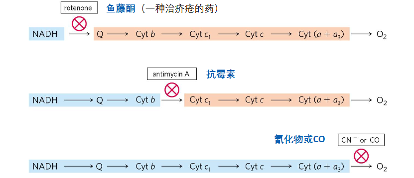
4. **方法4：组分分离与表征法**。使用去垢剂（如Digitonin）分离线粒体内膜，通过层析法分离出四个复合体及ATP合酶，分别研究它们的功能。

---

### 8. 电子传递复合体 I–IV

**呼吸链由四个大型多蛋白复合体组成**。

#### 复合体 I (NADH:泛醌氧化还原酶)

- **一个巨大的“L”型多聚体蛋白复合体（44个不同的亚基）**。
- **辅基**：FMN 和 多个 Fe-S 簇。
- **功能**：接收来自 NADH 的电子（一个氢负离子 $:H^-$），将其传递给泛醌 (Q)。
- **反应**：$NADH + Q + 5 H_{matrix}^{+} \rightarrow NAD^{+} + QH_{2} + 4 H_{intermembrane}^{+}$。
- **质子泵**：每传递一对电子（来自NADH），从基质（N侧）泵出 **4 个 H⁺** 到膜间空间（P侧）。

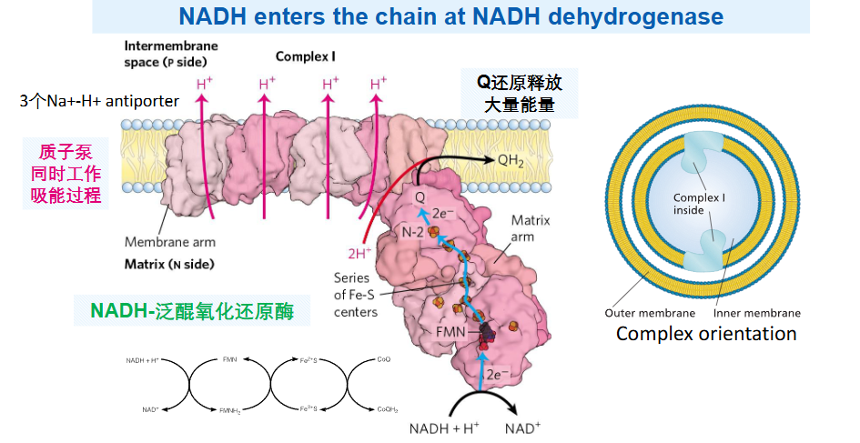

#### 复合体 II (琥珀酸:泛醌氧化还原酶)

- **身份**：就是TCA循环中的**琥珀酸脱氢酶**。
- **辅基**：FAD、Fe-S簇、Heme b。
- **功能**：接收来自琥珀酸的电子（生成延胡索酸），通过FAD和Fe-S簇将其传递给泛醌 (Q)。
- **反应**：$succinate + Q \rightarrow fumarate + QH_{2}$。
- **质子泵**：**不泵送质子**。因为该步骤释放的能量不足以驱动质子泵。Heme b 的功能被认为是在电子传递异常时防止ROS（活性氧）的产生。

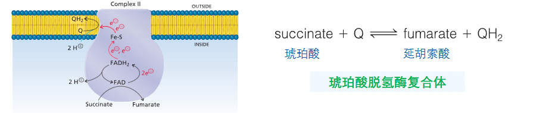

#### 复合体 III (细胞色素bc₁复合体 / 泛醌:细胞色素c氧化还原酶)

- **一个二聚体**，核心组分包括：细胞色素 b（含 $b_L$ 和 $b_H$ 两种血红素）、Rieske 铁硫蛋白、细胞色素 $c_1$。
- **功能**：接收来自 QH₂（泛醇）的电子，将其传递给细胞色素 c。
- **Q循环 (Q cycle)**：一个精巧的机制，用于协调2电子载体 (QH₂) 和1电子载体 (细胞色素) 之间的电子传递。
  - **第一阶段**：1个 $QH_2$ 结合，释放2个H⁺到P侧。1个电子传给Rieske Fe-S，再传给Cyt c₁，最后传给Cyt c；另1个电子传给Cyt $b_L$，再传给 $b_H$，最后传给Q，形成半醌 $Q^{\cdot-}$。
  - **第二阶段**：第2个 $QH_2$ 结合，释放2个H⁺到P侧。1个电子传给第2个Cyt c；另1个电子传给Cyt $b_L \rightarrow b_H$，最后与 $Q^{\cdot-}$ 结合，并从N侧吸收2个H⁺，再生1个 $QH_2$。
- **净反应**：$QH_{2} + 2 cyt c(oxidized) + 2H_{N}^{+} \rightarrow Q + 2 cyt c(reduced) + 4H_{P}^{+}$。
- **质子泵**：每传递一对电子（即消耗一个净 $QH_2$），泵出 **4 个 H⁺**。

#### 复合体 IV (细胞色素C氧化酶)

- **辅基**：Heme a、Heme a₃、CuA（双核铜中心）、CuB（与Heme a₃形成双核Fe-Cu中心）。
- **功能**：接收来自细胞色素 c 的电子（每次1个，共4次），并将其传递给最终的电子受体  **O₂**，将其还原为 **$H_2O$**。
- **净反应**：$4 cyt c_{red}(Fe^{2+}) + 8{H}_{matrix} + O_{2} \rightleftharpoons 4 cyt c_{ox}(Fe^{3+}) + 2H_{2}O + 4{H^{+}}_{intermembrance}$。
- **机制**：
  - **消耗 4 个 $H_{matrix}^{+}$ 作为“底物”质子**，用于将 O₂ 还原成 2 $H_2O$。
  - **同时泵出 4 个 $H^{+}$ 到膜间（P侧）**。（注：p81/p82/p99的总结均采用 10H⁺/NADH 和 6H⁺/FADH₂ 的模型，即 I=4, III=4, IV=2。此处遵循该模型，记为泵出2H⁺）。
- **质子泵送总结 (标准模型)**：
  - **1 NADH** (经 I → III → IV)：泵出 $4 + 4 + 2 =$ **10 H⁺**。
  - **1 FADH₂** (经 II → III → IV)：泵出 $0 + 4 + 2 =$ **6 H⁺**。

---

### 9. ATP 合酶（复合体 V）与 P/O 比

- **F₀F₁-ATPase (ATP合酶)**：利用PMF合成ATP的分子马达。
- **结构**：

  - **F₁（头部）**：位于基质（N侧），是一个外周膜蛋白。由 $\alpha_3\beta_3\gamma\delta\epsilon$ 亚基组成。$\alpha_3\beta_3$ 形成“结节状”六聚体，$\beta$ 亚基是催化位点。
  - **F₀（基座）**：嵌入内膜（P侧），是质子通道。由 $ab_2c_{8-17}$ 亚基组成。
- **结合-变构模型 (Binding-change Model)**（Paul Boyer）

  1. **关键能垒**：质子梯度释放的能量主要**不是**用于“合成”ATP（该步骤在酶表面 $\Delta G \approx 0$），而是用于克服高能垒，将**紧密结合的 ATP 从酶上释放出来**。
  2. **旋转催化 (Rotational Catalysis)**：
     - **H⁺ 顺浓度梯度流经 F₀ 的 c 环通道（质子在c亚基的Asp残基和a亚基的Arg残基间传递）**。
     - **H⁺ 流动导致 c 环 和中心的 $\gamma$ 亚基 发生 旋转**。
     - **$\gamma$ 亚基在固定的 $\alpha_3\beta_3$ 六聚体内部旋转**，像凸轮轴一样，迫使三个 $\beta$ 亚基（催化亚基）依次改变构象。
     - **$\beta$ 亚基在三种状态间循环：L (Loose) / $\beta$-ADP（疏松结合ADP+Pi）、T (Tight) / $\beta$-ATP（紧密结合并合成ATP）、O (Open) / $\beta$-empty（开放构型，释放ATP）**。
- **物质跨膜转运**

  - **腺嘌呤核苷酸转位酶 (antiporter)**：利用膜电位(Δψ)，将基质中的 $ATP^{4-}$ 运出，同时将胞质的 $ADP^{3-}$ 运入。
  - **磷酸盐转运载体 (symporter)**：利用质子梯度(ΔpH)，将 1个 $P_i$ (H₂PO₄⁻) 和 1个 H⁺ 同步运入基质。
- **P/O 比 (磷/氧比)**

  - **定义**：消耗每1摩尔氧原子（即 $\frac{1}{2}O_2$）所合成的ATP的摩尔数。
  - **H⁺/ATP 化学计量**：合成并转运1分子ATP，共需要 **4 个 H⁺**。
    - **3 个 H⁺** 用于驱动 F₀F₁ 旋转合成ATP。
    - **1 个 H⁺** 用于通过磷酸盐转运载体将 $P_i$ 运入基质。
  - **P/O 比计算（实验测定值）**：
    - **NADH**$\rightarrow$**2.5 ATP**。
    - **FADH₂**$\rightarrow$**1.5 ATP**。
    - **（理论吻合：NADH: (10 H⁺ 泵出) / (4 H⁺/ATP) = 2.5 ATP。FADH₂: (6 H⁺ 泵出) / (4 H⁺/ATP) = 1.5 ATP。）**

---

### 10. NADH 穿梭与ATP产量

**糖酵解在细胞质中产生的 NADH 不能直接穿过线粒体内膜**，必须通过穿梭系统转运其电子。

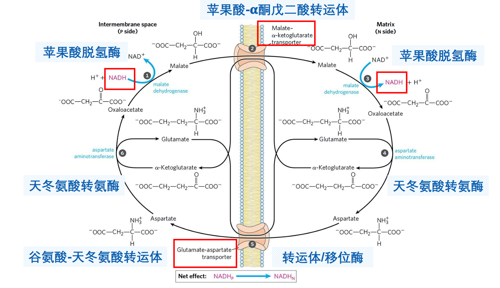

- **苹果酸-天冬氨酸穿梭 (Malate-Aspartate Shuttle)**

  - **地点**：肝、肾、心。
  - **机制**：胞质NADH将电子传给草酰乙酸生成苹果酸，苹果酸进入基质后，再由苹果酸脱氢酶将电子交给基质的NAD⁺，生成NADH。
  - **效率**：无能量损失。1 胞质NADH $\rightarrow$ 1 基质NADH。
  - **每葡萄糖总产 ATP**：~**32 ATP**。

  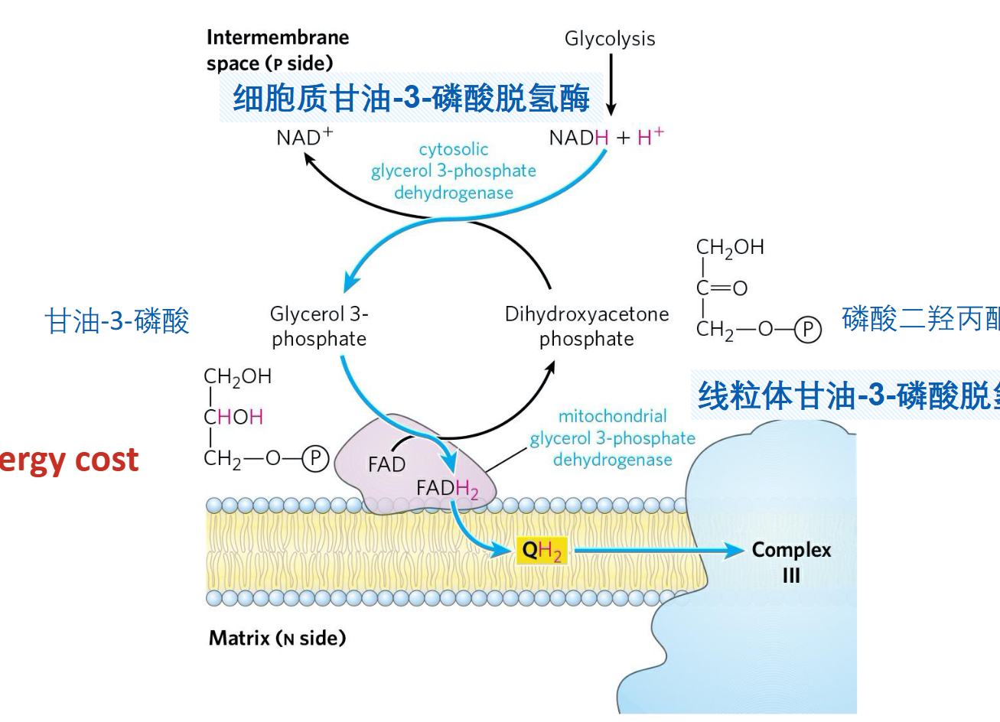
- **甘油-3-磷酸穿梭 (Glycerol 3-phosphate Shuttle)**

  - **地点**：骨骼肌、脑。
  - **机制**：胞质NADH将电子交给磷酸二羟丙酮（DHAP）生成甘油-3-磷酸。后者由线粒体内膜上的（FAD辅基）甘油-3-磷酸脱氢酶氧化，电子直接交给泛醌 (Q)，进入复合体III。
  - **效率**：有能量损失。1 胞质NADH $\rightarrow$ 1 $FADH_2$（绕过了复合体I）。P/O比为1.5而非2.5。
  - **每葡萄糖总产 ATP**：~**30 ATP**。

---

### 11. 氧化代谢调控、ROS 与线粒体其他功能

1. **受体控制 (Acceptor Control)**：

   - **呼吸速率主要由 ADP 的可利用性控制**。
   - **当 [ATP] 高 / [ADP] 低时（能量充足），ADP作为受体缺乏，氧化磷酸化和呼吸速率减慢**。NADH/NAD⁺ 比值升高，反馈抑制TCA循环和糖酵解。
   - **当 [ATP] 低 / [ADP] 高时（能量需求高），ADP充足，氧化磷酸化和呼吸速率加速**。
2. **低氧 (Hypoxia) 调控**：

   - **低氧会导致电子传递链受阻，产生 ROS（活性氧）**。
   - **HIF-1 (低氧诱导因子)**：
     - **常氧下**：HIF-1α 亚基被脯氨酰羟化酶羟基化，随后被 VHL 蛋白识别并泛素化，导致其被蛋白酶体降解。
     - **低氧下**：HIF-1α 无法被羟基化，保持稳定，进入细胞核与 HIF-1β 结合。
     - **功能**：HIF-1 作为转录因子，开启一系列基因（如EPO, VEGF, GLUT1等）的表达，帮助细胞适应低氧环境。
     - **（此发现获得了2019年诺贝尔奖）**。
3. **活性氧 (Reactive Oxygen Species, ROS)**：

   - **如：超氧自由基 ($O_2^{\cdot-}$) 、羟自由基 ($\cdot OH$)、过氧化氢 ($H_2O_2$)**。
   - **电子载体（如黄素蛋白、泛醌、Fe-S蛋白）在传递电子时可能“泄漏”电子，直接将 $O_2$ 还原为 $O_2^{\cdot-}$**，是ROS的主要来源。
   - **ROS活性极强，会引发链式反应**，损伤DNA、蛋白质和脂质，与多种退行性疾病（如帕金森、阿尔兹海默症）相关。
4. **抗氧化机制**：

   - **超氧化物歧化酶 (SOD)**：将 $O_2^{\cdot-}$ 转化为 $H_2O_2$。
   - **过氧化氢酶 (Catalase)**：将 $H_2O_2$ 转化为 $H_2O + O_2$。
   - **谷胱肽过氧化物酶 (Glutathione peroxidase)**：利用谷胱甘肽 (GSH) 将 $H_2O_2$ 还原为 $H_2O$。
5. **线粒体的其他功能**

   - **产热作用 (Thermogenesis)**：在棕色脂肪组织中，**解偶联蛋白1 (UCP1，又称生热素)** 会在内膜上形成一个质子通道，使H⁺不经过ATP合酶就流回基质（即解耦联），将PMF的能量以**热量**形式释放。
   - **细胞色素 P450 (Cytochrome P450)**：位于线粒体内膜，利用 NADPH 和 $O_2$ 催化 **甾醇类物质的羟化反应**（如类固醇激素的合成）。
   - **细胞凋亡 (Apoptosis)**：
     - **细胞色素 c (Cytochrome c)** 具有双重功能。
     - **当细胞受到凋亡信号刺激时，线粒体外膜通透性改变，细胞色素 c** 会从膜间空间释放到细胞质中。
     - **在细胞质中，Cyt c 作为关键触发因子，激活 Caspases** 蛋白酶家族（细胞凋亡蛋白酶），启动细胞凋亡程序。

---

### 12. 总结

1. **真核生物的氧化磷酸化发生在线粒体中**。
2. **氧化磷酸化依赖于电子转移**。
3. **呼吸链由四种复合体组成：三个质子泵（I, III, IV）和一个与TCA循环的直接链接（II）**。
4. **质子梯度（PMF）为ATP合成供能（由ATP合酶/复合体V催化）**。
5. **许多穿梭系统（如苹果酸-天冬氨酸穿梭）允许物质跨线粒体膜运动**。
6. **细胞呼吸的调节主要由ATP的需求（即ADP的可利用性，受体控制）来控制**。

---

## BIOCHEMISTRY 2 生物化学2（李春教授 - 氨基酸代谢）

### 1. 课程信息

- **课程名称**：BIOCHEMISTRY 2 / 生物化学2
- **授课教师**：李春（Li Chun）教授，清华大学化学工程系
- **授课主题**：氨基酸代谢（Amino Acid Metabolism）
- **关联背景**：涉及蛋白质降解、氨基代谢、尿素循环、氨基酸合成及代谢产物等核心内容

### 第一部分：前期内容复习——电子传递与ATP合成（Electron Transport and ATP Synthesis）

#### 1. 电子传递链（ETC）核心概述

- **核心功能**：通过氧化NADH和FADH₂释放能量，驱动H⁺跨线粒体内膜泵出，建立质子梯度以合成ATP。
- **电子流向规律**：电子从**低标准还原电位（E'°）** 载体流向**高标准还原电位**载体，最终电子受体为O₂（E'°=0.815V）。典型路径：NADH（E'°=-0.315V）→复合体I→辅酶Q（CoQ）→复合体III→细胞色素c（Cyt c）→复合体IV→O₂，该过程ΔG'°=-220 kJ/mol（每摩尔NADH氧化）。
- **质子泵化学计量**：氧化1分子NADH（经复合体I→III→IV）共泵出10个H⁺；氧化1分子FADH₂（经复合体II→III→IV）共泵出6个H⁺（标准模型）。

#### 2. ETC的关键组分（辅基与移动载体）

##### 2.1 固定辅基（复合体内部电子传递）

| 辅基类型          | 存在位置                        | 电子传递特点                                                             |
| ----------------- | ------------------------------- | ------------------------------------------------------------------------ |
| 黄素类（FMN/FAD） | 复合体I（FMN）、复合体II（FAD） | 可传递1个或2个电子，能形成稳定的半醌（Semiquinone）自由基中间体          |
| 铁-硫簇（Fe-S）   | 复合体I、II、III                | 包括[2Fe-2S]、[4Fe-4S]等类型，通过Fe²⁺↔Fe³⁺的氧化还原传递1个电子    |
| 血红素（Heme）    | 复合体III、IV、细胞色素c        | 按还原态光谱吸收峰分为a、b、c三类，通过血红素中Fe²⁺↔Fe³⁺传递1个电子 |
| 铜中心（Cu）      | 复合体IV                        | 含CuA（双核中心）和CuB（与Heme a₃形成Fe-Cu双核中心），参与电子传递至O₂ |

##### 2.2 移动电子载体（连接不同复合体）

- **辅酶Q（CoQ/泛醌）**：脂溶性小分子，不依赖蛋白质，可在内膜中自由扩散，连接复合体I/II与复合体III，能携带2个电子+2个质子（还原为QH₂，泛醇）。
- **细胞色素c（Cyt c）**：水溶性小蛋白，位于线粒体膜间空间（P侧），连接复合体III与复合体IV，每次传递1个电子。

#### 3. 电子传递复合体I-IV的功能细节

| 复合体编号与名称           | 亚基组成（近似）          | 电子供体→受体 | 每对电子泵H⁺数量（P侧） | 关键抑制剂     | 核心特点                                                                    |
| -------------------------- | ------------------------- | -------------- | ------------------------ | -------------- | --------------------------------------------------------------------------- |
| I（NADH-CoQ氧化还原酶）    | 44个亚基（1000kD单体）    | NADH→CoQ      | 4个                      | 鱼藤酮、安密妥 | 含FMN和多个Fe-S簇，“L”型结构，是ETC中最大的复合体                         |
| II（琥珀酸-CoQ氧化还原酶） | 4个亚基（420kD三聚体）    | 琥珀酸→CoQ    | 0个                      | 无特异性抑制剂 | 即TCA循环的琥珀酸脱氢酶，含FAD、Fe-S簇、Heme b（防止ROS产生），无质子泵功能 |
| III（CoQ-Cyt c氧化还原酶） | 9-11个亚基（450kD二聚体） | QH₂→Cyt c    | 4个                      | 抗霉素A        | 依赖“Q循环”协调2电子载体（QH₂）与1电子载体（细胞色素），二聚体结构       |
| IV（Cyt c氧化酶）          | 8-13个亚基（410kD二聚体） | Cyt c→O₂     | 2个（标准模型）          | CN⁻、CO       | 4个电子还原1分子O₂为2H₂O，消耗4个基质H⁺（底物），泵出4个H⁺（膜间）      |

- **Q循环（复合体III的电子传递机制）**：
  1. 第1个QH₂结合→释放2H⁺（P侧），1个电子→Rieske Fe-S→Cyt c₁→Cyt c，另1个电子→Cyt bL→Cyt bH→Q→形成半醌（Q•⁻）；
  2. 第2个QH₂结合→释放2H⁺（P侧），1个电子→第2个Cyt c，另1个电子→Cyt bL→Cyt bH→Q•⁻+2H⁺（N侧）→再生1个QH₂；
     净反应：QH₂ + 2Cyt c（氧化态） + 2H⁺（N侧）→Q + 2Cyt c（还原态） + 4H⁺（P侧）。

#### 4. 化学渗透理论与质子动力势（PMF）

- **提出者**：Peter Mitchell（1978年诺贝尔化学奖）。
- **核心思想**：电子传递释放的能量不直接合成ATP，而是用于将H⁺从线粒体基质（N侧，负电）泵至膜间空间（P侧，正电），建立**跨膜质子梯度**（化学势ΔpH：P侧H⁺浓度高）和**电位梯度**（Δψ：膜间正、基质负），两者总称**质子动力势（PMF）**，PMF储存的能量驱动ATP合酶合成ATP。
- **质子动力势公式**：
  $$
  \Delta G = 2.3RT\Delta pH + F\Delta\psi$$  
  （Δψ贡献约85%能量，ΔpH贡献约15%；Δψ通常为0.15-0.20V）
  $$
- **实验证据**：解偶联剂（如2,4-二硝基苯酚，脂溶性弱酸）可携带H⁺跨内膜，破坏质子梯度，导致电子传递（耗氧）继续但ATP合成停止，能量以热量散失。

#### 5. ATP合酶（复合体V）与ATP合成机制

##### 5.1 结构组成

- **F₁（头部）**：位于线粒体基质（N侧），外周膜蛋白，由α₃β₃γδε亚基组成；α₃β₃形成六聚体（结节状），β亚基是ATP合成的催化位点（共3个），γ亚基为不对称棒状结构。
- **F₀（基座）**：嵌入线粒体内膜（P侧），整合膜蛋白，由ab₂c₈₋₁₇亚基组成；c亚基形成环状结构（真核c₈₋₁₇，酵母c₁₇），为H⁺通道；a亚基含Arg残基，与c亚基Asp残基协同传递H⁺。
- **真核vs细菌**：真核ATP合酶为二聚体，细菌为单体。

##### 5.2 作用机制——结合-变构模型（Binding-change Model，Paul Boyer）

- **核心突破**：ATP合成的ΔG≈0（酶表面ADP+Pi→ATP易进行），质子梯度的能量主要用于**释放紧密结合的ATP**（克服高能垒），而非直接合成。
- **旋转催化过程**：
  1. H⁺顺浓度梯度流经F₀的c环→c环与γ亚基同步旋转（每传递10个H⁺旋转360°）；
  2. γ亚基旋转迫使3个β亚基依次改变构象（循环L→T→O态）：
     - **L态（Loose）**：疏松结合ADP+Pi；
     - **T态（Tight）**：构象改变，ADP+Pi合成ATP（紧密结合）；
     - **O态（Open）**：构象开放，释放ATP；
  3. 每旋转1圈，3个β亚基各完成1次循环，合成3分子ATP，消耗约10个H⁺（H⁺/ATP≈4：3个用于合成，1个用于Pᵢ转运）。

##### 5.3 P/O比与葡萄糖氧化的ATP产量

- **P/O比**：消耗1/2 O₂（1摩尔氧原子）所合成的ATP摩尔数，NADH氧化P/O=2.5，FADH₂氧化P/O=1.5。
- **葡萄糖完全氧化的ATP产量（真核生物）**：  | 穿梭机制            | 主要组织   | 胞质NADH去向          | 总ATP（每葡萄糖） | 计算依据（近似）                                  |
  | ------------------- | ---------- | --------------------- | ----------------- | ------------------------------------------------- |
  | 苹果酸-天冬氨酸穿梭 | 肝、肾、心 | 基质NADH（无损失）    | ~32               | 4（直接ATP/GTP）+2.5×10（NADH）+1.5×2（FADH₂） |
  | 甘油-3-磷酸穿梭     | 骨骼肌、脑 | FADH₂（绕开复合体I） | ~30               | 4+2.5×8（基质NADH）+1.5×4（FADH₂）             |

#### 6. 氧化代谢的调控机制

##### 6.1 呼吸控制（受体控制，Acceptor Control）

- **核心逻辑**：呼吸速率由**ADP的可利用性**决定（ADP是Pi的“受体”），是氧化代谢的主要调控方式。
  - 能量充足（[ATP]高/[ADP]低）：ADP缺乏，氧化磷酸化减慢，NADH/NAD⁺比值升高，反馈抑制TCA循环和糖酵解；
  - 能量需求高（[ATP]低/[ADP]高）：ADP充足，氧化磷酸化加速，呼吸速率上升。

##### 6.2 低氧调控（Hypoxia）

- **低氧影响**：O₂不足导致电子传递受阻，ROS（活性氧）产生增加；
- **HIF-1（低氧诱导因子-1）的调控作用**：  | 氧浓度 | HIF-1α状态                                               | 结果                                                                             |
  | ------ | --------------------------------------------------------- | -------------------------------------------------------------------------------- |
  | 常氧   | 被脯氨酰羟化酶羟基化→被VHL蛋白识别→泛素化→蛋白酶体降解 | HIF-1不激活，低氧响应基因不表达                                                  |
  | 低氧   | 不被羟基化，稳定存在→与HIF-1β（ARNT）结合→进入细胞核   | 激活EPO（促红细胞生成素）、VEGF（血管生成）、GLUT1（葡萄糖转运）等基因，适应低氧 |
- **诺贝尔奖关联**：2019年诺贝尔生理学或医学奖授予William G. Kaelin Jr、Peter J. Ratcliffe、Gregg L. Semenza，表彰其“细胞低氧感知与适应机制”的发现。

##### 6.3 活性氧（ROS）与抗氧化防御

- **ROS种类及产生**：
  1. 超氧自由基（O₂•⁻）：电子载体（黄素蛋白、CoQ、Fe-S簇）电子泄漏产生，半衰期1×10⁻⁶s；
  2. 羟自由基（•OH）：O₂•⁻与H₂O₂反应生成（Fenton反应），半衰期1×10⁻⁹s，活性极强；
  3. 过氧化氢（H₂O₂）：O₂•⁻经SOD转化生成，较稳定但可转化为•OH。
- **ROS危害**：引发链式反应，损伤DNA、蛋白质（氧化氨基酸残基）、脂质（膜脂质过氧化），与帕金森病、阿尔茨海默病等退行性疾病相关。
- **抗氧化机制**：  | 抗氧化酶/物质          | 反应                                                                      | 功能                             |
  | ---------------------- | ------------------------------------------------------------------------- | -------------------------------- |
  | 超氧化物歧化酶（SOD）  | 2O₂•⁻ + 2H⁺ → H₂O₂ + O₂                                           | 清除O₂•⁻，生成H₂O₂          |
  | 过氧化氢酶（Catalase） | 2H₂O₂ → 2H₂O + O₂                                                    | 清除H₂O₂（主要在过氧化物酶体） |
  | 谷胱甘肽过氧化物酶     | 2GSH + H₂O₂ → GSSG + 2H₂O                                             | 清除H₂O₂（依赖谷胱甘肽GSH）    |
  | 维生素C/E              | 维生素C（抗坏血酸）还原自由基，维生素E（α-生育酚）保护膜脂质（植物为主） | 辅助抗氧化                       |

#### 7. 线粒体的其他生理功能

##### 7.1 产热作用（Thermogenesis）

- **场所**：棕色脂肪组织（BAT，新生儿、冬眠动物为主）；
- **机制**：解偶联蛋白1（UCP1/生热素）在内膜形成H⁺通道，H⁺不经过ATP合酶，直接从P侧回流N侧，PMF的能量不合成ATP，而是以**热量**形式释放，维持体温。

##### 7.2 细胞色素P450催化甾醇羟化

- **定位**：线粒体内膜（催化位点面向基质）；
- **功能**：利用NADPH和O₂，催化甾醇类物质（如胆固醇→类固醇激素前体）的羟化反应，是类固醇激素合成的关键步骤；
- **电子传递路径**：NADPH→FAD（肾上腺铁氧还蛋白还原酶）→[2Fe-2S]（肾上腺铁氧还蛋白）→细胞色素P450→O₂+底物（R-H）→产物（R-OH）+H₂O。

##### 7.3 细胞凋亡（Apoptosis）的启动

- **关键分子**：细胞色素c（Cyt c）；
- **过程**：凋亡信号（如DNA损伤、ROS）→线粒体外膜通透性增加→Cyt c从膜间空间释放至胞质→与Apaf-1等蛋白结合形成**凋亡体（Apoptosome）** →激活procaspase-9→激活caspase-3/7（凋亡蛋白酶）→切割细胞内蛋白→启动细胞凋亡。

##### 7.4 线粒体基因组与相关疾病

- **线粒体DNA（mtDNA）**：闭环双链，16569bp，编码13种蛋白质（均为ETC复合体亚基）、12S/16S rRNA、22种tRNA；
- **mtDNA编码的复合体亚基**：复合体I（7个）、复合体III（1个）、复合体IV（3个）、复合体V（2个），共13个；其余ETC亚基由核DNA（nDNA）编码，导入线粒体组装。
- **常见线粒体疾病（mtDNA突变导致）**：
  - LHON（Leber遗传性视神经病变）：复合体I亚基突变→视神经退化→失明；
  - MELAS（线粒体脑肌病伴乳酸酸中毒及卒中样发作）：tRNA突变→脑肌病、乳酸堆积；
  - 其他：心肌病、运动神经元病、氨基糖苷类抗生素致聋等。

### 第二部分：氨基酸代谢

#### 2.1 蛋白质周转（Protein Turnover）

- **定义**：蛋白质持续合成与降解的动态过程，维持细胞内蛋白质稳态。
- **代谢数据**（以70kg人体为例）：
  - 每日从食物摄入蛋白质约100g；
  - 体内每日合成与分解蛋白质各约400g；
  - 降解释放的氨基酸中，300g（75%）重新用于蛋白质合成，100g（25%）进一步降解并排泄氮。
- **氮平衡**：通过周转实现氮的摄入与排出平衡，是机体氮代谢稳态的核心。

#### 2.2 蛋白质的体外消化（消化道途径）

| 消化部位 | 参与酶类                                      | 作用产物                                |
| -------- | --------------------------------------------- | --------------------------------------- |
| 口腔     | 唾液淀粉酶                                    | 无蛋白质降解（仅碳水化合物初步分解）    |
| 胃       | 胃蛋白酶（pepsin，pH=2时活性最高）            | 多肽（Polypeptides）                    |
| 十二指肠 | 胰蛋白酶（胰腺分泌）、脂肪酶、淀粉酶          | 寡肽（Oligopeptides）、二肽、三肽       |
| 小肠上皮 | 氨肽酶（Aminopeptidases）、肽酶（Peptidases） | 游离氨基酸（Amino acids）、单糖、脂肪酸 |

- **吸收机制**：氨基酸通过肠上皮细胞的特异性转运蛋白（绿色/橙色载体）进入血液，供全身组织利用。

#### 2.3 蛋白质的胞内降解

##### 2.3.1 溶酶体途径（Lysosomal Degradation）

- **溶酶体功能**：含约50种水解酶，内部pH≈5（酶的最适pH），避免胞质pH（7.2左右）下酶泄漏损伤细胞。
- **降解对象**：
  - 吞噬的外源细菌/食物颗粒；
  - 损伤的细胞器（自噬，Autophagy）；
  - 非选择性批量降解胞质成分。

##### 2.3.2 蛋白酶体途径（Proteasomal Degradation）

- **核心组件**：26S蛋白酶体（高度保守，约2000kD，含50个亚基），由19S调节颗粒（识别泛素化蛋白）和20S核心颗粒（催化水解）组成。
- **泛素化标记（Ubiquitination）**：

  - **泛素（Ubiquitin）**：76个氨基酸的小分子蛋白，高度保守，通过C端与靶蛋白赖氨酸残基（Lys48）连接。
  - **反应酶系**：
    1. E1（泛素激活酶）：消耗ATP激活泛素；
    2. E2（泛素结合酶）：结合激活的泛素；
    3. E3（泛素-蛋白连接酶）：将泛素转移至靶蛋白，形成多泛素链（含50+泛素单位）。

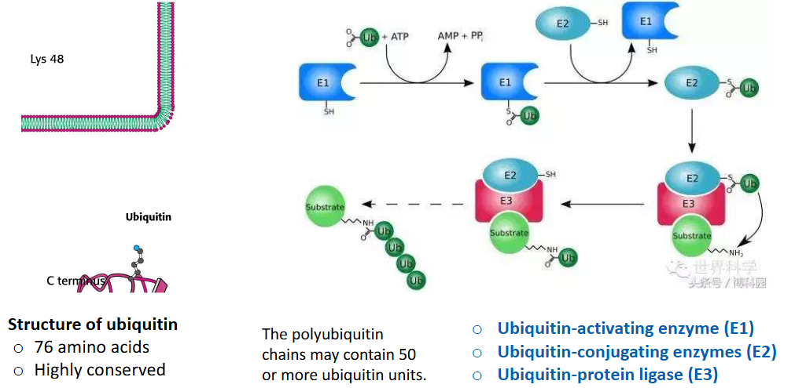

- **生理意义**：调控基因转录、细胞周期、昼夜节律、炎症反应等，缺陷可导致肿瘤、神经退行性疾病等。
- **诺贝尔奖关联**：2004年诺贝尔化学奖授予Aaron Ciechanover、Avram Hershko、Irwin Rose，表彰其发现“泛素介导的蛋白质降解”。

#### 2.4 蛋白质半衰期与氨基端残基

- **关键规律**：蛋白质氨基端残基种类决定其半衰期（酵母中 测定），如下表：

| 残基类型                  | 氨基端残基                   | 半衰期  |
| ------------------------- | ---------------------------- | ------- |
| 稳定型（Stabilizing）     | Ala、Gly、Met、Ser、Thr、Val | >20 h   |
| 不稳定型（Destabilizing） | Gln、Ile                     | ~30 min |
|                           | Glu、Tyr                     | ~10 min |
|                           | Pro                          | ~7 min  |
|                           | Asp、Leu、Lys、Phe           | ~3 min  |
|                           | Arg                          | ~2 min  |

### 3. 氨基酸分解代谢

#### 3.1 概述

- **核心路径**：
  1. **氨基移除**：氨基转化为尿素排泄；
  2. **碳骨架利用**：α-酮酸（α-keto acid）可氧化为CO₂和H₂O，或转化为葡萄糖、乙酰-CoA、酮体。
- **总反应示意**：
  氨基酸 → NH₃（氨基） + 碳骨架 → 尿素（排泄） + CO₂/H₂O/葡萄糖/乙酰-CoA/酮体

#### 3.2 氨基分解代谢

##### 3.2.1 转氨酶与磷酸吡哆醛（PLP）

- **转氨酶（Aminotransferase）**：催化氨基从氨基酸转移至α-酮戊二酸，生成谷氨酸和对应α-酮酸，反应可逆：
  $$
  \text{Amino acid} + \alpha\text{-Ketoglutarate} \rightleftharpoons \alpha\text{-Keto acid} + \text{Glutamate}
  $$
- **辅酶需求**：所有转氨酶需磷酸吡哆醛（PLP，维生素B₆衍生物）作为辅基，PLP通过醛基与酶活性中心赖氨酸残基结合，介导氨基转移。

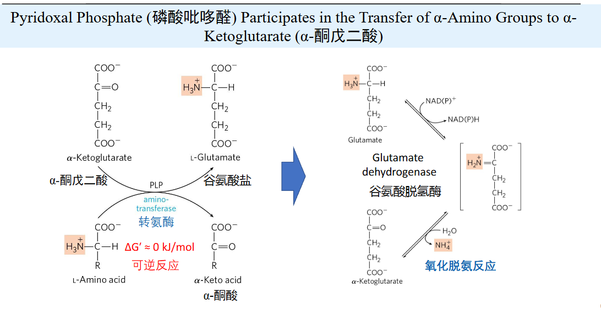

##### 3.2.2 氨的转运（避免氨毒性）

氨（NH₃/NH₄⁺）对细胞有毒性，需通过特定载体转运至肝脏代谢，主要途径：

| 转运途径          | 主要组织       | 转运形式        | 机制                                                                                                  |
| ----------------- | -------------- | --------------- | ----------------------------------------------------------------------------------------------------- |
| 谷氨酰胺途径      | 大多数组织     | 谷氨酰胺（Gln） | 谷氨酰胺合成酶催化谷氨酸 + NH₄⁺ + ATP → 谷氨酰胺，经血液运至肝脏后被谷氨酰胺酶水解为谷氨酸和NH₄⁺ |
| 葡萄糖-丙氨酸循环 | 骨骼肌         | 丙氨酸（Ala）   | 肌肉中氨基酸转氨给丙酮酸生成丙氨酸，运至肝脏后转氨为丙酮酸（糖异生为葡萄糖）和谷氨酸，氨进入尿素循环  |
| 直接排氨          | 水生动物（鱼） | NH₄⁺          | 通过鳃膜直接排出体外                                                                                  |
| 尿酸排泄          | 鸟类、爬行动物 | 尿酸            | 氨转化为尿酸（嘌呤降解产物）排泄                                                                      |

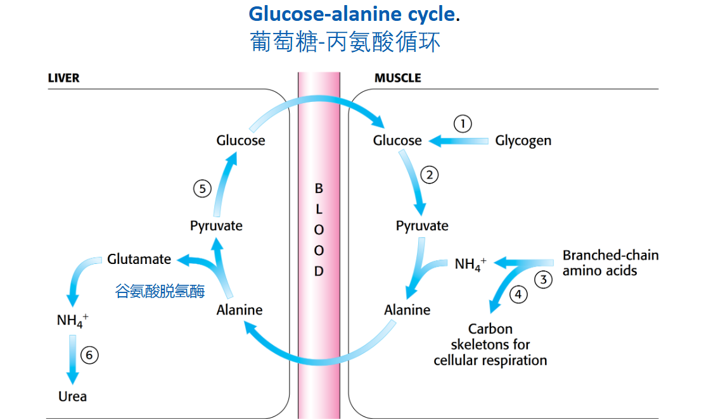

#### 3.3 尿素循环（Krebs–Henseleit Cycle）

- **发现**：1932年由Hans Krebs和Kurt Henseleit发现，是陆栖脊椎动物氨解毒的核心途径（肝脏中进行）。

  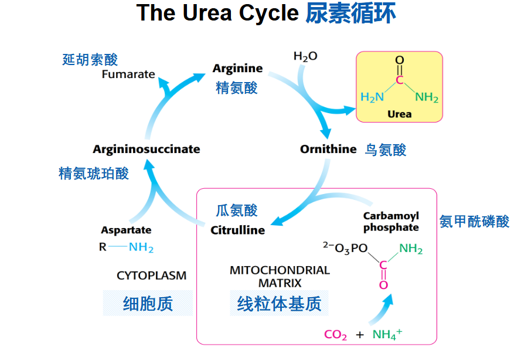
- **反应步骤与酶（分线粒体和胞质）**：

| 反应场所   | 步骤                                                 | 催化酶                          | 能量消耗/产物                   |
| ---------- | ---------------------------------------------------- | ------------------------------- | ------------------------------- |
| 线粒体基质 | 1. HCO₃⁻ + NH₄⁺ + 2ATP → 氨甲酰磷酸 + 2ADP + Pi | 氨甲酰磷酸合成酶I（CPS-I）      | 消耗2ATP                        |
| 线粒体基质 | 2. 氨甲酰磷酸 + 鸟氨酸 → 瓜氨酸 + Pi                | 鸟氨酸转氨甲酰酶（OTC）         | 生成瓜氨酸（进入胞质）          |
| 胞质       | 3. 瓜氨酸 + 天冬氨酸 + ATP → 精氨琥珀酸 + AMP + PPi | 精氨琥珀酸合成酶（ASS，限速酶） | 消耗1ATP（等价2ATP，因PPi水解） |
| 胞质       | 4. 精氨琥珀酸 → 精氨酸 + 延胡索酸                   | 精氨琥珀酸裂解酶（ASL）         | 延胡索酸进入柠檬酸循环          |
| 胞质       | 5. 精氨酸 + H₂O → 鸟氨酸 + 尿素                    | 精氨酸酶（Arginase）            | 鸟氨酸再生（返回线粒体）        |

- **核心特点**：
  - 1分子尿素清除2分子氨（1来自NH₄⁺，1来自天冬氨酸）和1分子CO₂；
  - 总消耗4ATP（步骤1消耗2ATP，步骤3消耗2ATP等价物）；
  - 尿素循环缺陷（如酶突变）导致高血氨症，引发脑损伤（如致命性脑水肿）。

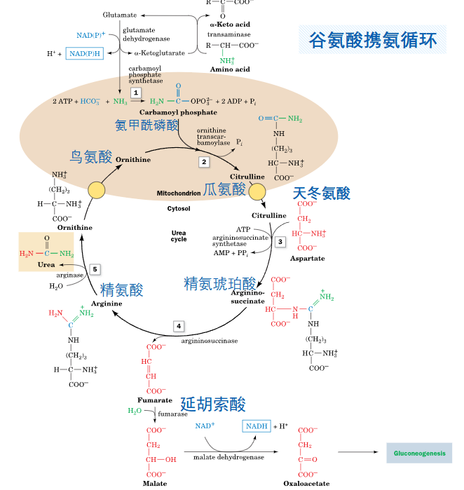

#### 3.4 尿素循环与柠檬酸循环的联系（Krebs Bicycle）

- **关键纽带**：尿素循环产生的延胡索酸进入柠檬酸循环，转化为苹果酸→草酰乙酸；草酰乙酸可通过转氨生成天冬氨酸（尿素循环步骤3的底物），或通过苹果酸-天冬氨酸穿梭进入线粒体，实现两循环的代谢偶联。

#### 3.5 尿素循环调节

- **关键激活剂**：N-乙酰谷氨酸（NAG），由N-乙酰谷氨酸合成酶催化乙酰-CoA + 谷氨酸生成，NAG激活氨甲酰磷酸合成酶I（CPS-I）。
- **疾病关联**：N-乙酰谷氨酸合成酶缺乏症（NAGSD）为罕见尿素循环障碍，导致高氨血症脑病和肝病。

### 4. 氨基酸碳骨架代谢

#### 4.1 碳骨架的去向（根据代谢产物分类）

氨基酸碳骨架最终进入糖酵解或柠檬酸循环，分为三类：

| 类型                     | 定义                                        | 代表氨基酸                                                                             |
| ------------------------ | ------------------------------------------- | -------------------------------------------------------------------------------------- |
| 生糖氨基酸（Glucogenic） | 碳骨架可转化为葡萄糖                        | 丙氨酸、丝氨酸、半胱氨酸、甘氨酸、谷氨酸、谷氨酰胺、脯氨酸、精氨酸、天冬氨酸、天冬酰胺 |
| 生酮氨基酸（Ketogenic）  | 碳骨架可转化为酮体（乙酰-CoA/乙酰乙酰-CoA） | 亮氨酸、赖氨酸                                                                         |
| 既生糖又生酮             | 碳骨架可同时生成葡萄糖和酮体                | 异亮氨酸、苯丙氨酸、酪氨酸、色氨酸                                                     |

#### 4.2 支链氨基酸的降解（肝外组织为主）

- **支链氨基酸**：亮氨酸（Leu）、异亮氨酸（Ile）、缬氨酸（Val），因侧链含分支结构得名。
- **降解部位**：主要在肌肉、脂肪、肾脏、脑等肝外组织（肝脏缺乏相关降解酶），氧化供能占氨基酸代谢总能量的10-15%。

#### 4.3 氨基酸代谢相关遗传疾病

| 疾病名称                 | 缺陷机制                                     | 临床症状                           |
| ------------------------ | -------------------------------------------- | ---------------------------------- |
| 苯丙酮尿症（PKU）        | 苯丙氨酸羟化酶缺陷，苯丙氨酸无法转化为酪氨酸 | 智力障碍、皮肤色素减少、癫痫       |
| 枫糖尿症（支链酮酸尿症） | 支链α-酮酸脱氢酶缺陷，支链氨基酸代谢受阻    | 呕吐、痉挛、智力障碍、婴儿期夭折   |
| 白化病                   | 酪氨酸酶缺陷，黑色素合成受阻                 | 皮肤、毛发、眼睛色素缺乏，对光敏感 |

### 5. 氨基酸生物合成

#### 5.1 氮循环（生物可利用氮的来源）

大气中N₂（占78%）需通过固氮作用转化为NH₃才能被生物利用，核心过程：

$$
N_2 \xrightarrow{\text{固氮菌/古菌（如根瘤菌）}} NH_3 \xrightarrow{\text{硝化细菌}} NO_2^- \xrightarrow{\text{硝化细菌}} NO_3^- \xrightarrow{\text{植物/微生物}} \text{氨基酸}
$$

- **固氮总量**：生物圈每年固定N₂约10¹¹kg，主要依赖固氮细菌（如与豆科植物共生的根瘤菌）。

#### 5.2 必需与非必需氨基酸

- **定义**：
  - 必需氨基酸（Essential）：哺乳动物无法合成，需从饮食获取；
  - 非必需氨基酸（Nonessential）：哺乳动物可从常见代谢中间物合成。

| 分类         | 氨基酸列表                                                                                                    | 备注                                                        |
| ------------ | ------------------------------------------------------------------------------------------------------------- | ----------------------------------------------------------- |
| 必需氨基酸   | Arginine*、Histidine†、Isoleucine、Leucine、Lysine、Methionine、Phenylalanine、Threonine、Tryptophan、Valine | *：哺乳动物可合成但多用于尿素循环；†：儿童必需，成人非必需 |
| 非必需氨基酸 | Alanine、Asparagine、Aspartate、Cysteine、Glutamate、Glutamine、Glycine、Proline、Serine、Tyrosine            | Cysteine需蛋氨酸提供硫；Tyrosine需苯丙氨酸转化              |

#### 5.3 合成的碳骨架来源

氨基酸的碳骨架均来自三大代谢途径的中间物：

| 代谢途径     | 中间物                                        | 合成的氨基酸                                                                                  |
| ------------ | --------------------------------------------- | --------------------------------------------------------------------------------------------- |
| 糖酵解       | 3-磷酸甘油酸、丙酮酸、磷酸烯醇式丙酮酸（PEP） | Ser、Gly、Cys、Ala、Val、Leucine、Isoleucine、Phenylalanine、Tyrosine、Tryptophan             |
| 柠檬酸循环   | α-酮戊二酸、草酰乙酸、琥珀酰-CoA             | Glutamate、Glutamine、Proline、Arginine、Aspartate、Asparagine、Methionine、Threonine、Lysine |
| 戊糖磷酸途径 | 5-磷酸核糖、赤藓糖-4-磷酸                     | Histidine、Tryptophan                                                                         |

#### 5.4 能量需求

合成氨基酸需消耗ATP（含前体合成能量），必需氨基酸合成消耗更高：

| 氨基酸类型 | 代表氨基酸 | 每分子氨基酸消耗ATP（摩尔） |
| ---------- | ---------- | --------------------------- |
| 非必需     | 天冬氨酸   | 2                           |
| 非必需     | 谷氨酸     | 3                           |
| 非必需     | 精氨酸     | 44                          |
| 必需       | 赖氨酸     | 50-51                       |
| 必需       | 色氨酸     | 78                          |
| 必需       | 苯丙氨酸   | 65                          |

### 6. 氨基酸的其他代谢产物

#### 6.1 血红素（Heme）合成

- **前体**：甘氨酸（Gly）和琥珀酰-CoA（Succinyl-CoA），在线粒体中启动合成，胞质中完成后续步骤。
- **功能**：构成血红蛋白、肌红蛋白、细胞色素（如细胞色素c）的辅基，参与氧运输和电子传递。

#### 6.2 生物活性胺（神经递质/激素）

氨基酸通过脱羧反应生成多种生理活性胺：

| 前体氨基酸 | 生物活性胺         | 功能                                         |
| ---------- | ------------------ | -------------------------------------------- |
| 酪氨酸     | 多巴胺             | 传递兴奋/愉悦信号，与成瘾行为相关            |
| 酪氨酸     | 肾上腺素           | 应激激素，增强心脏收缩力、提供能量，用于急救 |
| 酪氨酸     | 去甲肾上腺素       | 神经递质，调节血压和心率                     |
| 色氨酸     | 5-羟色胺（血清素） | 神经递质，调节情绪、睡眠                     |

#### 6.3 一氧化氮（NO）

- **来源**：由精氨酸（Arginine）在一氧化氮合酶（NOS）催化下生成，需NADPH和O₂参与。
- **功能**：
  - 舒张血管平滑肌，增加心脏供血；
  - 参与中枢神经系统信号传递；
  - 激活巨噬细胞产生羟自由基（·OH），杀灭细菌。

#### 6.4 肝脏中氨基酸作为主要碳源

- **研究结论**（Liao, Y, et al. Cell Metabolism, 2024）：
  - 肝脏三羧酸循环（TCA）的主要底物是氨基酸，而非葡萄糖；
  - 存在“丙酮酸屏障”，阻止丙酮酸进入肝脏TCA循环；
  - 谷氨酰胺（Gln）易作为碳源进入TCA循环；
  - 进食状态下，肝脏葡萄糖主要转化为糖原储存。

### 7. 总结

1. 错误折叠或快速周转的蛋白质通过ATP依赖系统降解：真核细胞中靶蛋白先被泛素化，再经蛋白酶体水解，该过程调控多种细胞功能。
2. 氨基酸分解代谢先移除氨基：多数情况下氨基转移至α-酮戊二酸生成谷氨酸（需PLP辅酶），谷氨酸在肝线粒体中释放氨（谷氨酸脱氢酶催化）。
3. 氨的转运与解毒：氨以谷氨酰胺（全身）或丙氨酸（肌肉）形式运至肝脏，经尿素循环转化为尿素排泄（1分子尿素消耗4ATP，再生鸟氨酸）。
4. 氨基酸碳骨架的利用：可转化为葡萄糖、酮体或氧化供能，营养缺乏时是重要能量来源。
5. 氨基酸合成差异：植物和细菌可合成所有20种常见氨基酸，哺乳动物仅合成非必需氨基酸，必需氨基酸需从饮食获取。
6. 氨基酸是关键生物前体：参与合成核苷酸、血红素、神经递质（如多巴胺）、NO等重要分子。
7. 肝脏代谢特点：氨基酸是肝脏TCA循环的主要碳源，谷氨酰胺是优选碳源，葡萄糖主要用于糖原合成。


---


## Biochemistry 2 笔记（第七讲）

课程信息

* 课程：BIOCHEMISTRY 2 / 生物化学 2
* 教师：Li Chun（李春）教授，化学工程系，清华大学
* 主题：核苷酸代谢（Nucleotide Metabolism）
* 关联背景：衔接氨基酸代谢（含氮有机物代谢延伸），核心涵盖核苷酸的合成（从头合成 / 补救途径）、降解、调控及临床代谢紊乱
  目录
* 1 代谢衔接与概述
* 2 核苷酸的结构与核心功能
* 3 嘌呤核苷酸代谢（合成 + 降解）
* 4 嘧啶核苷酸代谢（合成 + 降解）
* 5 脱氧核糖核苷酸的生物合成
* 6 核苷酸代谢的调控机制
* 7 临床关联：代谢紊乱与疾病
* 8 总结与关键问题思考

---

### 1 代谢衔接与概述

#### 1.1 代谢定位

* 核苷酸代谢是**含氮有机物代谢**的核心分支，衔接氨基酸代谢（氨的同化、谷氨酰胺 / 谷氨酸作为氮源），最终完成含氮废物的排泄（尿酸、尿素等）。
* 核心逻辑：核苷酸作为 DNA/RNA 的基本单位，其代谢平衡直接影响遗传信息传递、能量供应、信号传导等关键生命过程。

#### 1.2 核心代谢路径

| 代谢方向 | 核心底物 / 产物                         | 关键功能                                 |
| -------- | --------------------------------------- | ---------------------------------------- |
| 合成代谢 | 前体（氨基酸、PRPP 等）→ 核苷酸        | 合成核酸、能量载体（ATP/GTP）、辅酶组分  |
| 补救代谢 | 游离碱基 / 核苷 + PRPP → 核苷酸        | 节约能量，回收降解产物，维持核苷酸池稳态 |
| 降解代谢 | 核苷酸 → 碱基 → 终产物（尿酸 / 氨等） | 清除多余核苷酸，排泄含氮废物             |

#### 1.3 关键前体物质

* 5 - 磷酸核糖 - 1 - 焦磷酸（PRPP）：激活的核糖供体，是从头合成和补救途径的共同前体，来自戊糖磷酸途径（PPP）的核糖 - 5 - 磷酸。
* 含氮前体：谷氨酰胺（酰胺氮供体）、天冬氨酸（氨基供体）、甘氨酸（嘌呤环骨架）。
* 碳源 / 其他：CO₂（嘌呤环 C6、嘧啶环 C2）、甲酸盐（10 - 甲酰四氢叶酸携带）。

---

### 2 核苷酸的结构与核心功能

#### 2.1 基本结构层级

核苷酸由 “碱基 + 戊糖 + 磷酸基团” 组成，层级关系如下：

```plaintext
碱基（嘌呤/嘧啶） + 戊糖（核糖/脱氧核糖）→ 核苷 → （加1-3个磷酸）→ 核苷酸
```

* 戊糖差异：核糖核苷酸（RNA 组分）含 2'- 羟基，脱氧核糖核苷酸（DNA 组分）含 2'- 氢。
* 磷酸基团：连接在戊糖的 5'- 羟基，形成核苷一磷酸（NMP）、二磷酸（NDP）、三磷酸（NTP）。

#### 2.2 核心组分分类

| 类别           | 具体组分                                | 存在形式                                |
| -------------- | --------------------------------------- | --------------------------------------- |
| 嘌呤碱基       | 腺嘌呤（A）、鸟嘌呤（G）                | DNA/RNA 共通                            |
| 嘧啶碱基       | 胞嘧啶（C）、尿嘧啶（U）、胸腺嘧啶（T） | U 仅存于 RNA，T 仅存于 DNA              |
| 核糖核苷酸     | AMP、GMP、CMP、UMP                      | RNA 基本单位；能量载体（ATP）、辅酶组分 |
| 脱氧核糖核苷酸 | dAMP、dGMP、dCMP、dTMP                  | DNA 基本单位                            |

#### 2.3 核苷酸的七大核心功能

1. 核酸的基本构件：DNA 和 RNA 的合成原料（NTP/dNTP）。
2. 能量货币：ATP 是通用能量载体，GTP 参与信号传导、蛋白质合成等特定过程。
3. 生物合成中间体：如 UDP - 葡萄糖（糖原合成）、CDP - 二酰甘油（磷脂合成）。
4. 信号传导组分：参与 GPCR 等信号通路的核心分子。
5. 第二信使：cAMP（环腺苷酸）、cGMP（环鸟苷酸）介导胞内信号传递。
6. 磷酸基团供体：ATP 为蛋白激酶催化的磷酸化反应提供磷酸基团。
7. 辅酶核心组分：FAD、NAD⁺、CoA 等辅酶均含核苷酸结构。

---

### 3 嘌呤核苷酸代谢

嘌呤核苷酸合成以**次黄嘌呤核苷酸（IMP）** 为共同前体，分为从头合成和补救途径，降解终产物为尿酸。

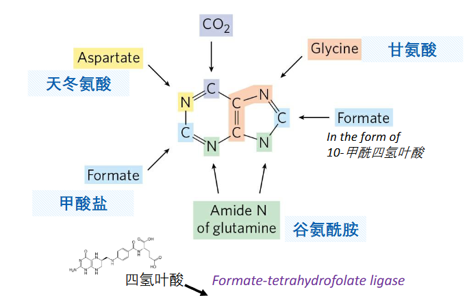

#### 3.1 从头合成途径（De Novo Pathway）

* **合成部位** ：细胞质，哺乳动物以肝脏为主，其次是小肠和胸腺。
* **核心前体** ：PRPP、甘氨酸、谷氨酰胺、天冬氨酸、CO₂、10 - 甲酰四氢叶酸（携带甲酸盐）。
* **关键步骤（10 步反应，核心特点）** ：

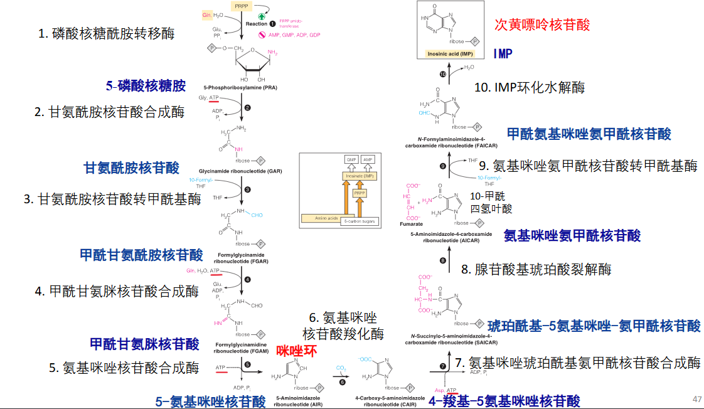

1. 起始反应：PRPP + 谷氨酰胺 → 5 - 磷酸核糖胺（PRA），由磷酸核糖酰胺转移酶催化，是限速步骤。
2. 环结构形成：第 5 步形成咪唑环，第 10 步形成嘧啶环，最终生成 IMP。
3. 能量消耗：每生成 1 分子 IMP 需消耗 6 分子 ATP（含 PRPP 合成消耗的 2 个高能磷酸键）。
4. 原子来源：嘌呤环 N9（谷氨酰胺）、C4/C5/N7（甘氨酸）、C8（10 - 甲酰四氢叶酸）、N3（谷氨酰胺）、C6（CO₂）、N1（天冬氨酸）、C2（10 - 甲酰四氢叶酸）。

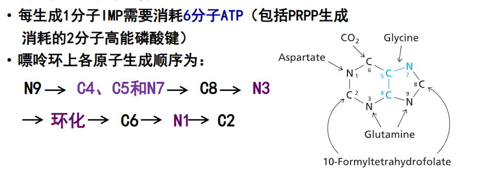

* **IMP 的转化** ：IMP 通过两条独立途径分别生成 AMP 和 GMP：
* IMP → 腺苷酸琥珀酸 → AMP（需天冬氨酸、GTP 供能）。
* IMP → XMP（黄嘌呤核苷酸） → GMP（需谷氨酰胺、ATP 供能）。

#### 3.2 补救途径（Salvage Pathway）

* **核心意义** ：回收核酸降解产生的游离碱基，节约从头合成的能量（仅需 1 分子 ATP，而从头合成需 6 分子 ATP）。
* 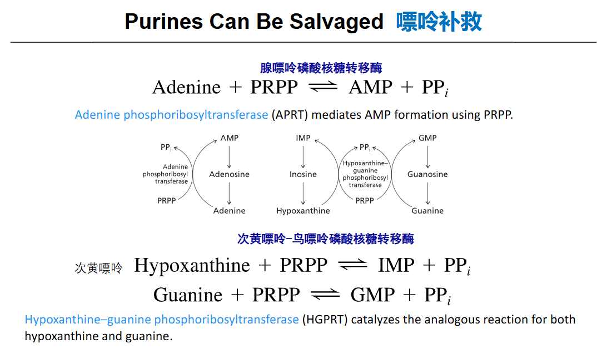
* **关键酶与反应** ：

1. 腺嘌呤磷酸核糖转移酶（APRT）：腺嘌呤 + PRPP → AMP + PPi（特异性作用于腺嘌呤）。
2. 次黄嘌呤 - 鸟嘌呤磷酸核糖转移酶（HGPRT）：次黄嘌呤 + PRPP → IMP + PPi；鸟嘌呤 + PRPP → GMP + PPi（作用于次黄嘌呤和鸟嘌呤）。

* **酶学特点** ：HGPRT 对 PRPP 的 Km 值低于从头合成的磷酸核糖酰胺转移酶，低 PRPP 浓度下补救途径优先进行。

#### 3.3 嘌呤核苷酸的降解

* **核心路径** ：嘌呤核苷酸 → 核苷 → 游离碱基 → 尿酸（人类及灵长类）。
* **关键步骤** ：核苷酸酶水解磷酸基团生成核苷，核苷磷酸化酶水解糖苷键生成碱基，最终经黄嘌呤氧化酶催化生成尿酸。
* **不同动物的排泄形式** ：
* 排氨动物（水生脊椎动物）：尿酸进一步降解为氨排泄。
* 排尿素动物（多数陆地脊椎动物）：氨经尿素循环生成尿素排泄。
* 排尿酸动物（鸟类、爬行动物）：直接排泄尿酸（节水适应）。

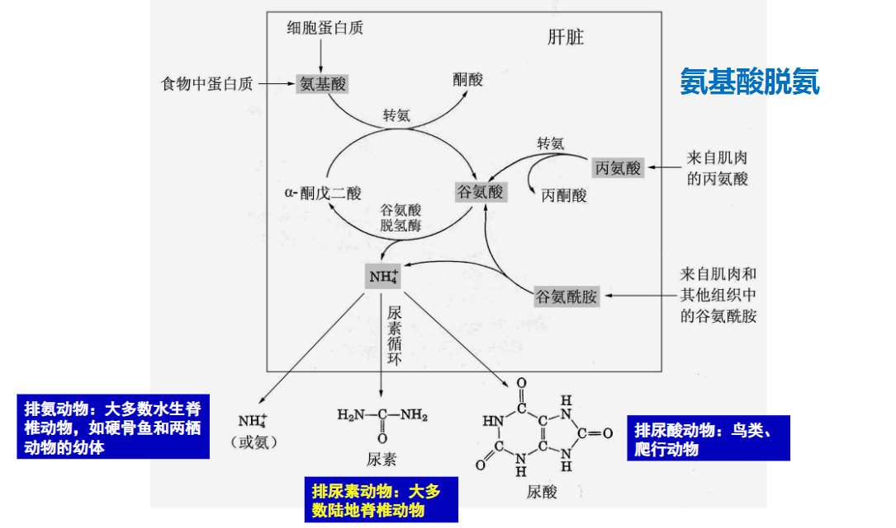

---

### 4 嘧啶核苷酸代谢

嘧啶核苷酸合成以**尿嘧啶核苷酸（UMP）** 为前体，合成过程较嘌呤简单，降解产物为可溶性小分子。

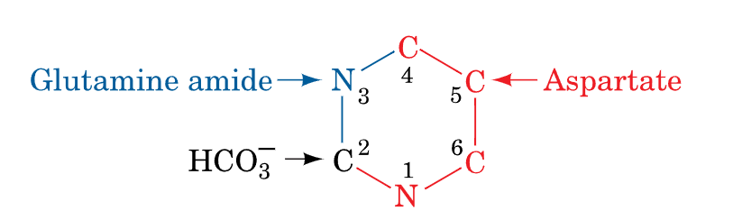

#### 4.1 从头合成途径

* **合成部位** ：细胞质（所有细胞均有，肝脏活性最高）。
* **核心前体** ：PRPP、氨甲酰磷酸（HCO₃⁻ + 谷氨酰胺 + ATP 生成）、天冬氨酸。
* **关键步骤与特点** ：

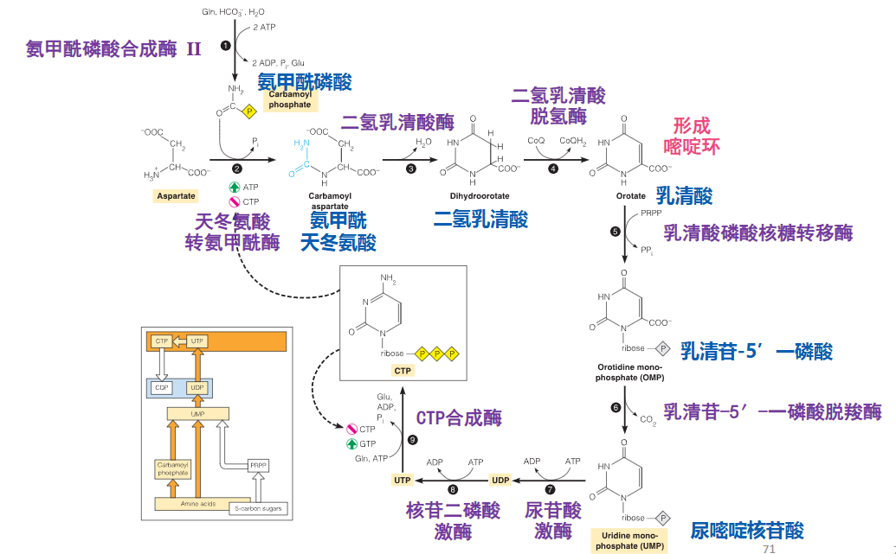

1. 起始反应：谷氨酰胺 + HCO₃⁻ + ATP → 氨甲酰磷酸，由氨甲酰磷酸合成酶 II（CPS II）催化（限速步骤）。
2. 环结构形成：氨甲酰磷酸与天冬氨酸缩合，经 6 步反应生成 UMP（先形成嘧啶环，再结合 PRPP，与嘌呤合成顺序相反）。
3. UMP 的转化：UMP → UDP → UTP → CTP（CTP 合成酶催化，谷氨酰胺提供氨基，ATP 供能）。
4. 原子来源：嘧啶环 N1/C4/C5/C6（天冬氨酸）、C2（HCO₃⁻）、N3（谷氨酰胺）。

#### 4.2 补救途径

* **主要路径** ：

1. 嘧啶核苷激酶途径（核心）：尿嘧啶核苷 + ATP → UMP + ADP（尿苷激酶催化）；胸苷 + ATP → dTMP + ADP（胸苷激酶催化）。
2. 磷酸核糖转移酶途径：嘧啶 + PRPP → 磷酸嘧啶核苷 + PPi（嘧啶磷酸核糖转移酶催化，特异性较低）。

#### 4.3 与尿素循环的关联

* 关键酶对比：氨甲酰磷酸合成酶（CPS）有两种同工酶，功能严格区分：| 同工酶 | 分布               | 氮源         | 变构激活剂     | 功能           |
  | ------ | ------------------ | ------------ | -------------- | -------------- |
  | CPS I  | 肝细胞线粒体       | 氨（NH₄⁺） | N - 乙酰谷氨酸 | 尿素合成       |
  | CPS II | 细胞质（所有细胞） | 谷氨酰胺     | 无             | 嘧啶核苷酸合成 |

#### 4.4 嘧啶核苷酸的降解

* **降解产物** ：嘧啶碱基经水解、还原反应，最终生成：
* 胞嘧啶 / 尿嘧啶：氨 + 碳酸氢盐 + 乙酰 CoA。
* 胸腺嘧啶：氨 + 碳酸氢盐 + 琥珀酰 CoA（可进入柠檬酸循环供能）。
* **特点** ：降解产物均为可溶性小分子，无结晶沉积风险（与嘌呤降解的尿酸不同）。

---

### 5 脱氧核糖核苷酸的生物合成

脱氧核糖核苷酸（dNTP）由核糖核苷酸（NDP）还原生成，为 DNA 合成提供原料，核心酶为核糖核苷酸还原酶。

#### 5.1 核心酶：核糖核苷酸还原酶（Ribonucleotide Reductase, RNR）

* **功能** ：催化 ADP、GDP、CDP、UDP（核苷二磷酸）还原为 dADP、dGDP、dCDP、dUDP（唯一催化所有核糖核苷酸还原的酶）。
* **结构特点** ：
* 大肠杆菌酶由 α₂β₂亚基组成，含双核铁中心（β 亚基）和酪氨酸自由基（ Tyr122），参与电子传递。
* 真核酶结构类似，依赖谷胱甘氧还蛋白或硫氧还蛋白提供还原当量（再生酶的二硫键）。
* **催化机制** ：

1. 酪氨酸自由基传递电子，激活半胱氨酸产生硫自由基。
2. 硫自由基与核苷酸核糖 C3 羟基互作，引发 C2 羟基质子化、C3 羟基去质子化。
3. 二硫键阴离子还原 C2 和 C3，生成脱氧核糖，再生酪氨酸自由基。

#### 5.2 dTMP 的特异性合成

dTMP 由 dUMP 甲基化生成，是 DNA 特有的核苷酸：

* 路径：dUDP → dUMP（dUDP 磷酸酶催化）；或 dCMP → dUMP（dCMP 脱氨酶催化）。
* 关键酶：胸苷酸合酶，以 5,10 - 亚甲基四氢叶酸为甲基供体，将 dUMP 甲基化为 dTMP（四氢叶酸转化为二氢叶酸，需二氢叶酸还原酶再生）。

#### 5.3 调控机制

* 核糖核苷酸还原酶受 dNTPs 别构调控：
  * ATP 激活酶活性，维持酶的基础功能。
  * dATP 强烈抑制酶活性（避免 dNTP 过量积累）。
  * dGTP、dTTP、dCTP 分别调控特定底物的还原（如 dGTP 促进 ADP 还原，dTTP 促进 CDP 还原）。

---

### 6 核苷酸代谢的调控机制

核苷酸代谢通过 “限速酶别构调节 + 产物反馈抑制” 维持平衡，避免无效循环。

#### 6.1 嘌呤核苷酸合成的调控

* 限速步骤：磷酸核糖酰胺转移酶（从头合成起始反应）受 IMP、AMP、GMP 反馈抑制（协同抑制，增强调控效果）。
* 分支点调控：IMP 转化为 AMP 需 GTP，转化为 GMP 需 ATP，形成交叉调控（一种核苷酸过量抑制自身合成，促进另一种合成）。
* 补救途径调控：HGPRT 活性不足时，PRPP 积累，反而激活从头合成（导致嘌呤过量降解生成尿酸）。

#### 6.2 嘧啶核苷酸合成的调控

* 限速步骤：
  * 原核生物：天冬氨酸转氨甲酰酶（ATCase）受 CTP 反馈抑制，ATP 激活（平衡嘌呤与嘧啶比例）。
  * 真核生物：氨甲酰磷酸合成酶 II（CPS II）受 UTP 反馈抑制，PRPP 激活。
* 终产物调控：CTP 抑制 UTP → CTP 的转化，UMP 抑制自身合成的多步反应。

#### 6.3 跨途径调控

* PRPP 合成酶：催化核糖 - 5 - 磷酸 → PRPP，是嘌呤和嘧啶合成的共同调控点，受 ADP、GDP、UDP、CDP 反馈抑制（避免 PRPP 过量）。
* 嘌呤核苷酸循环：肌肉中 AMP 脱氨生成 IMP 和氨，同时产生延胡索酸补充柠檬酸循环（衔接能量代谢与核苷酸代谢）。

---

### 7 临床关联：代谢紊乱与疾病

核苷酸代谢酶缺陷或调控异常会导致多种疾病，核心关联如下：

#### 7.1 痛风（Gout）

* **病因** ：尿酸生成过量或排泄不足，导致血尿酸浓度＞420μmol/L（尿酸钠溶解度阈值），结晶沉积于关节、肾脏。
* **核心机制** ：

1. HGPRT 部分缺陷：补救途径减弱，嘌呤从头合成增强，尿酸生成增多（最常见原因）。
2. PRPP 合成酶活性亢进：PRPP 过量，驱动嘌呤从头合成加速。
3. 葡萄糖 - 6 - 磷酸酶缺陷：戊糖磷酸途径增强，核糖 - 5 - 磷酸增多，PRPP 生成增加。

* **症状** ：急性关节炎（多累及趾基底部）、关节畸形、肾结石、肾功能损伤。

#### 7.2 Lesch-Nyhan 综合征（自毁容貌症）

* **病因** ：HGPRT 完全缺陷（X 连锁隐性遗传），仅发生于男性。
* **机制** ：嘌呤补救途径完全阻断，嘌呤只能通过从头合成和降解生成尿酸，导致血尿酸急剧升高。
* **症状** ：2 岁左右发病，智力迟钝、运动协调障碍、自我伤害倾向（咬手指 / 脚趾）、痛风性关节炎、肾功能衰竭。

#### 7.3 其他代谢紊乱

* 嘧啶代谢缺陷：如乳清酸尿症（乳清苷酸脱羧酶缺陷），导致乳清酸沉积，引发贫血、发育迟缓。
* 脱氧核苷酸代谢缺陷：如严重联合免疫缺陷症（腺苷脱氨酶缺陷），导致 dATP 积累，抑制 RNR 活性，淋巴细胞增殖受阻。

---

### 8 总结与关键问题思考

#### 8.1 核心知识点总结

1. 核苷酸代谢是含氮有机物代谢的核心，衔接氨基酸代谢（谷氨酰胺 / 谷氨酸供氮）和能量代谢（ATP/GTP 为能量载体）。
2. 嘌呤和嘧啶核苷酸均有从头合成（从简单前体组装）和补救途径（回收游离碱基），前者耗能高，后者节能且为分化组织的主要合成方式。
3. 脱氧核糖核苷酸由核糖核苷酸还原生成（RNR 催化），dTMP 需 dUMP 甲基化合成，严格受 dNTPs 别构调控。
4. 嘌呤降解终产物为尿酸（人类），嘧啶降解为可溶性小分子，代谢缺陷多与尿酸积累（痛风）或酶缺陷（Lesch-Nyhan 综合征）相关。
5. 调控核心是限速酶的反馈抑制，跨途径调控（如 PRPP 合成酶）维持嘌呤与嘧啶的比例平衡。

#### 8.2 关键问题思考

1. 比较嘌呤和嘧啶从头合成的差异（起始物质、环结构形成顺序、限速酶）。
2. 为什么 HGPRT 缺陷会同时导致痛风和 Lesch-Nyhan 综合征？两者的酶活性缺陷程度有何不同？
3. 核糖核苷酸还原酶的别构调控如何确保 dNTPs 的比例适配 DNA 合成需求？
4. 解释 “嘌呤核苷酸循环” 如何衔接肌肉的能量代谢与核苷酸代谢。
5. 临床治疗痛风的药物（如别嘌醇）作用靶点是什么？其代谢机制如何？


## Biochemistry 2 笔记（第九讲）

课程信息

- 课程：BIOCHEMISTRY 2 / 生物化学2
- 教师：Qin Lei（秦磊）教授，化学工程系，清华大学
- 主题：脂类代谢（Lipid Metabolism）
- 授课核心：围绕脂类的“消化吸收-分解供能-合成储存-特殊代谢”展开，涵盖三酰甘油、脂肪酸、酮体及其他脂类（甘油磷脂、鞘脂、胆固醇）的代谢路径与调控机制
- 参考依据：结合同位素示踪实验（如Knoop脂肪酸氧化实验、Buchanan嘌呤合成实验）、酶促反应机制及临床关联案例

目录

- 1 脂类代谢概述（功能、能量优势、核心路径）
- 2 三酰甘油的消化与吸收（乳化-酶解-转运全流程）
- 3 三酰甘油的分解代谢（脂解作用+脂肪酸氧化）
- 4 酮体的生成、利用与代谢异常
- 5 脂肪酸的生物合成（原料转运-关键酶-合成循环）
- 6 其他脂类的合成（甘油磷脂、鞘脂、胆固醇）
- 7 脂蛋白系统（分类、组成、功能与运输路径）
- 8 脂类代谢的多层调控（激素-酶-信号分子）
- 9 总结与关键问题思考

---

### 1 脂类代谢概述

#### 1.1 脂类的核心生理功能

脂类是细胞代谢的关键分子，主要承担四大功能，且各功能存在明确的生理场景适配：

- **1. 燃料分子（能量储备核心）**

  - 储存形式：以**三酰甘油（Triacylglycerols, TAG）** 为主，存在于脂肪组织的脂肪细胞（Adipocytes）中，占人体燃料储备的70%以上（70kg成人约储存15kg TAG）。
  - 供能特点：氧化能值极高（**37 kJ/g**），是碳水化合物（17 kJ/g）和蛋白质（17 kJ/g）的2.2倍；且近乎无水储存（1g TAG仅结合少量水），而1g糖原需结合2g水，因此TAG的“能量密度”是水化糖原的**6.75倍**，是进化选择的主要能量储备形式。
- **2. 构建分子（生物膜骨架）**

  - 核心成分：磷脂（如磷脂酰胆碱、磷脂酰乙醇胺）和糖脂，构成细胞膜、线粒体膜等生物膜的“脂质双层”结构。
  - 结构优势：磷脂分子的“疏水尾部+亲水头部”特性，使膜具备屏障功能，分隔细胞内外/细胞器内外的代谢环境。
- **3. 蛋白质共价修饰（功能定位调控）**

  - 修饰方式：脂肪酸（如棕榈酸、豆蔻酸）通过酯键或酰胺键连接到蛋白质的特定氨基酸残基（如半胱氨酸、赖氨酸）。
  - 生理作用：引导蛋白质定位于细胞膜（如G蛋白偶联受体GPCR的棕榈酰化），确保信号传导、物质转运等功能的精准执行。
- **4. 脂肪酸衍生物（信号分子）**

  - 主要类型：前列腺素（炎症信号）、白三烯（免疫调节）、肾上腺素（应激激素）等。
  - 作用机制：作为激素或胞内第二信使，调控食欲、体重、炎症反应等生理过程

#### 1.2 脂类代谢的核心路径框架

脂类代谢遵循“分解-合成-特殊分流”的逻辑，不同路径对应不同生理需求：

| 代谢方向 | 核心底物        | 关键场所                                | 最终产物/功能                  |
| -------- | --------------- | --------------------------------------- | ------------------------------ |
| 分解代谢 | 三酰甘油        | 脂肪细胞（脂解）→ 线粒体（脂肪酸氧化） | 乙酰CoA→ATP（供能）           |
| 合成代谢 | 乙酰CoA         | 肝脏/脂肪细胞（细胞质）                 | 脂肪酸→三酰甘油（储存）       |
| 特殊代谢 | 乙酰CoA（肝脏） | 肝细胞线粒体                            | 酮体（供能给脑/肌肉）          |
| 特殊代谢 | 乙酰CoA         | 肝脏/小肠（内质网）                     | 胆固醇/磷脂（膜成分/信号前体） |

---

### 2 三酰甘油的消化与吸收（针对膳食来源）

#### 2.1 消化的核心挑战与解决方案

- **核心挑战**：脂类不溶于水（膳食TAG为油滴形式），而消化酶（如脂肪酶）在水溶液中发挥作用，需通过“乳化”打破油-水界面。
- **解决方案**：胆汁盐（Bile Salts）作为乳化剂，其分子结构含“疏水环（胆酸骨架）+亲水侧链（羧基/磺酸基）”，可将大油滴分散为**500nm以下的微滴**，增大脂肪酶与TAG的接触面积。

#### 2.2 消化的分步过程（从口腔到小肠）

| 消化部位         | 参与物质                                                      | 反应过程                                                                                   | 产物                                        |
| ---------------- | ------------------------------------------------------------- | ------------------------------------------------------------------------------------------ | ------------------------------------------- |
| 口腔/食道        | 唾液脂肪酶（少量）                                            | 无显著TAG水解（停留时间短）                                                                | -                                           |
| 胃               | 胃脂肪酶（pH 3-6活性）                                        | 水解TAG的1位酯键，生成少量脂肪酸（FA）和二酰甘油（DAG）                                    | 脂肪酸、二酰甘油                            |
| 小肠（关键场所） | 1. 胆汁盐（肝脏合成，胆囊储存）`<br>`2. 胰腺脂肪酶+辅脂肪酶 | 1. 胆汁盐乳化TAG为微滴；`<br>`2. 辅脂肪酶结合脂肪酶，锚定在微滴表面，水解TAG的1、3位酯键 | 2分子游离脂肪酸（FFA）+1分子单酰甘油（MAG） |

#### 2.3 吸收与转运机制（肠上皮细胞→全身）

1. **肠上皮细胞吸收**

   - 吸收形式：脂肪酸（短链/中链FA直接扩散，长链FA需脂肪酸转运蛋白FATP介导）、单酰甘油通过肠绒毛上皮细胞的刷状缘膜进入细胞。
   - 细胞内重组：吸收的FA和MAG在细胞质中被“甘油三酯合成酶”重新合成TAG，避免FA对细胞的毒性。
2. **乳糜微滴（Chylomicron）形成与转运**

   - 结构组成：以TAG为核心（占86%干重），表面包裹磷脂（7%）、胆固醇（5%）和载脂蛋白（如A-I、A-II、B-48，占2%），直径1000-10000Å，是最大的脂蛋白。
   - 转运路径：由于乳糜微滴体积大，无法直接进入毛细血管，需通过**淋巴系统**（肠绒毛淋巴管→胸导管）进入血液，再运输至脂肪组织、肌肉等外周组织。
3. **临床关联**：胆汁盐缺乏（如肝硬化、胆道梗阻）会导致脂肪消化吸收障碍，引发**脂肪泻**（每日粪便排脂量＞30g，粪便油腻、恶臭）。

---

### 3 三酰甘油的分解代谢（细胞内TAG→能量）

#### 3.1 脂解作用（脂肪细胞内TAG水解）

脂解是TAG分解的第一步，指脂肪细胞内的TAG被脂酶逐步水解为FA和甘油的过程，受激素严密调控。

##### 3.1.1 关键脂酶与作用步骤

脂解需三种脂酶协同作用，逐步去除TAG的脂肪酸链：

| 脂酶名称         | 英文缩写   | 作用底物        | 产物                | 调控特点                                        |
| ---------------- | ---------- | --------------- | ------------------- | ----------------------------------------------- |
| 脂肪甘油三酯脂酶 | ATGL       | 三酰甘油（TAG） | 二酰甘油（DAG）+ FA | 启动脂解的关键酶，需辅激活因子CA（Coactivator） |
| 激素敏感性脂酶   | HS lipase  | 二酰甘油（DAG） | 单酰甘油（MAG）+ FA | 受激素调控（磷酸化激活、去磷酸化抑制）          |
| 单酰甘油脂酶     | MAG lipase | 单酰甘油（MAG） | 甘油 + FA           | constitutively active（组成型活性），无显著调控 |

##### 3.1.2 激素调控的信号通路（以肾上腺素激活为例）

1. 信号触发：肾上腺素（或胰高血糖素）结合脂肪细胞膜上的**GPCR（7TM受体）**，激活G蛋白（Gsα亚型）。
2. 第二信使生成：Gsα激活腺苷酸环化酶，催化ATP生成**cAMP**。
3. 酶促级联：cAMP激活蛋白激酶A（PKA），PKA进一步磷酸化两个关键靶点：
   - **Perilipin（围脂滴蛋白）**：磷酸化后构象变化，暴露脂滴表面的TAG，便于脂酶结合。
   - **HS lipase**：磷酸化后从细胞质转移至脂滴表面，激活其水解活性。
4. 脂解抑制：胰岛素通过激活磷酸酶（如PP1），使HS lipase和Perilipin去磷酸化，抑制脂解（与肾上腺素作用互逆）。

##### 3.1.3 负反馈调节（FFA4介导的抑制）

当脂解产生大量游离脂肪酸（FFA）时，FFA会结合脂肪细胞膜上的**FFA4（GPCR家族成员）**，通过以下机制抑制脂解：

- FFA4激活Gi/o型G蛋白，抑制腺苷酸环化酶活性，降低cAMP水平。
- cAMP减少导致PKA激活不足，HS lipase无法被磷酸化，脂解速率下降（避免FFA过量积累对细胞的毒性）。

#### 3.2 脂肪酸氧化（线粒体中的能量转化）

脂解产生的FA需进入线粒体进行β-氧化（β-Oxidation），生成乙酰CoA后进入柠檬酸循环（CAC）产ATP，分为“激活-转运-β-氧化”三步。

##### 3.2.1 步骤1：脂肪酸激活（细胞质，消耗能量）

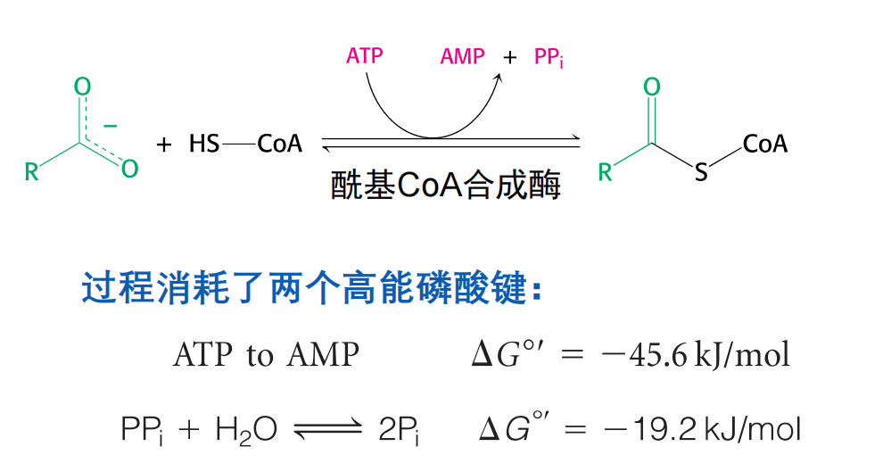

- 催化酶：**酰基CoA合成酶（Acyl-CoA Synthetase）**，分三类（短链：C4-C6；中链：C8-C12；长链：C14-C20），确保不同长度FA的激活。
- 反应过程：
  $$
  \text{脂肪酸} + \text{CoA-SH} + \text{ATP} \xrightarrow{\text{酰基CoA合成酶}} \text{脂酰CoA} + \text{AMP} + \text{PPi}
  $$
- 能量消耗：反应生成的PPi（焦磷酸）被“焦磷酸酶”快速水解（ΔG'°=-19.2 kJ/mol），相当于消耗**2个高能磷酸键**（ATP→AMP+2Pi），确保反应不可逆。

##### 3.2.2 步骤2：脂酰CoA转运（线粒体内膜，关键调控点）

脂酰CoA无法直接穿过线粒体内膜，需通过**肉碱酰基转移酶系统（Carnitine Shuttle System）** 转运，该系统含3个核心组件：

| 组件名称            | 英文缩写    | 定位           | 功能                                                                |
| ------------------- | ----------- | -------------- | ------------------------------------------------------------------- |
| 肉碱酰基转移酶I     | CPT I       | 线粒体外膜内侧 | 催化脂酰CoA + 肉碱 → 脂酰肉碱 + CoA-SH（生成可跨膜的脂酰肉碱）     |
| 肉碱-脂酰肉碱移位酶 | Translocase | 线粒体内膜     | 介导脂酰肉碱进入基质，同时将肉碱运回膜间隙（反向转运）              |
| 肉碱酰基转移酶II    | CPT II      | 线粒体基质侧   | 催化脂酰肉碱 + CoA-SH → 脂酰CoA + 肉碱（再生脂酰CoA，用于β-氧化） |

- **关键调控**：CPT I是脂肪酸氧化的“速率限制酶”，受**丙二酸单酰CoA（Malonyl-CoA）** 别构抑制（丙二酸单酰CoA是脂肪酸合成的中间体，其积累时优先促进合成，抑制氧化，避免“无效循环”）。
- **临床关联**：左旋肉碱（L-Carnitine）是肉碱的活性形式，可辅助脂酰CoA转运，常用于健身人群（加速脂肪燃烧）、高血脂患者（改善脂肪酸代谢），但需注意其为膳食补充剂，不能替代药物。

##### 3.2.3 步骤3：β-氧化循环（线粒体基质，4步反应）

饱和脂肪酸（如棕榈酸，C16）通过“脱氢-水合-再脱氢-硫解”的循环反应，每次去除2个碳原子（生成1分子乙酰CoA），共需7轮循环（C16→8分子乙酰CoA）。

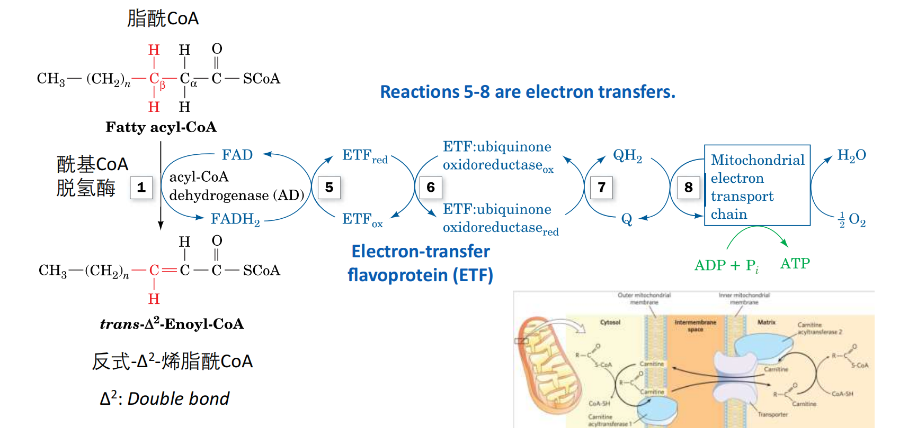

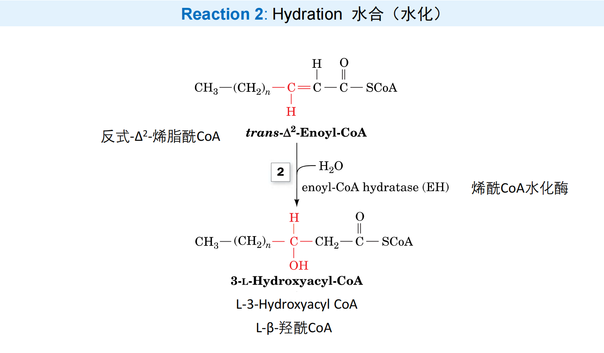

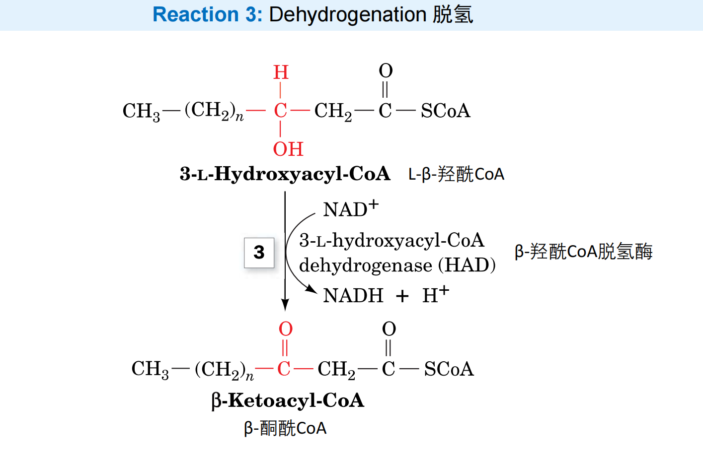

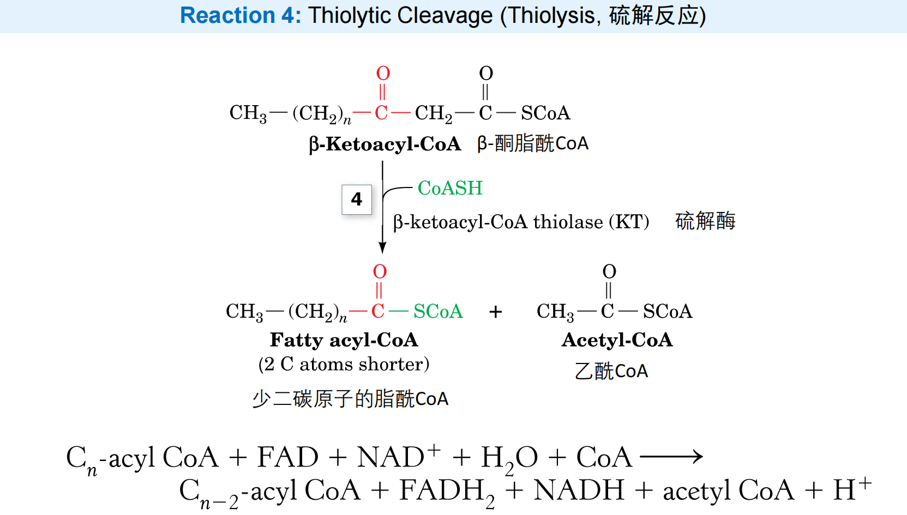

| 反应步骤  | 催化酶             | 反应过程                                                            | 能量产物 | 关键特点                                                          |
| --------- | ------------------ | ------------------------------------------------------------------- | -------- | ----------------------------------------------------------------- |
| 1. 脱氢   | 脂酰CoA脱氢酶      | 脂酰CoA的α、β碳之间脱氢，生成反式-Δ²-烯脂酰CoA                  | FADH₂   | FADH₂通过ETF（电子转移黄素蛋白）进入电子传递链（ETC），产1.5 ATP |
| 2. 水合   | 烯脂酰CoA水合酶    | 反式-Δ²-烯脂酰CoA加水，生成L-β-羟脂酰CoA                         | -        | 立体专一性：仅生成L型异构体                                       |
| 3. 再脱氢 | β-羟脂酰CoA脱氢酶 | L-β-羟脂酰CoA脱氢，生成β-酮脂酰CoA                                | NADH     | NADH进入ETC，产2.5 ATP                                            |
| 4. 硫解   | β-酮脂酰CoA硫解酶 | β-酮脂酰CoA与CoA-SH反应，生成1分子乙酰CoA + 短链脂酰CoA（少2个碳） | -        | 硫解酶催化C-C键断裂，是循环的“终止步骤”                         |

##### 3.2.4 能量结算（以棕榈酰CoA为例）

- 循环次数：C16棕榈酰CoA需7轮β-氧化，生成8分子乙酰CoA、7分子FADH₂、7分子NADH。
- ATP计算（按氧化磷酸化标准：NADH→2.5 ATP，FADH₂→1.5 ATP）：
  - 7×1.5（FADH₂） + 7×2.5（NADH） + 8×10（乙酰CoA→CAC产10 ATP） - 2（激活消耗） = **106 ATP**
- 对比优势：1分子棕榈酸（C16）氧化产106 ATP，而1分子葡萄糖（C6）仅产30-32 ATP，凸显脂肪酸的高效供能特性。

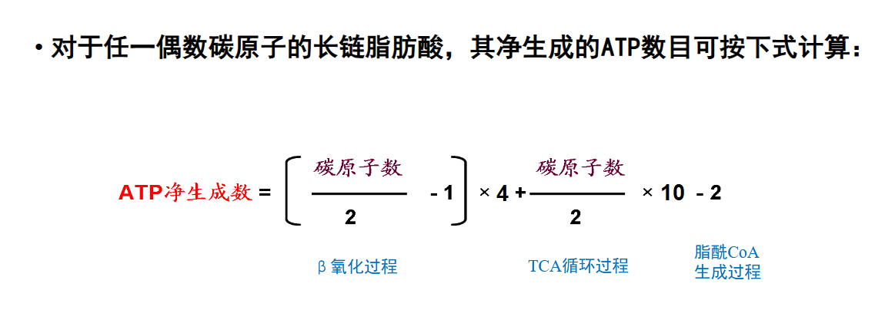

##### 3.2.5 特殊脂肪酸的氧化（适应不同链长/饱和度）

- **不饱和脂肪酸（如油酸，C18:1Δ9）**：需额外两种酶：

  1. **烯酰CoA异构酶**：将顺式双键（Δ9）转化为反式双键（Δ2），适配β-氧化的底物需求。
  2. **2,4-二烯酰CoA还原酶**：对多不饱和脂肪酸（如亚油酸，C18:2Δ9,12），先还原Δ4双键为单双键，再经异构酶处理。

  - 能量差异：因不饱和脂肪酸已含双键，少1次脱氢反应，故C18:1（油酸）比C18:0（硬脂酸）少产1.5 ATP（少1分子FADH₂）。
- **奇数碳脂肪酸（如C17）**：前6轮β-氧化生成6分子乙酰CoA + 1分子丙酰CoA（C3），丙酰CoA需经“丙酰CoA羧化酶”催化生成琥珀酰CoA（需生物素辅基），再进入CAC代谢，最终多产1分子GTP（相当于1 ATP）。
- **过氧化物酶体氧化（极长链脂肪酸，C20+）**：

  - 场所：过氧化物酶体（而非线粒体），第一步反应生成H₂O₂（经过氧化氢酶分解为H₂O + O₂），不产生ATP，仅负责“缩短链长”，后续短链脂肪酸再进入线粒体氧化。

---

### 4 酮体的生成、利用与代谢异常

酮体（Ketone Bodies）是肝脏特有的“能量转运分子”，在葡萄糖缺乏时（如禁食、糖尿病），将脂肪酸氧化产生的乙酰CoA转化为酮体，供脑、肌肉等组织利用。

#### 4.1 酮体的组成与生成条件

- **组成**：主要含三种分子，其中乙酰乙酸（Acetoacetate）和D-β-羟丁酸（D-β-Hydroxybutyrate）是主要供能形式，丙酮（Acetone）含量极少（乙酰乙酸自发脱羧生成，可通过呼吸排出，产生“烂苹果味”）。
- **生成条件**：
  1. 葡萄糖供应不足（禁食＞12小时，肝糖原消耗殆尽）；
  2. 胰岛素缺乏（糖尿病患者，葡萄糖无法进入细胞，脂肪大量分解）；
  3. 乙酰CoA无法进入CAC（肝脏糖异生消耗草酰乙酸，CAC底物不足，乙酰CoA转向酮体生成）。

#### 4.2 酮体的生成过程（肝细胞线粒体，3步关键反应）

1. **乙酰乙酰CoA合成**：2分子乙酰CoA在“硫解酶”催化下缩合，生成乙酰乙酰CoA（ΔG'°=-32.2 kJ/mol，不可逆）。

   $$
   2\text{乙酰CoA} \xrightarrow{\text{硫解酶}} \text{乙酰乙酰CoA} + \text{CoA-SH}
   $$
2. **HMG-CoA生成**：乙酰乙酰CoA与1分子乙酰CoA在“HMG-CoA合成酶”催化下生成β-羟基-β-甲基戊二酸单酰CoA（HMG-CoA），该酶是酮体生成的“速率限制酶”。
3. **酮体生成**：HMG-CoA在“HMG-CoA裂解酶”催化下裂解，生成乙酰乙酸（主要产物），乙酰乙酸再经“β-羟丁酸脱氢酶”还原为D-β-羟丁酸（ NADH充足时，如禁食时脂肪酸氧化旺盛，D-β-羟丁酸比例升高）。

- **关键特点**：肝脏仅生成酮体，不利用酮体（缺乏“琥珀酰CoA转移酶”），需转运至肝外组织利用。

#### 4.3 酮体的利用过程（肝外组织，如脑、肌肉）

1. **D-β-羟丁酸氧化**：在“β-羟丁酸脱氢酶”催化下，D-β-羟丁酸→乙酰乙酸 + NADH（NADH进入ETC产ATP）。
2. **乙酰乙酸活化**：乙酰乙酸与琥珀酰CoA在“琥珀酰CoA转移酶”催化下，生成乙酰乙酰CoA + 琥珀酰CoA（肝外组织特有的活化步骤）。
3. **硫解生成乙酰CoA**：乙酰乙酰CoA在“硫解酶”催化下，生成2分子乙酰CoA，进入CAC氧化产ATP。

- **生理意义**：饥饿时，脑可利用酮体替代葡萄糖供能（占脑能量需求的60%以上），减少肌肉蛋白分解（避免氨基酸糖异生），维持生命活动。

#### 4.4 代谢异常：糖尿病酮症（Diabetic Ketoacidosis, DKA）

- **诱因**：胰岛素绝对缺乏（1型糖尿病患者未注射胰岛素），导致：

  1. 肝脏无法摄取葡萄糖，糖异生增强，消耗草酰乙酸；
  2. 脂肪大量分解，脂肪酸氧化产生过量乙酰CoA，转向酮体生成；
  3. 酮体（乙酰乙酸、D-β-羟丁酸）是酸性分子，大量积累导致**代谢性酸中毒**（血液pH＜7.3）。
- **临床症状**：呼吸深快（库斯莫尔呼吸）、呼气带“烂苹果味”（丙酮）、血糖显著升高（＞16.7 mmol/L）、尿酮体阳性，严重时可引发昏迷甚至死亡。
- **核心机制**：“柠檬酸命运决定碳流方向”——高胰岛素时，柠檬酸外运→促进脂肪酸合成；低胰岛素时，柠檬酸留守+草酰乙酸不足→促进酮体生成（文档中“柠檬酸外运=造脂肪；柠檬酸留守=造酮体”的核心逻辑）。

---

### 5 脂肪酸的生物合成（与β-氧化镜像反应）

脂肪酸合成是β-氧化的逆过程，但场所、酶系、载体均不同，核心是将乙酰CoA转化为棕榈酸（C16），再延伸/去饱和为其他脂肪酸。

#### 5.1 原料与辅酶的准备（关键在于乙酰CoA转运）

- **碳源**：乙酰CoA（主要来自线粒体中丙酮酸的氧化脱羧、脂肪酸β-氧化或氨基酸分解），但乙酰CoA无法直接穿过线粒体内膜，需通过**三羧酸转运系统（Tricarboxylate Shuttle）** 进入细胞质：

  1. 线粒体中：乙酰CoA + 草酰乙酸 → 柠檬酸（柠檬酸合酶催化）；
  2. 跨膜转运：柠檬酸通过“三羧酸转运体”进入细胞质；
  3. 细胞质中：柠檬酸在“柠檬酸裂解酶”催化下→乙酰CoA + 草酰乙酸（需ATP供能：ATP→ADP+Pi）；
  4. 草酰乙酸再生：草酰乙酸→苹果酸→丙酮酸（苹果酸酶催化，生成NADPH），丙酮酸再进入线粒体合成草酰乙酸，完成循环。
- **还原剂**：NADPH（主要来源：苹果酸酶反应+磷酸戊糖途径），脂肪酸合成需14分子NADPH（合成1分子棕榈酸），NADPH的[氧化态/还原态]比例（[NADP⁺]/[NADPH]）低，确保还原反应顺利进行。
- **关键中间体**：丙二酸单酰CoA（Malonyl-CoA），由“乙酰CoA羧化酶”催化生成，是脂肪酸合成的“二碳单位供体”（而非β-氧化的乙酰CoA）。

#### 5.2 限速步骤：乙酰CoA羧化酶（ACC）的催化与调控

- **催化反应**：

  $$
  \text{乙酰CoA} + \text{HCO}_3^- + \text{ATP} \xrightarrow{\text{乙酰CoA羧化酶（ACC）}} \text{丙二酸单酰CoA} + \text{ADP} + \text{Pi}
  $$
- **辅基需求**：需生物素（Biotin）作为辅基，生物素通过赖氨酸残基与酶共价结合，传递羧基（“生物素-酶”复合体是羧化反应的核心）。
- **酶结构差异**：

  - 细菌：ACC由3个独立亚基（生物素羧化酶、生物素羧基载体蛋白、转羧酶）组成；
  - 动物：ACC是单链多功能酶，含上述3种活性，催化效率更高。
- **多层调控（避免与β-氧化同时进行）**：

  | 调控方式 | 激活因素                    | 抑制因素                          | 生理意义              |
  | -------- | --------------------------- | --------------------------------- | --------------------- |
  | 变构调节 | 柠檬酸（乙酰CoA充足信号）   | 棕榈酰CoA（脂肪酸过量信号）       | 实时响应底物/产物浓度 |
  | 共价修饰 | 胰岛素（促进去磷酸化）      | 胰高血糖素/肾上腺素（促进磷酸化） | 激素调控合成速率      |
  | 转录调控 | 高糖饮食（诱导ACC基因表达） | 禁食（抑制ACC基因表达）           | 长期适应营养状态      |

#### 5.3 脂肪酸合酶（FAS）的催化循环

脂肪酸合酶是合成的核心酶系，不同生物结构不同：

- **哺乳动物FAS-I**：单链多酶复合体（分子量≈270 kDa），含6个功能结构域：KS（β-酮酰基-ACP合酶）、MAT（丙二酸单酰/乙酰CoA-ACP转酰基酶）、DH（β-羟酰基-ACP脱水酶）、ER（烯酰基-ACP还原酶）、KR（β-酮酰基-ACP还原酶）、TE（硫酯酶，释放终产物）。
- **细菌/植物FAS-II**：由多个独立酶组成，松散结合发挥作用。

##### 5.3.1 合成前的“加载步骤”（激活酶系）

1. 乙酰CoA在MAT催化下，将乙酰基转移至KS的半胱氨酸（Cys）残基，形成“乙酰-KS”。
2. 丙二酸单酰CoA在MAT催化下，将丙二酸单酰基转移至ACP的磷酸泛酰巯基乙胺（Phosphopantetheine）基团，形成“丙二酸单酰-ACP”。

- **ACP的作用**：酰基载体蛋白（ACP）通过磷酸泛酰巯基乙胺的长链（类似“摇臂”）携带酰基中间体，在各功能结构域间传递，确保反应高效。

##### 5.3.2 四步循环反应（每次延长2个碳）

以合成棕榈酸为例，需7轮循环，每轮包括“缩合-还原-脱水-再还原”：

| 反应步骤  | 催化结构域 | 反应过程                                         | 辅酶需求              |
| --------- | ---------- | ------------------------------------------------ | --------------------- |
| 1. 缩合   | KS         | 乙酰-KS + 丙二酸单酰-ACP → β-酮丁酰-ACP + CO₂ | -（CO₂释放驱动反应） |
| 2. 还原   | KR         | β-酮丁酰-ACP → D-β-羟丁酰-ACP                 | NADPH（供氢）         |
| 3. 脱水   | DH         | D-β-羟丁酰-ACP → 反式-Δ²-烯丁酰-ACP          | -（脱水生成双键）     |
| 4. 再还原 | ER         | 反式-Δ²-烯丁酰-ACP → 丁酰-ACP                 | NADPH（供氢，饱和）   |

- **关键特点**：每轮循环消耗1分子丙二酸单酰CoA和2分子NADPH，释放1分子CO₂（与乙酰CoA羧化的CO₂循环利用，无净消耗）。

##### 5.3.3 终产物释放与后续加工

- **终产物**：7轮循环后，生成棕榈酰-ACP，由TE（硫酯酶）催化水解，释放游离棕榈酸（C16:0）。
- **总反应**：

  $$
  \text{乙酰CoA} + 7\text{丙二酸单酰CoA} + 14\text{NADPH} + 14\text{H}^+ \rightarrow \text{棕榈酸} + 7\text{CO}_2 + 8\text{CoA} + 14\text{NADP}^+ + 6\text{H}_2O
  $$
- **后续加工**：

  1. **延长**：内质网中的“脂肪酸延长酶”将棕榈酸延长为硬脂酸（C18:0）、花生酸（C20:0）等长链脂肪酸。
  2. **去饱和**：“脂肪酸去饱和酶”（如Δ9去饱和酶）在脂肪酸链中引入双键，生成油酸（C18:1Δ9）、亚油酸（C18:2Δ9,12）等不饱和脂肪酸。

  - **必需脂肪酸**：人体无法合成亚油酸（ω-6）和α-亚麻酸（ω-3），需从膳食获取（如植物油、深海鱼油），缺乏会导致皮肤干燥、免疫下降。

#### 5.4 脂肪酸合成与β-氧化的核心区别（避免无效循环）

| 对比维度   | 脂肪酸合成（细胞质）               | 脂肪酸β-氧化（线粒体）                       |
| ---------- | ---------------------------------- | --------------------------------------------- |
| 酰基载体   | ACP（酰基载体蛋白）                | CoA（辅酶A）                                  |
| 电子载体   | NADPH（供体，还原反应）            | NAD⁺、FAD（受体，氧化反应）                  |
| 二碳单位   | 丙二酸单酰CoA（供体）              | 乙酰CoA（产物）                               |
| 关键酶系   | FAS-I（单链多酶复合体）            | 4种独立酶（脱氢酶、水合酶等）                 |
| 中间体构型 | D-β-羟脂酰中间体                  | L-β-羟脂酰中间体                             |
| 调控关键   | ACC（乙酰CoA羧化酶），受柠檬酸激活 | CPT I（肉碱酰基转移酶I），受丙二酸单酰CoA抑制 |

---

### 6 其他脂类的合成（甘油磷脂、鞘脂、胆固醇）

除三酰甘油和脂肪酸外，细胞还需合成甘油磷脂、鞘脂、胆固醇等脂类，用于膜结构、信号分子合成。

#### 6.1 甘油磷脂的合成（生物膜的核心成分）

甘油磷脂是含“甘油骨架+2个脂肪酸链+1个磷酸基团+1个极性头部”的两性分子，合成前体为**磷脂酸（Phosphatidic Acid, PA）**。

##### 6.1.1 合成途径（两种主要路径）

- **路径1：CDP-甘油二酯途径（适用于含肌醇/甘油头部的磷脂）**

  1. 磷脂酸 + CTP → CDP-甘油二酯 + PPi（CDP-甘油二酯合成酶催化）；
  2. CDP-甘油二酯 + 肌醇 → 磷脂酰肌醇 + CMP（肌醇磷脂合成酶催化）；
  3. CDP-甘油二酯 + 甘油-3-磷酸 → 磷脂酰甘油 + CMP，再进一步生成二磷脂酰甘油（心磷脂）。
- **路径2：1,2-二酰甘油途径（适用于含胆碱/乙醇胺头部的磷脂）**

  1. 磷脂酸 → 1,2-二酰甘油（磷脂酸磷酸酶催化，去磷酸化）；
  2. 胆碱 + ATP → 磷酸胆碱 + ADP（胆碱激酶催化）；
  3. 磷酸胆碱 + CTP → CDP-胆碱 + PPi（CDP-胆碱合成酶催化）；
  4. CDP-胆碱 + 1,2-二酰甘油 → 磷脂酰胆碱 + CMP（胆碱磷酸转移酶催化）。

##### 6.1.2 常见甘油磷脂的功能

| 甘油磷脂名称           | 极性头部（X-OH）             | 主要分布         | 功能                                       |
| ---------------------- | ---------------------------- | ---------------- | ------------------------------------------ |
| 磷脂酰胆碱（卵磷脂）   | 胆碱（-CH₂CH₂N⁺(CH₃)₃） | 细胞膜、脂蛋白   | 膜结构核心，乳化剂（如蛋黄中的卵磷脂）     |
| 磷脂酰乙醇胺（脑磷脂） | 乙醇胺（-CH₂CH₂NH₃⁺）    | 细胞膜、线粒体膜 | 维持膜流动性，参与细胞凋亡                 |
| 磷脂酰丝氨酸           | 丝氨酸（-CH₂CH(NH₂)COOH）  | 细胞膜内侧       | 信号传导（如凝血过程），凋亡时外翻至膜外侧 |
| 磷脂酰肌醇             | 肌醇（六元环醇）             | 细胞膜           | 生成第二信使（如IP3、DAG），调控钙信号     |
| 二磷脂酰甘油（心磷脂） | 甘油-3-磷酸                  | 线粒体内膜       | 维持ATP合酶活性，参与氧化磷酸化            |

#### 6.2 鞘脂的合成（膜识别与信号分子）

鞘脂以**鞘氨醇（Sphingosine，C18不饱和氨基醇）** 为骨架，而非甘油，主要存在于细胞膜的“脂筏”区域（信号传导热点）。

##### 6.2.1 合成步骤（内质网与高尔基体）

1. **鞘氨醇合成**：棕榈酰CoA + 丝氨酸 → 3-酮基二氢鞘氨醇 → 二氢鞘氨醇 → 鞘氨醇（需NADPH供氢）。
2. **神经酰胺合成**：鞘氨醇 + 脂酰CoA → 神经酰胺（Ceramide，关键中间体，由神经酰胺合成酶催化）。
3. **鞘磷脂/糖鞘脂合成**：
   - 神经酰胺 + CDP-胆碱 → 鞘磷脂（高尔基体，鞘磷脂合成酶催化）；
   - 神经酰胺 + 糖基（如葡萄糖） → 糖鞘脂（如葡萄糖神经酰胺，糖基转移酶催化）。

##### 6.2.2 功能与临床关联

- **功能**：参与细胞识别（如ABO血型抗原是糖鞘脂）、信号传导（神经酰胺可诱导凋亡）。
- **疾病关联**：鞘脂降解酶缺陷导致“鞘脂贮积症”，如戈谢病（葡萄糖脑苷脂酶缺陷）、尼曼-匹克病（鞘磷脂酶缺陷），表现为器官肿大、神经损伤。

#### 6.3 胆固醇的合成（27个碳均来自乙酰CoA）

胆固醇是动物特有的脂类，用于合成胆汁盐、类固醇激素、维生素D，也是细胞膜的重要成分（调节膜流动性）。

##### 6.3.1 四阶段合成路径（主要在肝脏/小肠细胞质与内质网）

| 阶段                | 反应过程                                                   | 关键酶                  | 产物（碳数） |
| ------------------- | ---------------------------------------------------------- | ----------------------- | ------------ |
| 1. 甲羟戊酸生成     | 3分子乙酰CoA → HMG-CoA → 甲羟戊酸                        | HMG-CoA还原酶（限速酶） | 6            |
| 2. 异戊二烯单位生成 | 甲羟戊酸 → 异戊烯焦磷酸（IPP） → 二甲丙烯焦磷酸（DMAPP） | 甲羟戊酸激酶            | 5            |
| 3. 鲨烯生成         | 6分子异戊二烯单位（IPP+DMAPP） → 法尼基焦磷酸 → 鲨烯     | 鲨烯合成酶              | 30           |
| 4. 胆固醇生成       | 鲨烯 → 羊毛固醇 → 胆固醇（经20步反应，含环化、去甲基）   | 鲨烯环化酶              | 27           |

- **关键调控**：HMG-CoA还原酶（3-羟基-3-甲基戊二酸单酰CoA还原酶）是胆固醇合成的“速率限制酶”，受多重调控：
  1. **反馈抑制**：胆固醇积累时，抑制酶的活性并促进其降解；
  2. **激素调控**：胰岛素促进酶活性（合成增加），胰高血糖素抑制酶活性（合成减少）；
  3. **药物调控**：他汀类药物（如阿托伐他汀）抑制HMG-CoA还原酶，降低血液胆固醇水平，用于治疗高血脂。

##### 6.3.2 胆固醇的生理功能与转运

- **功能**：

  1. 合成胆汁盐（肝脏合成，储存于胆囊，辅助脂肪消化）；
  2. 合成类固醇激素（肾上腺皮质激素、性激素如睾酮、雌激素）；
  3. 合成维生素D（皮肤中胆固醇经紫外线照射生成前维生素D，再转化为活性维生素D）；
  4. 维持细胞膜流动性（调节膜的“刚性”，避免低温时凝固、高温时过度流动）。
- **转运形式**：胆固醇不溶于水，需通过脂蛋白（如LDL、HDL）运输，具体见“脂蛋白系统”部分。

---

### 7 脂蛋白系统（脂类的血液运输载体）

脂类（TAG、胆固醇、磷脂）不溶于水，需与蛋白质结合形成“脂蛋白（Lipoprotein）”才能在血液中运输，不同脂蛋白的密度、组成、功能差异显著。

#### 7.1 脂蛋白的分类与核心特征

根据**密度（密度=质量/体积，蛋白质含量越高，密度越大）** 分为五类，核心特征如下表：

| 脂蛋白类型     | 英文缩写    | 密度（g/mL） | 直径（Å） | 主要成分（%干重）                          | 主要功能                                 |
| -------------- | ----------- | ------------ | ---------- | ------------------------------------------ | ---------------------------------------- |
| 乳糜微滴       | Chylomicron | ＜0.95       | 1000-10000 | 蛋白质（2）、TAG（86）、胆固醇（10）       | 运输膳食TAG至脂肪组织/肌肉               |
| 超低密度脂蛋白 | VLDL        | 0.950-1.006  | 300-800    | 蛋白质（8）、TAG（55）、胆固醇（19）       | 运输肝脏合成的TAG至外周组织              |
| 中等密度脂蛋白 | IDL         | 1.006-1.019  | 250-350    | 蛋白质（15）、TAG（31）、胆固醇（37）      | VLDL代谢中间产物，转化为LDL              |
| 低密度脂蛋白   | LDL         | 1.019-1.063  | 180-250    | 蛋白质（22）、TAG（6）、胆固醇（58）       | 运输胆固醇至外周组织（“坏胆固醇”）     |
| 高密度脂蛋白   | HDL         | 1.063-1.210  | 50-120     | 蛋白质（40-55）、TAG（4）、胆固醇（30-34） | 回收外周组织胆固醇至肝脏（“好胆固醇”） |

- **命名逻辑**：LDL被称为“低密度脂蛋白”，是因为其蛋白质含量（22%）远低于HDL（40-55%），而脂类（尤其是胆固醇）含量高，导致整体密度低（1.019-1.063 g/mL）。

#### 7.2 载脂蛋白（Apolipoprotein，脂蛋白的“功能蛋白”）

载脂蛋白是脂蛋白表面的蛋白质成分，负责“识别受体”“激活酶”“调控代谢”，主要类型及功能如下：

| 载脂蛋白 | 分子量（Da） | 主要分布       | 核心功能                                           |
| -------- | ------------ | -------------- | -------------------------------------------------- |
| A-I      | 28,300       | HDL            | 激活LCAT（卵磷脂胆固醇酰基转移酶），促进胆固醇酯化 |
| A-II     | 17,400       | HDL            | 稳定HDL结构，调控胆固醇转运                        |
| B-48     | 241,100      | 乳糜微滴       | 介导乳糜微滴与脂蛋白脂肪酶（LPL）结合              |
| B-100    | 513,000      | LDL、VLDL      | 介导LDL与LDL受体结合，促进胆固醇摄取               |
| C-II     | 8,900        | VLDL、乳糜微滴 | 激活LPL（脂蛋白脂肪酶），促进TAG水解               |
| C-III    | 8,800        | VLDL、乳糜微滴 | 抑制LPL活性，调节TAG代谢速率                       |
| E        | 34,000       | VLDL、HDL      | 介导脂蛋白与肝脏受体结合，参与胆固醇回收           |

#### 7.3 脂蛋白的运输路径（以TAG和胆固醇为例）

##### 7.3.1 三酰甘油的运输（乳糜微滴+VLDL）

1. **膳食TAG运输（乳糜微滴路径）**：

   - 小肠合成乳糜微滴→淋巴→血液→与外周组织（脂肪、肌肉）毛细血管壁的LPL结合→C-II激活LPL→水解TAG为FA和甘油→FA被细胞摄取（脂肪细胞储存为TAG，肌肉细胞氧化供能）→乳糜微滴残体被肝脏摄取。
2. **肝脏合成TAG运输（VLDL路径）**：

   - 肝脏合成TAG→与载脂蛋白（B-100、C-II、E）形成VLDL→血液→LPL水解TAG→VLDL转化为IDL→IDL进一步水解TAG→转化为LDL（主要含胆固醇）。

##### 7.3.2 胆固醇的运输（LDL+HDL）

- **LDL路径（胆固醇“ delivery”）**：LDL携带肝脏合成的胆固醇→血液→与外周组织细胞的LDL受体结合→内吞进入细胞→溶酶体降解LDL→释放胆固醇→用于膜合成或激素合成；若细胞内胆固醇充足，反馈抑制LDL受体合成和HMG-CoA还原酶活性（减少自身合成）。

  - **风险关联**：LDL过量时，易沉积在动脉血管壁，形成动脉粥样硬化斑块，引发冠心病、心肌梗死、缺血性脑卒中（因此LDL被称为“坏胆固醇”）。
- **HDL路径（胆固醇“ reverse delivery”）**：
  HDL在肝脏/小肠合成→血液→通过A-I激活LCAT→将外周组织细胞膜上的游离胆固醇酯化→酯化胆固醇进入HDL核心→HDL将胆固醇运回肝脏（“胆固醇逆向转运”）→肝脏将胆固醇转化为胆汁盐或排泄；因此HDL被称为“好胆固醇”，其水平低与心血管疾病风险升高相关。

---

### 8 脂类代谢的多层调控（激素-酶-信号分子协同）

脂类代谢的调控围绕“能量供需平衡”展开，涉及激素、关键酶、信号分子的多层协同，确保合成与分解按需进行。

#### 8.1 激素调控（核心是胰岛素与胰高血糖素的互逆作用）

| 激素       | 分泌条件         | 对脂解的影响                       | 对脂肪酸氧化的影响                       | 对脂肪酸合成的影响                   | 对酮体生成的影响                         |
| ---------- | ---------------- | ---------------------------------- | ---------------------------------------- | ------------------------------------ | ---------------------------------------- |
| 胰岛素     | 高血糖（进食后） | 抑制（激活PP1，去磷酸化HS lipase） | 抑制（促进丙二酸单酰CoA生成，抑制CPT I） | 激活（促进ACC去磷酸化，诱导FAS表达） | 抑制（促进草酰乙酸生成，乙酰CoA进入CAC） |
| 胰高血糖素 | 低血糖（禁食时） | 激活（促进PKA，磷酸化HS lipase）   | 激活（抑制ACC，降低丙二酸单酰CoA水平）   | 抑制（促进ACC磷酸化，抑制FAS表达）   | 激活（消耗草酰乙酸，乙酰CoA转向酮体）    |
| 肾上腺素   | 应激/运动        | 激活（同胰高血糖素，快速供能）     | 激活（快速提供能量）                     | 抑制（优先供能，暂停合成）           | 激活（应急供能）                         |

#### 8.2 关键酶的调控（速率限制酶是核心靶点）

| 代谢过程   | 速率限制酶    | 激活因素                    | 抑制因素                        | 调控机制                    |
| ---------- | ------------- | --------------------------- | ------------------------------- | --------------------------- |
| 脂解作用   | HS lipase     | PKA磷酸化、肾上腺素         | PP1去磷酸化、胰岛素             | 共价修饰（磷酸化/去磷酸化） |
| 脂肪酸氧化 | CPT I         | ADP（能量缺乏）、胰高血糖素 | 丙二酸单酰CoA、胰岛素           | 别构调节 + 激素调控         |
| 脂肪酸合成 | ACC           | 柠檬酸、胰岛素（去磷酸化）  | 棕榈酰CoA、胰高血糖素（磷酸化） | 别构调节 + 共价修饰         |
| 胆固醇合成 | HMG-CoA还原酶 | 胰岛素、胆固醇缺乏          | 胆固醇（反馈抑制）、他汀类药物  | 反馈抑制 + 药物抑制         |
| 酮体生成   | HMG-CoA合成酶 | 乙酰CoA过量、胰岛素缺乏     | 胰岛素、草酰乙酸充足            | 底物浓度 + 激素调控         |

#### 8.3 信号分子调控（局部微环境的精细调节）

- **FFA4（游离脂肪酸受体）**：当脂解产生过量FFA时，FFA结合FFA4→激活Gi/o蛋白→抑制腺苷酸环化酶→降低cAMP→抑制脂解，避免FFA毒性。
- **AMPK（AMP激活的蛋白激酶）**：能量缺乏时（AMP升高），AMPK激活→磷酸化ACC→抑制脂肪酸合成；同时磷酸化HS lipase→促进脂解，实现“开源节流”。
- **SREBP（固醇调节元件结合蛋白）**：胆固醇缺乏时，SREBP进入细胞核→激活HMG-CoA还原酶、LDL受体等基因表达→促进胆固醇合成与摄取；胆固醇充足时，SREBP被抑制，维持胆固醇稳态。

---

### 9 总结与关键问题思考

#### 9.1 核心知识点总结

1. **脂类代谢的核心逻辑**：三酰甘油是主要能量储备，脂肪酸氧化是高效供能路径，酮体是葡萄糖缺乏时的“应急能量载体”，脂肪酸合成与氧化通过“丙二酸单酰CoA-CPT I”轴互逆调控，避免无效循环。
2. **脂蛋白的功能分工**：乳糜微滴/VLDL运输TAG，LDL运输胆固醇至外周（“坏”），HDL回收胆固醇至肝脏（“好”），不同脂蛋白的密度差异源于蛋白质/脂类比例。
3. **临床关联的核心**：胆汁盐缺乏→脂肪泻，CPT I缺陷→脂肪酸氧化障碍，胰岛素缺乏→糖尿病酮症，他汀类药物→抑制胆固醇合成（降LDL）。

#### 9.2 关键问题思考（结合文档与课程内容）

1. 为什么1g脂肪的能量储备是1g糖原的6.75倍？（提示：从能量密度和含水率两方面分析）
2. 脂肪酸β-氧化生成的FADH₂和NADH如何进入电子传递链？与葡萄糖代谢的NADH有何差异？
3. 肝脏为何“只生成酮体，不利用酮体”？这一特性的生理意义是什么？
4. 对比LDL和HDL的结构与功能，解释为何LDL升高、HDL降低会增加心血管疾病风险？
5. 乙酰CoA在肝细胞中有哪些代谢去向？（提示：CAC、脂肪酸合成、酮体生成、胆固醇合成），不同生理状态下（进食/禁食）如何切换？
